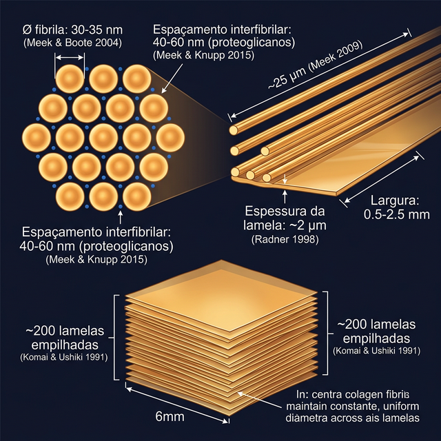
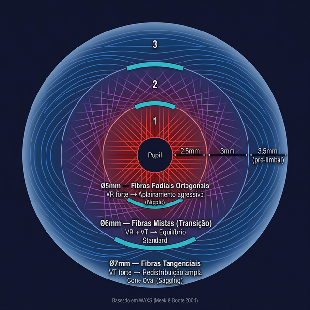
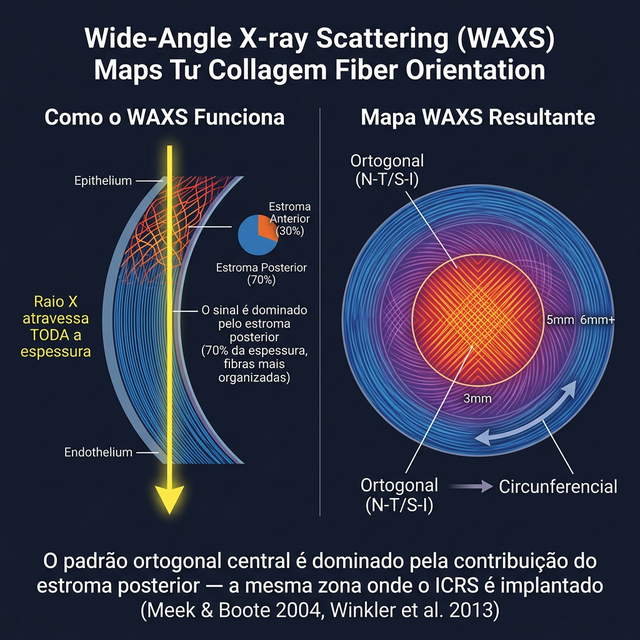
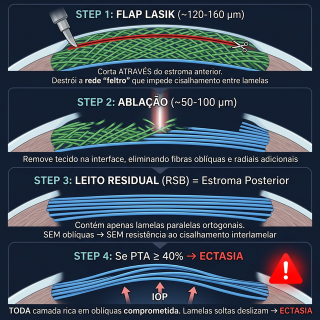
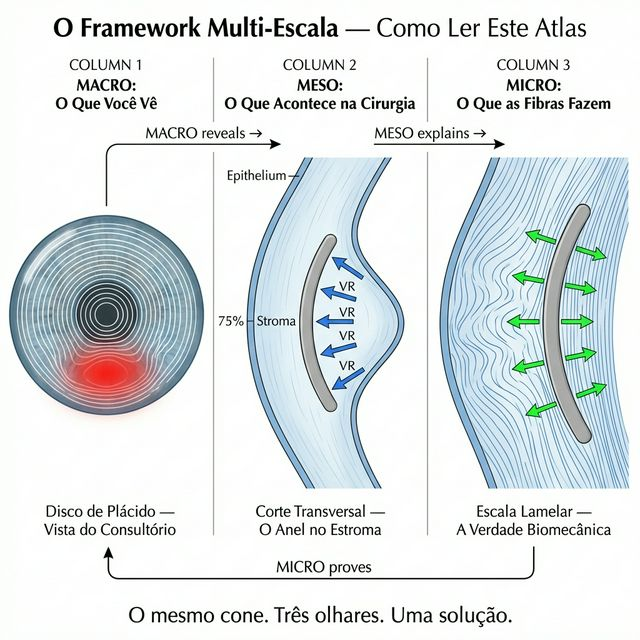
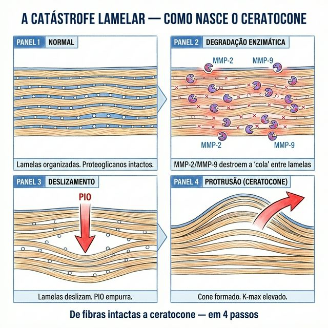

# Capítulo 1 — Anatomia Corneana Essencial para o Cirurgião de Anéis

---

## 📋 METADADOS DO CAPÍTULO

```yaml
chapter_id: CH-001
title: "Anatomia Corneana Essencial: O Que Você Precisa Saber Antes de Implantar um Anel"
language: PT-BR
status: draft
version: 0.1.0
```

---

## 📖 CONTEÚDO INSTRUCIONAL

### Introdução

Antes de entender **como** um anel intracorneano funciona, é preciso entender **onde** ele funciona. Este capítulo apresenta apenas a anatomia que é diretamente relevante para o cirurgião de anéis — sem excesso, sem revisão de histologia completa. O foco é cirúrgico.

### A Córnea em 60 Segundos

A córnea humana é uma lente transparente com ~550 μm de espessura central e ~700 μm na periferia. Ela contribui com aproximadamente **70% do poder refrativo total do olho** (~43 D de ~60 D totais).

Para o cirurgião de anéis, a córnea pode ser entendida como uma estrutura com **3 camadas funcionais**:

| Camada | Espessura | Relevância para ICRS |
|--------|-----------|---------------------|
| **Epitélio + Bowman** | ~50 μm | Não envolvido diretamente. Cicatrização superficial. |
| **Estroma** | ~450 μm (90%) | **CAMADA ALVO.** O anel é implantado aqui, a ~70-80% de profundidade. |
| **Descemet + Endotélio** | ~15 μm | Proteção crítica. Nunca deve ser atingido pelo túnel. |


### O Estroma: A Camada que Importa

O estroma corneano é composto por ~200–250 lamelas de colágeno sobrepostas. Cada lamela é uma "folha" finíssima de fibras colágenas dispostas em padrões precisos.

Por que isso importa para os anéis?
Porque o anel intracorneano não age como uma ponte mecânica rígida (como uma placa de titânio num osso fraturado). Ele age **tensionando as fibras de colágeno**.

Imagine o estroma como uma rede de descanso feita de cordas frouxas (a córnea com ceratocone). Quando você insere um bloco rígido triangular ou semi-circular (o anel) entre as cordas, você obriga as cordas que passam por cima e por baixo dele a percorrerem um caminho mais longo. O resultado? **Elas esticam.** 

Essa tensão gerada no anel se propaga pelas lamelas e é transmitida de volta para a superfície anterior da córnea, "puxando-a" e alterando sua curvatura macroscópica.


**Fato crucial para ICRS:** As lamelas não são todas iguais.

- **Lamelas anteriores (superficiais):** Entrelaçadas, densas, fortemente conectadas entre si. Difíceis de separar. Respondem menos ao anel (rigidez alta).
- **Lamelas posteriores (profundas):** Mais paralelas, menos entrelaçadas, com mais substância fundamental entre elas. **Mais fáceis de separar.** É aqui que o túnel do anel é criado.

> **Pérola Anatômica — Por Que 70-75% de Profundidade?**
>
> O anel é implantado no estroma posterior (~70-75%) por razões **arquiteturais e biomecânicas**, não apenas técnicas:
>
> **Arquitetura lamelar:** O estroma anterior (1/3) tem fibras entrelaçadas e oblíquas — uma rede densa tipo feltro, difícil de dissecar. O estroma posterior (2/3) tem lamelas **paralelas**, predominantemente nos eixos nasal-temporal e superior-inferior (WAXS: 66% em ±22.5°). As lamelas separam-se ao longo dos planos naturais → o túnel é criado com facilidade nessa zona. A facilidade é **consequência** da arquitetura, não o motivo primário.
>
> **Equilíbrio tenting–âncora:** O motivo primário é biomecânico. O anel age como cunha/fulcro: empurra o tecido *acima* anteriormente (tenting = VR), enquanto o tecido *abaixo* fornece a ancoragem reativa. O ponto ótimo equilibra ambos:
>
> | Profundidade | Acima do anel | Abaixo (âncora) | Efeito |
> |-------------|--------------|-----------------|--------|
> | 60% | 60% | 40% | VR fraco — pouco tecido acima para tenting |
> | **70-75%** ✅ | 70-75% | 25-30% | **Ótimo** — máximo tenting + âncora suficiente |
> | >80% | >80% | <20% | VR **diminuído** (FEM) — âncora posterior fina demais |
>
> Acima de 80%, o anel "flutua" sem resistência posterior adequada — o efeito de aplainamento cai. A frase "mais fundo = sempre melhor" é um mito perigoso.

### Geometria Corneana: O Mapa que o Cirurgião Lê

A córnea pode ser mapeada em zonas concêntricas. **Cada zona tem uma arquitetura fibrilar diferente** — e é isso que determina como cada diâmetro de anel interage com o tecido:

#### Dimensões das Fibrilas de Colágeno e a Técnica WAXS

> **Entendendo a Ferramenta:** **WAXS** = *Wide-Angle X-ray Scattering* (Espalhamento de Raios-X de Ângulo Amplo). É a técnica de ponta usada por biofísicos como Keith Meek e Craig Boote para mapear a orientação das fibras de colágeno na córnea em escala nanométrica. São os mapas WAXS que revelam onde as fibras são ortogonais (centro) e onde viram tangenciais (periferia). Esta tecnologia é a base científica fundamental da correspondência geométrica demonstrada neste Atlas.

| Parâmetro | Valor | Referência |
|-----------|-------|-----------|
| **Diâmetro da fibrila** | 30-35 nm | ✅ Meek & Boote, 2004 |
| **Comprimento da fibrila** | ~25 µm | ✅ Meek, 2009 |
| **Espaçamento interfibrilar** | 40-60 nm (controlado por proteoglicanos) | ✅ Meek & Knupp, 2015 |
| **Espessura de cada lamela** | ~2 µm | ✅ Radner et al., 1998 |
| **Largura de cada lamela** | 0.5–2.5 mm (variável) | ✅ Winkler et al., 2013 |
| **Número total de lamelas** | ~200 (empilhadas) | ✅ Komai & Ushiki, 1991 |



#### Arquitetura Fibrilar por Zona — A Chave para Entender os Diâmetros dos Anéis

| Zona | Diâmetro | Fibras Dominantes | Orientação | Relevância para ICRS |
|------|----------|-------------------|-----------|---------------------|
| **Central** | 0–3 mm | 🔴 Radiais ortogonais | N-T (0°) e S-I (90°), **66% em ±22.5°** dos eixos | Zona óptica — NÃO implante aqui. É o alvo do aplainamento (VR). Fibrilas mantêm diâmetro constante. |
| **Paracentral** | 3–5 mm | 🔴→🔵 Transição | Ortogonal → isotrópico (fibras se espalham) | **Anel Ø5mm** — intercepta zona mista. VR forte, VT moderado. Fibrilas começam a se alterar. |
| **Periférica** | 5–7 mm | 🔵 Circunferenciais emergem | Radiais começam a curvar-se para tangenciais | **Anel Ø6mm** — intercepta transição. VR + VT equilibrados |
| **Pré-limbal** | 7–9 mm | 🔵🔵 Circunferenciais dominam | Fibras mudam de direção **1-1.5mm antes do limbo** | **Anel Ø7mm** — intercepta tangenciais. VT domina, VR menor |
| **Limbo** | 9–12 mm | 🔵🔵🔵 Annulus Limbal | Circunferencial puro (posterior 30% do estroma) | Não se implanta aqui. Referência anatômica para incisão |


#### 💡 O Que Isto Significa para o Cirurgião (Síntese do Autor)

| Diâmetro do Anel | Zona que Intercepta | Fibras que Tensiona | Vetor Dominante | Efeito Clínico |
|-----------------|--------------------|--------------------|----------------|---------------|
| **Ø5mm** | Paracentral (2.5mm do centro) | Principalmente 🔴 radiais ortogonais | **VR forte** | Aplainamento agressivo. Ideal para cones centrais (nipple) com K-max alto |
| **Ø6mm** | Periférica (3mm do centro) | Misto 🔴/🔵 (transição) | **VR + VT** | Equilíbrio aplainamento/redistribuição. Diâmetro mais usado ("standard") |
| **Ø7mm** | Pré-limbal (3.5mm do centro) | Principalmente 🔵 tangenciais | **VT forte** | Redistribuição ampla, aplainamento suave. Ideal para cones ovais (sagging) com astigmatismo alto |

> **🔬 Evidência Indireta Convergente:** A relação diâmetro→fibra→vetor é baseada em: (1) mapas WAXS de Meek & Boote 2004 mostrando transição ortogonal→circumferencial, (2) dados clínicos mostrando que anéis de diâmetro menor geram mais ΔK (aplainamento) e anéis maiores geram mais redistribuição, (3) princípio biomecânico de que o vetor gerado depende da orientação das fibras interceptadas.



#### Proporções do Estroma — Anterior vs Posterior

A córnea central (~550 µm) divide-se em camadas com funções distintas:

| Camada | Espessura | % total |
|--------|----------|---------|
| Epitélio | ~50 µm | 9% |
| Bowman | ~8-14 µm | 2% |
| **Estroma Anterior** | **~120-160 µm** | **~30% do estroma** |
| **Estroma Posterior** | **~320-360 µm** | **~70% do estroma** |
| Descemet + Endotélio | ~15-17 µm | 3% |

```
Diagrama em escala — Onde o anel fica:

  0 µm ┬─── Epitélio (50µm)
 50 µm ├─── Bowman
 64 µm ├═══════════════════════════════ Estroma Anterior (30%)
       │   🟢🟢🟢 Oblíquas densas      ← "feltro" — difícil dissecção
       │   Fibras entrelaçadas
       │   Orientação isotrópica
~210µm ├─ ─ ─ ─ ─ ─ ─ ─ ─ ─ ─ ─ ─ ─  Transição
       │
       ├═══════════════════════════════ Estroma Posterior (70%)
       │   🔴🔴 Radiais ortogonais     ← N-T e S-I (WAXS: 66%)
       │   Lamelas paralelas
       │   Orientação fortemente organizada
       │
385µm ─┤   ███ ANEL (70% profundidade)  ← AQUI
413µm ─┤   ███ ANEL (75% profundidade)  ← OU AQUI
       │
       │   Poucas oblíquas nesta zona
~530µm ├─── Descemet + Endotélio
 550µm ┴
```


> **⚠️ Qualificação sobre Profundidade WAXS (importante para defesa científica):**
>
> Os mapas WAXS de Meek & Boote (2004) representam a **soma de toda a espessura corneana** — o raio X atravessa a córnea inteira. Porém, o padrão ortogonal N-T/S-I registrado é **dominado pela contribuição do estroma posterior** (70% da espessura, fibras mais organizadas). Winkler et al. (2013) confirmaram por SHG que o estroma posterior é mais fortemente ortogonal que o anterior. **Conclusão:** os mapas zonais (centro ortogonal → limbo circunferencial) são diretamente representativos da zona de interação do ICRS a 70-75%, já que a orientação preferencial vem primariamente do estroma posterior onde o anel é implantado.
>
> 

---

### A Proporção Estromal Explica o PTA — Hipótese da Ponte Fibrilar

> **💡 SÍNTESE DO AUTOR — Hipótese Original**
>
> A seção a seguir propõe uma ponte inédita entre dois corpos de evidência independentes: a anatomia fibrilar (Meek/Winkler) e o índice PTA de Santhiago. Cada componente é fato publicado; **a conexão causal é proposta pelo autor deste Atlas.**

#### O Que é o PTA (Percent Tissue Altered)

O PTA foi proposto por Marcony R. Santhiago como preditor de ectasia pós-LASIK (✅ Santhiago MR et al., *Ophthalmology*, 2014):

```
PTA = (Espessura do Flap + Profundidade de Ablação) / Espessura Corneana Central (CCT)
```

| PTA | Interpretação | Evidência |
|-----|--------------|-----------|
| <35% | Seguro | ✅ Santhiago 2014 |
| 35-40% | Zona cinza | ✅ Santhiago 2014 |
| **≥40%** | **Risco independente de ectasia** | ✅ Santhiago 2014, Ophthalmology |

**Achados clínicos (✅ fatos publicados):**
- PTA ≥40% é o preditor **mais robusto e independente** de ectasia pós-LASIK (✅ Santhiago MR et al., *Ophthalmology*, 2014)
- Superior ao RSB (leito estromal residual) isolado como preditor (✅ Santhiago MR et al., *JCRS*, 2014)
- Superior ao ERSS (Ectasia Risk Scoring System) de Randleman (✅ Santhiago MR et al., 2014)
- O anterior **40%** da córnea tem resistência tensil **significativamente maior** que os posteriores 60% (✅ Randleman JB et al., *JCRS*, 2008)

#### A Coincidência Numérica — Por Que 40%?

A pergunta fundamental: **por que exatamente 40%?** Marcony Santhiago respondeu a isso em seus estudos primários apontando que a força elástica (*tensile strength*) não é uniforme: o terço anterior é biomecanicamente muito mais forte do que os dois terços posteriores (baseado nos estudos de Randleman, 2008). 

Contudo, Santhiago descreveu o "o quê" (a força elástica), mas faltava o "porquê" microestrutural. A resistência à tração não surge do nada; ela é o produto físico de uma arquitetura invisível. A resposta estrutural exata está na **proporção e localização das fibras oblíquas interlamelares** mapeadas por Winkler et al.:

| Dado Anatômico | Valor | Dado Clínico | Valor |
|---------------|-------|-------------|-------|
| ✅ Estroma anterior (oblíquas 🟢 densas) | **~30-40%** da espessura | ✅ Limiar PTA de ectasia | **≥40%** |
| ✅ Resistência tensil anterior >> posterior | Anterior 40% concentra a maior rigidez | ✅ RSB sozinho não prediz ectasia | RSB é posterior puro |
| ✅ Oblíquas impedem cisalhamento interlamelar | Radner 1998, Winkler 2013 | ✅ Ectasia pós-LASIK = mesmo fenótipo que KC | Mesma morfologia e progressão |

> **💡 Hipótese do Autor:** O limiar PTA ≥40% marca o ponto em que TODA a camada rica em fibras oblíquas (estroma anterior) foi **cortada** (pelo flap) e/ou **removida** (pela ablação). Abaixo desse ponto, o RSB é estroma posterior puro — lamelas paralelas sem travamento interlamelar — vulnerável ao deslizamento sob PIO.

#### Cascata Patogênica: PTA na Linguagem das Fibras

```
✅ FLAP LASIK (~120-160 µm) corta ATRAVÉS do estroma anterior
   ↓
✅ Flap ROMPE as fibras oblíquas 🟢 interlamelares (Winkler 2013)
   → Destrói a rede "feltro" que impede cisalhamento entre lamelas
   ↓
✅ ABLAÇÃO a laser (~50-100 µm) REMOVE tecido na interface
   → Elimina fibras oblíquas e radiais adicionais
   ↓
🔬 O leito residual (RSB) = estroma POSTERIOR
   → Contém apenas fibras paralelas 🔴 (radiais ortogonais N-T/S-I)
   → SEM oblíquas 🟢 → SEM resistência ao cisalhamento interlamelar
   ↓
💡 Se PTA ≥40%:
   → TODA a camada rica em oblíquas foi comprometida
   → O RSB é composto de lamelas posteriors SEM travamento transversal
   → A PIO atua sobre lamelas "soltas" (mesma situação do ceratocone)
   → Lamelas deslizam → ECTASIA
```



#### Comparação: LASIK Seguro vs LASIK Risco

| | LASIK Seguro (PTA 35%) | LASIK Risco (PTA ≥40%) |
|--|----------------------|----------------------|
| **Flap** | 120 µm — corta **parte** das oblíquas | 160 µm — corta **todas** as oblíquas |
| **Ablação** | 70 µm — dentro da zona anterior | 90 µm — atinge a zona de transição |
| **Oblíquas restantes** | 🟢 **Sim** — "feltro" parcialmente preservado | ❌ **Não** — "feltro" completamente rompido |
| **RSB** | Misto anterior/posterior — algum travamento residual | Posterior puro — sem travamento interlamelar |
| **Resultado** | ✅ Córnea estável sob PIO | ⚠️ Risco de deslizamento lamelar → ectasia |

#### Simulações PTA — Testando a Hipótese com Diversas Paquimetrias

> **💡 Método:** Para cada córnea simulada, calculamos: (1) PTA, (2) quanto do estroma anterior (oblíquas) foi comprometido pelo flap + ablação, (3) composição do RSB. O estroma anterior é estimado em ~35% da espessura corneana total (Winkler 2013, Randleman 2008).

| # | CCT (µm) | Flap (µm) | Ablação (µm) | PTA (%) | Estroma Ant. (35%) | Flap+Abl. vs Ant. | 🟢 Oblíquas | RSB (µm) | Risco |
|---|---------|----------|-------------|---------|-------------------|-------------------|------------|---------|-------|
| 1 | **580** | 100 | 50 | **26%** | 203 µm | 150 < 203 | ✅ Preservadas (~26%) | 430 | ✅ Seguro |
| 2 | **580** | 120 | 70 | **33%** | 203 µm | 190 < 203 | ✅ Fino residual (~6%) | 390 | ✅ Seguro |
| 3 | **580** | 120 | 100 | **38%** | 203 µm | 220 > 203 | ⚠️ **Invadiu posterior** | 360 | ⚠️ Limite |
| 4 | **580** | 160 | 90 | **43%** | 203 µm | 250 >> 203 | ❌ **Todas cortadas** | 330 | ❌ **Risco** |
| 5 | **540** | 100 | 50 | **28%** | 189 µm | 150 < 189 | ✅ Preservadas (~21%) | 390 | ✅ Seguro |
| 6 | **540** | 120 | 80 | **37%** | 189 µm | 200 > 189 | ⚠️ **Marginal** | 340 | ⚠️ Limite |
| 7 | **540** | 140 | 80 | **41%** | 189 µm | 220 >> 189 | ❌ **Todas cortadas** | 320 | ❌ **Risco** |
| 8 | **540** | 160 | 90 | **46%** | 189 µm | 250 >> 189 | ❌ **Todas cortadas** | 290 | ❌ **Alto risco** |
| 9 | **500** | 100 | 50 | **30%** | 175 µm | 150 < 175 | ✅ Preservadas (~14%) | 350 | ✅ Seguro |
| 10 | **500** | 120 | 70 | **38%** | 175 µm | 190 > 175 | ⚠️ **Marginal** | 310 | ⚠️ Limite |
| 11 | **500** | 120 | 90 | **42%** | 175 µm | 210 >> 175 | ❌ **Todas cortadas** | 290 | ❌ **Risco** |
| 12 | **440** | 100 | 70 | **39%** | 154 µm | 170 > 154 | ⚠️→❌ **Quase todas** | 270 | ❌ **Risco** |

**Achados das simulações:**

1. ✅ Em **todas** as 12 simulações, PTA ≥40% corresponde a flap+ablação **excedendo** a espessura do estroma anterior
2. ✅ O limiar PTA ~38-40% coincide com o ponto onde flap+ablação **ultrapassa** a camada rica em oblíquas
3. ✅ Isso é consistente **independentemente da paquimetria** (440-580 µm)
4. 🔬 Córneas mais finas (440-500 µm) atingem o limiar com flaps e ablações menores — coerente com dados clínicos de Santhiago

> **💡 Conclusão da Simulação:** A coincidência PTA ≥40% ≈ disrupção total do estroma anterior se mantém em **todas as paquimetrias testadas**. O PTA não é um número arbitrário — é um **proxy inadvertido da integridade das fibras oblíquas**. Santhiago descobriu empiricamente o que a anatomia já previa.


#### A Ponte com o Ceratocone — O Mesmo Mecanismo

| Etapa | Ceratocone | Ectasia pós-LASIK |
|-------|-----------|-------------------|
| **Causa primária** | ✅ Enzimas (MMP-2/9) degradam proteoglicanos | ✅ Flap + ablação cortam/removem tecido |
| **Consequência** | 🔬 Oblíquas perdem ancoragem | 🔬 Oblíquas são fisicamente cortadas |
| **Resultado mecânico** | 🔬 Lamelas sem travamento → deslizam | 🔬 RSB sem oblíquas → desliza |
| **Fenótipo final** | ✅ Protrusão focal, K-max elevado | ✅ Protrusão focal, K-max elevado |
| **O que preserva** | ✅ Anel límbico intacto (tangenciais 🔵) | ✅ Periferia não ablacionada intacta |

> **💡 Síntese do Autor:** Ceratocone e ectasia pós-LASIK são **o mesmo mecanismo fibrilar** (perda de travamento oblíquo → deslizamento lamelar) por causas diferentes (enzimática vs. iatrogênica). O PTA ≥40% quantifica o limiar onde o dano iatrogênico é equivalente ao dano enzimático do ceratocone.
>
> **Nível de evidência:** Cada componente individual é ✅ fato publicado: PTA (Santhiago 2014), proporção estromal (Winkler 2013), resistência tensil (Randleman 2008), mecanismo de deslizamento (Radner 1998). **A ponte entre eles é 💡 síntese original do autor.**

---

#### 💡 BOX DE DISCUSSÃO: O PTA é Igual em PRK e LASIK? — Uma Provocação Fibrilar

> **⚠️ NOTA IMPORTANTE:** Os estudos originais de Santhiago (2014) definiram e validaram o PTA exclusivamente para **LASIK**. O PTA não foi formalmente estudado em PRK nos artigos originais. A discussão a seguir é uma **extensão hipotética proposta pelo autor**, aplicando a lógica fibrilar à diferença mecânica entre os dois procedimentos.

##### A Fórmula é a Mesma — O Efeito Não

```
PTA_LASIK = (Espessura do Flap + Ablação) / CCT
PTA_PRK   = (0 + Ablação) / CCT        ← SEM FLAP
```

Numericamente, um PTA de 30% em PRK parece "menos" que um PTA de 40% em LASIK. Mas a questão fibrilar é mais profunda: **o que cada procedimento faz com as oblíquas 🟢?**

##### O Duplo Insulto do LASIK vs. O Insulto Simples do PRK

| Mecanismo | LASIK | PRK |
|-----------|-------|-----|
| **Corte horizontal das oblíquas** | ✅ O flap (~120-160 µm) cria um **plano de cisalhamento horizontal** que secciona TODAS as oblíquas naquela profundidade | ❌ **NÃO há corte horizontal** |
| **Remoção de oblíquas** | ✅ A ablação remove tecido do leito (pós-flap) | ✅ A ablação remove tecido superficial (inclui oblíquas) |
| **Tipo de dano** | **Secção + Remoção** (duplo insulto) | **Apenas Remoção** (insulto simples) |
| **Oblíquas restantes** | As oblíquas **acima do flap** ficam desconectadas do estroma abaixo — o flap NUNCA regenera oblíquas (✅ Dawson et al., 2008) | As oblíquas restantes mantêm **continuidade vertical intacta** — não há plano de cisalhamento |
| **Integridade da rede "feltro"** | ❌ **Fendida** — o feltro é cortado em dois "tapetes" que não se reconectam | ⚠️ **Afinada** — o feltro fica mais fino, mas as conexões verticais que restam continuam funcionais |

##### 💡 Hipótese do Autor: O PTA Efetivo é Diferente

Na perspectiva fibrilar, o mesmo número de PTA gera danos diferentes:

```
PTA 35% em LASIK (flap 120 + abl 72 / CCT 550):
  → Flap secciona TODAS as oblíquas até 120 µm
  → Ablação remove mais 72 µm
  → Total: 192 µm de dano → CORTE HORIZONTAL criado
  → "Feltro" FENDIDO em dois planos desconectados

PTA 35% em PRK (ablação 193 / CCT 550):
  → Ablação remove 193 µm de superfície
  → Remove oblíquas progressivamente (de cima para baixo)
  → NÃO há plano de cisalhamento horizontal
  → "Feltro" AFINADO mas INTEIRO — oblíquas residuais mantêm conexão
```

> **💡 Conclusão do Autor:** Um PTA de 35% em LASIK é biomecanicamente **mais destrutivo** do que um PTA de 35% em PRK, porque o flap cria um plano de cisalhamento interlamelar que a ablação de superfície do PRK nunca cria. **O PTA numérico é o mesmo, mas o dano fibrilar é qualitativamente diferente.**

##### Evidência Indireta que Suporta Esta Hipótese

1. **Ectasia pós-PRK é muitíssimo mais rara** do que pós-LASIK, mesmo com ablações profundas (✅ fato clínico amplamente reconhecido)
2. **A cicatrização epitelial do PRK preserva** a continuidade da Bowman/estroma anterior de forma que o LASIK não preserva (✅ Netto MV et al., 2006)
3. **O flap de LASIK nunca recupera** a resistência tensil original — as oblíquas cortadas não se regeneram (✅ Dawson DG et al., 2008; Schmack I et al., 2005)

##### A Provocação para Futuros Estudos

| Predição | Método | Resultado Esperado |
|----------|--------|--------------------|
| O limiar PTA de ectasia no PRK deveria ser **significativamente maior** do que 40% | Estudo retrospectivo multicêntrico PRK (modelo Santhiago aplicado ao PRK) | PTA_ectasia_PRK ≈ 50-55% (hipótese) vs PTA_ectasia_LASIK ≈ 40% |
| Córneas pós-PRK com PTA 40% terão **mais oblíquas residuais** do que pós-LASIK com mesmo PTA | SHG microscopia confocal (Winkler) | PRK: oblíquas residuais presentes; LASIK: zero oblíquas na zona do flap |
| Corvis ST mostrará resposta biomecânica **menos alterada** em PRK do que em LASIK para o mesmo PTA | Análise de deformação (Ambrósio) | Deformação amplitude menor no PRK para PTA equivalente |

> **O Valor Editorial Desta Discussão:** Santhiago formalizou o PTA como preditor para LASIK. A extensão para PRK — com a predição de que o limiar deveria ser mais alto — é a consequência lógica da Hipótese da Ponte Fibrilar. Se confirmada em estudos futuros, esta predição redefine o PTA de um número arbitrário para um **índice ponderado pelo tipo de dano fibrilar**, onde o peso do flap é maior do que o peso da ablação de superfície.

---

#### Predição Verificável

Esta hipótese é experimentalmente testável:

| Experimento | Método | Predição |
|-------------|--------|---------|
| Medir oblíquas residuais em córneas pós-LASIK | SHG microscopia (Winkler) | Córneas com PTA ≥40% terão **zero** oblíquas residuais |
| Resistência ao cisalhamento do RSB | Teste mecânico ex vivo | RSB de PTA ≥40% terá resistência ao cisalhamento **significativamente menor** |
| Resposta de deformação biomecânica *in vivo* | Corvis ST e TBI/CBI (Ambrósio) | Córneas com PTA ≥40% demonstrarão resposta de deformação (CBI) equivalente a ceratocones subclínicos devido ao deslizamento lamelar |
| CXL pós-LASIK | Histologia com SHG | CXL recria crosslinks artificiais **equivalentes funcional** às oblíquas perdidas |

#### Referências (Seção PTA)

```yaml
references_pta:
  - title: "Santhiago MR et al. (2014). Association between the percent tissue altered and post-LASIK ectasia in eyes with normal preoperative topography. J Refract Surg."
    relevance: "✅ Artigo original definindo PTA. PTA ≥40% = preditor independente de ectasia."
  - title: "Santhiago MR et al. (2014). Role of percent tissue altered on ectasia after LASIK in eyes with suspicious topography. JCRS."
    relevance: "✅ PTA superior ao RSB como preditor isolado."
  - title: "Randleman JB et al. (2008). Depth-dependent cohesive tensile strength in human donor corneas. JCRS."
    relevance: "✅ Anterior 40% tem resistência tensil significativamente maior que posterior 60%."
  - title: "Winkler M et al. (2013). Three-dimensional distribution of transverse collagen fibers. IOVS."
    relevance: "✅ Oblíquas concentradas no anterior 30-40%. Gradiente: densas→raras."
  - title: "Radner W et al. (1998). Interlacing and cross-angle distribution of collagen lamellae. Cornea."
    relevance: "✅ Coesão interlamelar mediada por fibras oblíquas."
  - title: "Meek KM, Knupp C (2015). Corneal structure and transparency. Prog Retin Eye Res."
    relevance: "✅ Organização fibrilar diferencial anterior vs posterior."
  - title: "Kenney MC et al. (2004). Increased levels of catalase and cathepsin V/L2. Exp Eye Res."
    relevance: "✅ MMPs no ceratocone — mecanismo enzimático de perda de oblíquas (comparação com iatrogênica)."
```


### Os 5 Marcos Anatômicos do Cirurgião de Anéis

1. **Ápice corneano** — O ponto de maior curvatura. No ceratocone, quase nunca coincide com o centro pupilar. É este ponto que os vetores tentam reposicionar.

2. **Centro pupilar** — O eixo visual funcional. O "alvo" para onde o VComa deve empurrar o ápice.

3. **Eixo mais curvo (K-steep)** — O meridiano de maior curvatura topográfica. Define onde a incisão deve ser feita (Regra do Eixo).

4. **Profundidade do túnel** — 70–80% da paquimetria no local de implantação. Muito superficial = risco de extrusão. Muito profundo = risco de perfuração.

5. **Paquimetria mínima** — A espessura mais fina da córnea (geralmente no ápice do cone). Define o limite de segurança para o anel (em geral, >400 μm mínimo no local do túnel).

### O Que Muda no Ceratocone?

No ceratocone, a anatomia corneana se altera de formas específicas que afetam diretamente o planejamento do anel:

| Alteração | Impacto Clínico |
|-----------|----------------|
| **Afinamento estromal focal** | Menor margem de segurança para profundidade do túnel |
| **Deslocamento do ápice** | Gera coma (VComa). Exige torque (Vτ) para corrigir |
| **Lamelas desorganizadas** | Cicatriz e opacidade estromal podem limitar a transparência pós-operatória |
| **Curvatura aumentada focalmente** | K-max elevado. Alvo principal do VR |
| **Assimetria de espessura** | Paquimetria desigual entre meridianos exige planejamento assimétrico |

---

### A Malha de Colágeno na Escala Micro — A Protagonista Invisível

> *Esta é a seção mais importante deste capítulo e talvez de todo o Atlas. Tudo que você aprenderá nas próximas 200 páginas — vetores, Plácido, nomogramas — nasce aqui, nas fibras de colágeno.*



#### Arquitetura Lamelar Normal

O estroma é composto por ~200 lamelas empilhadas. Cada lamela é uma "folha" de ~2 µm de espessura com fibrilas de colágeno tipo I dispostas paralelamente dentro de cada folha, mas cruzando-se em ângulos regulares entre folhas adjacentes.

**Padrão de cruzamento (Modelo 3-Fibras — baseado em WAXS e SHG):**

- 🔴 **Fibras radiais:** correm do centro para a periferia (como raios de uma roda) — ✅ Meek & Boote, 2004; Winkler et al., 2013
- 🔵 **Fibras tangenciais (circunferenciais):** correm em arcos paralelos ao limbo (como cercas concêntricas) — ✅ Meek & Newton, 1998 (Annulus Limbal)
- 🟢 **Fibras oblíquas (interlamelares):** conectam as camadas anteriores às posteriores (como tirantes de uma ponte) — ✅ Radner et al., 1998; Winkler et al., 2013


> **💡 Síntese do Autor:** Cada família de fibras conecta-se a um vetor de correção do ICRS: radiais → VR (aplainamento), tangenciais → VT (redistribuição), oblíquas → estabilização interlamelar. Esta ponte fibra→vetor é proposta pelo autor com base na convergência de evidência WAXS (Meek), SHG (Winkler), e EM (Radner).

#### Gradiente de Fibras Oblíquas — Por Que o Anel Vai a 70-75%

As fibras oblíquas não estão distribuídas uniformemente. Elas formam um **gradiente**: abundantes no estroma anterior (tipo "feltro"), progressivamente raras no posterior (lamelas paralelas):


#### O Que Muda no Ceratocone — A Cascata Patogênica nas Fibras

No ceratocone, a degradação enzimática (MMP-2, MMP-9 — ✅ Kenney et al., 2004) enfraquece os proteoglicanos que ancoram as fibras oblíquas. A cascata progride em 4 etapas:


**Na linguagem das 3 fibras:**
1. 🟢 **Oblíquas degradam primeiro** — proteoglicanos perdidos → lamelas perdem "rebites" (🔬 evidência indireta: Radner 1998 + Winkler 2013)
2. 🔴 **Radiais afrouxam em seguida** — sem travamento oblíquo, PIO estica radiais focalmente (✅ Meek & Knupp 2015)
3. 🔵 **Tangenciais límbicas permanecem intactas** — o anel límbico é uma estrutura de contenção independente (✅ Meek & Newton 1998)
4. Resultado: tensão assimétrica → curvatura focal → anéis de Plácido comprimidos na zona do cone

> **Nota (Skill 0):** A massa total de colágeno no ceratocone diminui apenas ~5%. O que ocorre não é destruição das fibras, mas **redistribuição por deslizamento** — as fibrilas escorregam entre e dentro das lamelas, mudando de posição e orientação sem serem destruídas.



#### O Plácido Como Espelho da Malha

Cada anel do disco de Plácido refletido é, literalmente, o **reflexo da tensão superficial gerada pelas fibras abaixo**.

- **Fibras tensas e organizadas** → superfície lisa → reflexo regular → anéis concêntricos
- **Fibras frouxas e desorganizadas** → superfície irregular → reflexo distorcido → anéis comprimidos

> **A frase que define o Atlas:** O Plácido não mede curvatura. Ele mede o **estado de tensão** da malha de colágeno. Cada distorção que você vê nos anéis é uma fibra que cedeu.

#### Astigmatismo: A Malha que Puxa Desigual

O astigmatismo corneano, na sua essência, não é uma "forma oval" da superfície. É uma **diferença de tensão entre dois meridianos ortogonais** da malha de colágeno.

No meridiano mais curvo (K-steep), as fibras estão sob alta tensão — densas, próximas, resistentes. No meridiano mais plano (K-flat), as fibras estão mais relaxadas — espaçadas, com menor pré-carga elástica. Essa assimetria de tensão gera uma assimetria de curvatura: onde a malha é mais tensa, a superfície é mais curva; onde é mais frouxa, a superfície é mais plana.


No Plácido, isso aparece como anéis elípticos — comprimidos ao longo do K-steep e espaçados ao longo do K-flat. Cada anel oval é o reflexo de uma malha que não puxa igualmente em todas as direções.

Esta perspectiva é fundamental para entender o Vetor Tangencial (Capítulo 5): quando o anel é implantado no K-steep, ele descongestiona as fibras hiper-tensas daquele meridiano e redistribui tensão para o K-flat — o Efeito de Acoplamento. **O anel não "corrige" o astigmatismo diretamente. Ele reequilibra a tensão entre meridianos.**

> **Pérola:** O astigmatismo é uma doença da malha, não da superfície. A superfície é consequência. Quando o cirurgião entende isso, nunca mais pensa em "aplainar o K-steep" — pensa em "redistribuir tensão para o K-flat."

---

#### Por Que Anterior e Posterior Não Concordam

Se a córnea fosse uma casca homogênea — mesma rigidez em toda a espessura — o astigmatismo anterior e o posterior teriam sempre o mesmo eixo e a mesma magnitude. Mas a córnea **não é homogênea**. Ela possui ao menos dois "andares" mecânicos com propriedades distintas.

O **estroma anterior** (~120 µm) tem lamelas densamente entrelaçadas, com fibras cruzando-se em múltiplas direções. Esta arquitetura confere alta rigidez tangencial — ele resiste à deformação e redistribui carga lateralmente, como um tecido trançado.

O **estroma posterior** tem lamelas organizadas de forma mais paralela, com menor entrelaçamento entre camadas adjacentes. Ele é estruturalmente mais deformável — cede mais facilmente sob a mesma carga.


Quando a PIO — que é a mesma para ambos os andares — deforma a córnea, **cada camada responde de acordo com sua arquitetura**. O estroma posterior, mais flexível, pode ceder em eixo ligeiramente diferente do anterior. O estroma anterior, mais rígido, redistribui parte da carga e pode manter um eixo aparente diferente do real.

O resultado é mensurável no Pentacam: divergência angular de 15–40° entre o eixo do astigmatismo anterior e posterior. Isso não é erro de medida. É a assinatura de duas redes mecânicas distintas respondendo à mesma força de maneira diferente.

> **Implicação cirúrgica (desenvolvida no Capítulo 8, Limitação 4):** Quando anterior e posterior divergem significativamente, o Plácido — que lê apenas a superfície anterior — pode não revelar o verdadeiro eixo vetorial da ectasia. A tomografia posterior e o eixo do coma tornam-se complementos obrigatórios.

---

#### A Ectasia como Falência em Camadas

A ectasia corneana — seja ceratocone primário, seja ectasia pós-cirurgia refrativa — não é um evento instantâneo. É um colapso progressivo que se manifesta de forma diferente em cada camada da malha.

**Estágio 1 — O posterior desloca-se anteriormente.** A degradação dos proteoglicanos enfraquece primeiro as lamelas posteriores (menos entrelaçadas, menos resistentes). A malha posterior começa a ceder focalmente — mas, diferentemente do que a intuição sugere, a superfície posterior não protrui para fora. Ela **abaulha em direção à superfície anterior**, reduzindo focalmente a espessura estromal. Esta é a razão pela qual a elevação posterior e a paquimetria mínima são os primeiros marcadores a se alterar no Pentacam, antes que a superfície anterior mostre qualquer anomalia significativa.

**Estágio 2 — O anterior compensa.** As lamelas anteriores, com seu entrelaçamento denso, redistribuem a tensão lateralmente. Elas "seguram" a superfície por mais tempo, mascarando parcialmente a deformação que já existe em profundidade. O Plácido pode parecer quase normal enquanto o posterior já está significativamente alterado.

**Estágio 3 — O epitélio mascara.** O epitélio corneano atua como uma camada de suavização biológica — ele engrossa sobre as depressões e afina sobre as protrusões. Este remodelamento epitelial (visível em mapas de espessura epitelial por OCT) cria uma superfície anterior mais regular do que o estroma subjacente realmente é. O Plácido, refletindo esta superfície suavizada, pode subestimar a severidade real da ectasia.


> **A lição fundamental para o cirurgião de anéis:** O que você vê no Plácido é o resultado final de uma cadeia de compensações. A superfície anterior é o último dominó a cair — e quando cai, já é visível. Mas o vetor biomecânico que causou a ectasia frequentemente começou no plano posterior, em eixo que pode diferir do que a superfície mostra. É por isso que o planejamento vetorial avançado (Capítulo 8) integra Plácido, tomografia posterior e coma — nunca um isoladamente.

### Armadilhas Anatômicas

1. **A paquimetria do centro NÃO é a paquimetria do local de implantação.** O anel é implantado na periferia, onde a córnea é mais espessa. Sempre medir paquimetria no local previsto do túnel, não apenas no centro.

2. **O ápice topográfico NÃO é o centro pupilar.** No ceratocone, esses dois pontos estão frequentemente separados por 1–3 mm. Essa distância é o VComa.

3. **Estroma anterior ≠ estroma posterior.** As propriedades biomecânicas mudam drasticamente com a profundidade. Um anel implantado a 60% versus 80% de profundidade terá efeitos mecânicos diferentes.

---

## 🎨 ESPECIFICAÇÃO VISUAL

1. **Figura 1.1 — Corte Transversal da Córnea:** Camadas com destaque para a zona de implantação do anel (~70-80%).
2. **Figura 1.2 — Mecanismo de Tensão no Colágeno:** O bloco de PMMA tensionando as fibras adjacentes.
3. **Figura 1.3 — Framework Multi-Escala:** Plácido (macro), Corte (meso), Fibras (micro).
4. **Figura 1.4 — A Catástrofe Lamelar:** Fibras normais → degradação → deslizamento → protrusão.
5. **Figura 1.5 — Astigmatismo na Linguagem das Fibras:** Tensão desigual entre meridianos ortogonais.
6. **Figura 1.6 — Por Que Anterior e Posterior Não Concordam:** Duas camadas, mesma PIO, eixos diferentes.
7. **Figura 1.7 — A Ectasia como Falência em Camadas:** Progressão posterior → anterior → epitélio.

---

## 📚 REFERÊNCIAS

```yaml
references:
  # Anatomia geral
  - title: "Corneal Anatomy and Physiology — Krachmer's Cornea"
    relevance: "Referência anatômica padrão para estrutura lamelar."
  - title: "Stromal Lamellar Organization in Keratoconus (Meek & Knupp)"
    relevance: "Demonstra as diferenças entre lamelas anteriores e posteriores."
  - title: "Implantation Depth and ICRS Outcomes"
    relevance: "Correlação entre profundidade do túnel e efeito biomecânico."
  
  # Arquitetura de fibras de colágeno (Modelo 3-Fibras)
  - title: "Meek KM, Newton RH (1998). Organization of collagen fibrils in the corneal stroma in relation to mechanical properties and surgical practice. J Refract Surg."
    relevance: "Evidência WAXS do Annulus Limbal — fibras tangenciais circunferenciais no limbo."
  - title: "Meek KM, Boote C (2004). The organization of collagen in the corneal stroma. Exp Eye Res."
    relevance: "WAXS quantitativo: 66% das fibras centrais em ±22.5° dos eixos preferenciais (nasal-temporal e superior-inferior)."
  - title: "Winkler M et al. (2013). Three-dimensional distribution of transverse collagen fibers in the anterior human corneal stroma. Invest Ophthalmol Vis Sci."
    relevance: "Mapeamento SHG 3D: fibras oblíquas interlamelares abundantes no 1/3 anterior, raras no posterior. Fibras radiais na periferia."
  - title: "Radner W et al. (1998). Interlacing and cross-angle distribution of collagen lamellae in the human cornea. Cornea."
    relevance: "Microscopia eletrônica: fibras oblíquas conectando camadas no estroma anterior (tipo feltro)."
  - title: "Mallinger R, Stockinger H (2002). Corneal collagen lamella architecture."
    relevance: "Gradiente de fibras oblíquas: abundantes anterior → raras posterior."
  - title: "Gogola A et al. (2018). Radial and circumferential collagen fibers are a feature of the peripapillary sclera. Invest Ophthalmol Vis Sci."
    relevance: "Confirmação do padrão radial e circunferencial como princípio organizador do tecido ocular."
  - title: "Agbaje TO et al. (2022). Corneal collagen orientation studies."
    relevance: "Validação adicional do padrão tangencial límbico por técnicas modernas."
```

> **Nota de qualificação (modelo 3-fibras→3-vetores):** O modelo radial/tangencial/oblíqua é uma abstração didática baseada em evidência WAXS e SHG. As 3 famílias de fibras não são entidades anatômicas discretas — são orientações preferenciais dentro de uma malha anisotrópica contínua. O mapeamento fibra→vetor (radial→VR, tangencial→VT, oblíqua→Vτ) é funcional: as fibras são o principal substrato mecânico de cada vetor, mas não o exclusivo. Esta simplificação prioriza clareza para o cirurgião sobre completude descritiva para o anatomista.

---
*Pipeline Status: DRAFT v0.6.0 — Revisado pelo Engenheiro Vetorial*
