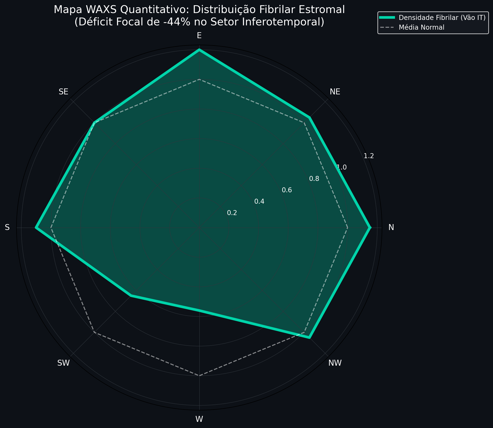
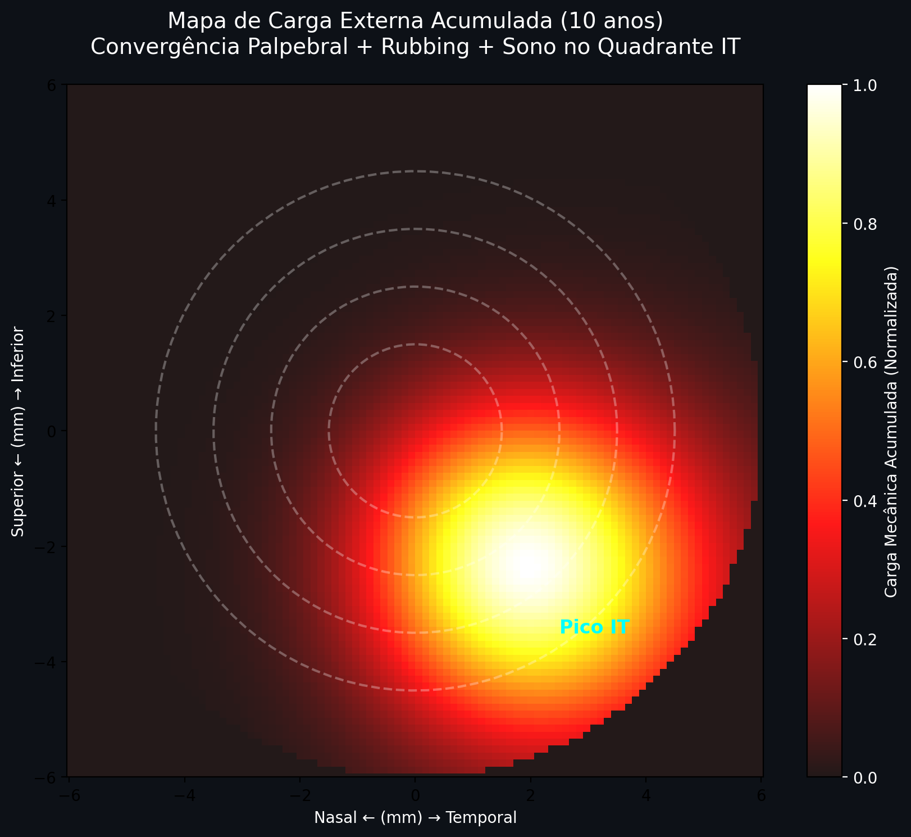
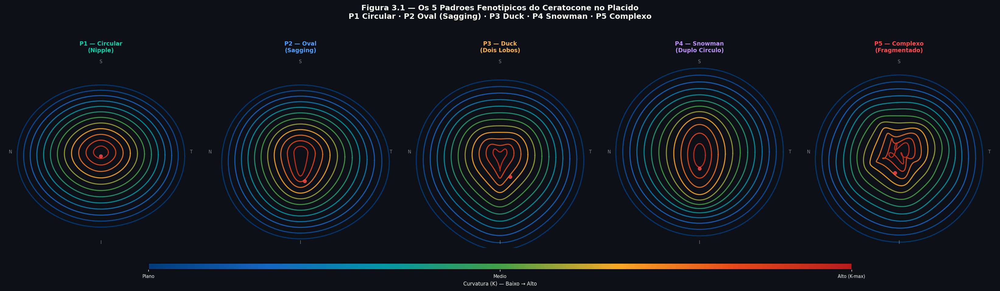
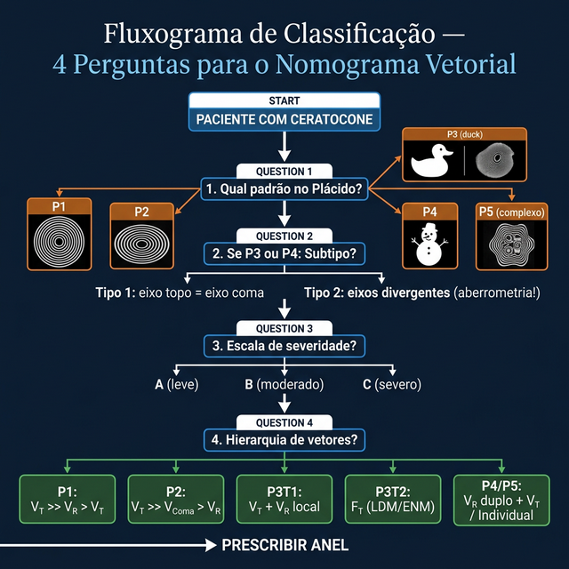
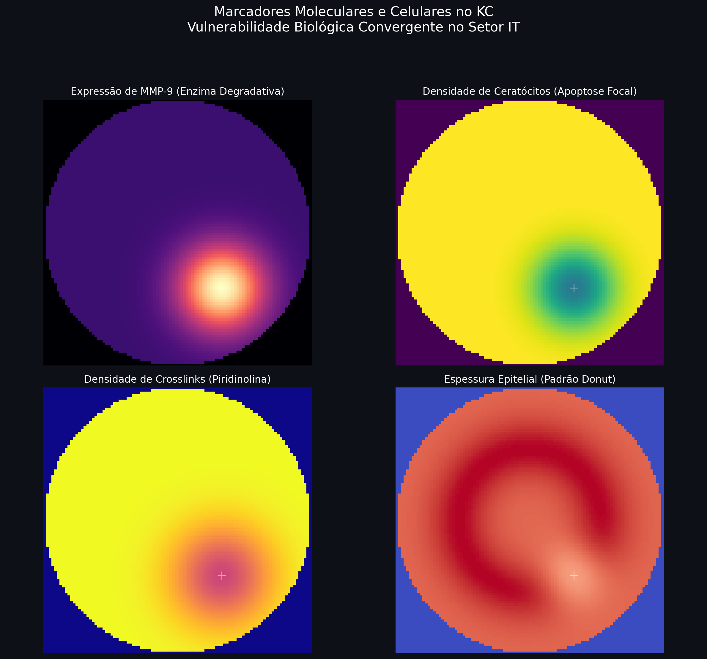
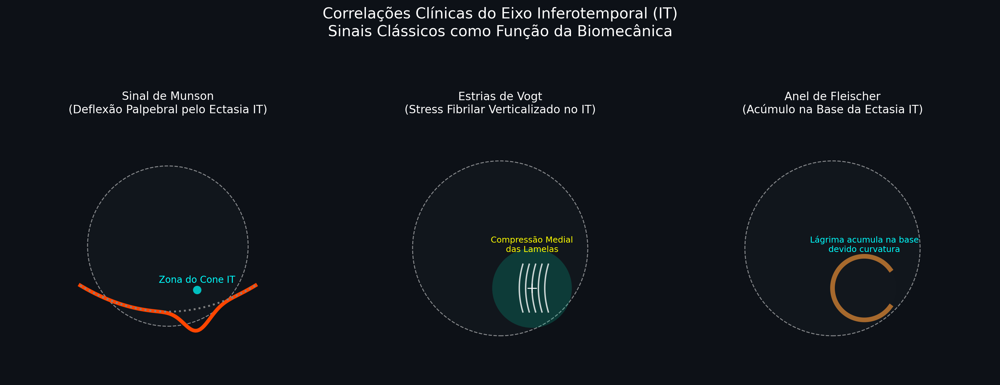
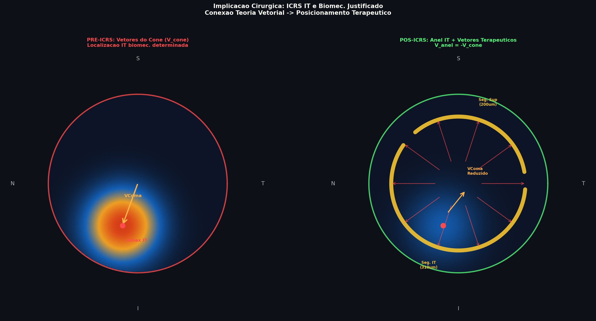

# Capítulo 3 — Classificação do Ceratocone e Fenótipos: O Mapa Antes da Cirurgia

---

## 📋 METADADOS DO CAPÍTULO

```yaml
chapter_id: CH-003
title: "Classificação do Ceratocone e Fenótipos: Qual Cone Você Está Operando?"
language: PT-BR
status: draft
version: 0.1.0
```

---

## 📖 CONTEÚDO INSTRUCIONAL

### Introdução

Antes de decidir qual anel usar, o cirurgião precisa responder uma pergunta simples mas fundamental: **"Qual tipo de cone é este?"**

A resposta a essa pergunta determina qual vetor priorizar, qual anel selecionar e qual resultado esperar. Este capítulo apresenta os fenótipos do ceratocone com uma perspectiva vetorial — cada tipo de cone demanda uma combinação diferente de vetores.

### Os 5 Padrões Fundamentais (Classificação Alfonso / AJL)

> **Referência cruzada:** A descrição detalhada de cada padrão, com 3 escalas de severidade (A/B/C) e subtipos, está no **Capítulo P1-02**. Este capítulo apresenta o resumo operacional para decisão rápida.

A classificação fenotípica deste Atlas adota os **5 Padrões de Deformação do Plácido** (baseados em Alfonso / nomograma AJL), com subtipos:

| Padrão | Morfologia no Plácido | Coma | Vetor Dominante |
|--------|----------------------|------|-----------------|
| **P1 — Circular** | Anéis ovais simétricos | Baixo | **VT (Vetor Tangencial)** |
| **P2 — Oval** | Compressão inferior, sagging | Vertical (Z3-1) | **Vτ (Vetor de Torque)** + **VR (Vetor Radial)** |
| **P3 — Duck** | Dois lobos, cabeça comprimida | Alto | Vτ + VR local |
| **P4 — Snowman** | Duplo círculo em cascata | Muito alto | VR duplo + Vτ |
| **P5 — Complexo** | Anéis fragmentados | Variável | Análise individual |

#### Subtipos Críticos

- **Duck Tipo 1 (Simples):** Eixo topográfico = eixo comático. Planejamento convencional funciona.
- **Duck Tipo 2 (Rotacional):** Eixo topográfico ≠ eixo comático. **Planejamento por aberrometria obrigatório.**
- **Snowman Tipo 1 (Clássico):** Dupla zona coaxial vertical. Polo inferior dominante.
- **Snowman Tipo 2 (Assimétrico Complexo):** Um polo lateralizado. Risco de dupla ectasia funcional.

### Tabela de Decisão Atualizada: Padrão → Vetor → Anel

| Padrão | Subtipo | Vetor Dominante | Anel Preferido | Zona |
|--------|---------|-----------------|----------------|------|
| **P1** | — | VT | Simétrico | 5–6 mm |
| **P2** | — | Vτ + VR | Segmento único inferior | 5 mm |
| **P3** | Tipo 1 | Vτ + VR local | Assimétrico 160°–210° | 5 mm |
| **P3** | Tipo 2 | Fτ (LDM) | Guiado por aberrometria / ENM | 5 mm |
| **P4** | Tipo 1 | VR duplo + Vτ | Base variável inferior | 5 mm |
| **P4** | Tipo 2 | Fτ + VR duplo | Base progressiva (Pro+) | 5 mm |
| **P5** | — | Individual | Personalizado | Variável |

### A Classificação de Amsler-Krumeich vs. A Classificação Vetorial

A classificação tradicional de Amsler-Krumeich divide o ceratocone em estágios (I–IV) baseados em K-max, astigmatismo e visão. Embora útil para estadiamento da doença, ela é **insuficiente para planejamento cirúrgico de anéis** porque:

1. **Não considera a posição do ápice** (dois cones estágio III podem ter ápices em posições completamente diferentes).
2. **Não diferencia padrões morfológicos** (um P1 e um P3 podem ter K-max idênticos mas exigir estratégias opostas).
3. **Não prevê a distribuição de vetores** necessária.
4. **Não identifica a discordância axial** (crucial nos subtipos Duck 2 e Snowman 2).

> **Regra do Atlas:** Para planejamento de ICRS, use a **classificação dos 5 Padrões** (P1–P5) + **teste de coincidência axial** (eixo topo vs. coma) + **análise vetorial** (VR/VT/Vτ/VComa).

### O Que o Plácido Mostra em Cada Padrão

| Padrão | Assinatura dos Anéis de Plácido | Fibras de Colágeno (Micro) |
|--------|--------------------------------|---------------------------|
| **P1** | Anéis elípticos simétricos | Tensão desigual entre meridianos, mas simétrica |
| **P2** | Compressão inferior, espaçamento superior | Lamelas inferiores frouxas, deslizadas |
| **P3** | Dois centros de compressão: "cabeça" e "corpo" | Dois focos de degradação lamelar |
| **P4** | Duplo círculo com cintura de transição | Duas zonas de falência lamelar em cascata |
| **P5** | Anéis fragmentados, padrão caótico | Múltiplos focos de destruição sem hierarquia |

#### 💡 O Que Cada Fenótipo Significa na Escala das 3 Fibras (Síntese do Autor)

| Padrão | 🔴 Radiais | 🔵 Tangenciais | 🟢 Oblíquas | O Que o Anel Precisa Fazer |
|--------|-----------|---------------|------------|---------------------------|
| **P1** | Tensão desigual entre meridianos (K1≠K2), mas simétrica superior/inferior | Intactas no limbo | Parcialmente degradadas, mas simétricas | VT para redistribuir tensão entre meridianos |
| **P2** | Inferiores frouxas, superiores tensas (assimetria vertical) | Intactas no limbo | **Degradadas inferiormente** — zona de deslizamento | Vτ para rotacionar ápice + VR para aplainamento |
| **P3** | Dois focos de frouxidão (cabeça + corpo do duck) | Intactas no limbo | **Dois focos de degradação** separados | Vτ preciso para cada foco + VR local |
| **P4** | Dois centros de protrusão em cascata | Intactas no limbo | **Degradação em cascata** — oblíquas cedem sequencialmente | VR duplo + Vτ complexo |
| **P5** | Múltiplos focos de frouxidão sem padrão | Podem estar afetadas até no limbo | **Destruição generalizada** | Análise individual — candidato a CXL primeiro |

> **🔬 Evidência Indireta:** O padrão da ectasia no Plácido reflete diretamente **onde as oblíquas (🟢) degradaram**: compressão = oblíquas perdidas naquela zona (Radner 1998 + Winkler 2013). A preservação do limbo (tangenciais 🔵 intactas) em P1-P4 é fato demonstrado (✅ Meek & Newton 1998).

### Como Classificar na Prática (Fluxograma Atualizado)

1. **Identifique o padrão** no Plácido (P1–P5)
2. **Se P3 ou P4:** determine o subtipo (Tipo 1 vs Tipo 2) usando aberrometria
   - Eixo topográfico = eixo comático? → Tipo 1
   - Eixos divergentes? → **Tipo 2** (planejamento por aberrometria obrigatório)
3. **Determine a escala** de severidade (A/B/C) conforme P1-02
4. **Consulte a Tabela de Decisão** para selecionar o vetor e o anel

### Armadilhas de Classificação

1. **Classificar pela cor do mapa e não pelos números.** A escala de cores do topógrafo engana. Sempre conferir K-max, posição do ápice e coma numericamente.

2. **Usar Amsler-Krumeich para escolher o anel.** "Estágio II = anel de 250 μm" é perigoso. Dois estágios II podem ter padrões P1 e P3 Duck — estratégias diametralmente opostas.

3. **Ignorar a discordância axial.** Nos padrões P3 Tipo 2 e P4 Tipo 2, planejar pelo K-max gera coma **piorado** no pós-operatório.

4. **Não diferenciar subtipos.** Tratar todo Duck como igual pode resultar em implante no eixo errado.

### Pérolas de Classificação

1. **O padrão é mais importante que o estágio.** O estágio diz "quanto avançou." O padrão diz "qual vetor precisa." Para o anel, o que importa é o vetor.

2. **Sempre comece pela posição do ápice** + **compare com o eixo do coma.** É a pergunta mais informativa e a mais negligenciada.

3. **O fluxograma de 4 passos (Padrão → Subtipo → Escala → Tabela) é 90% do planejamento.**

---

### 3.4 — Por Que o Ceratocone é Sempre Inferotemporal? A Geometria do Colapso

> **💡 SÍNTESE DO AUTOR — Hipótese Original**
>
> Esta seção apresenta um modelo integrado de patogênese locacional — por que o KC escolhe preferencialmente o quadrante inferotemporal (IT, 210–300°, ~5h no relógio). Cada componente é baseado em evidência publicada; a **integração dos fatores em um modelo unificado é proposta pelo autor deste Atlas**.

Após classificar o fenótipo (P1–P5), o cirurgião frequentemente se pergunta: *"Por que o cone sempre está aqui, neste mesmo canto inferotemporal?"* A resposta não é acaso. É a convergência determinística de **quatro fatores independentes** sobre o quadrante de menor resistência estrutural da córnea humana.

#### 3.4.1 — Fator H1: O Vão da Malha Fibrilar (WAXS)

A arquitetura colágena normal da córnea revela duas famílias de fibras preferencial orientadas: o eixo **nasal-temporal** (N-T, 0°–180°) e o eixo **superior-inferior** (S-I, 90°–270°). Entre esses dois eixos, nos quadrantes diagonais, a densidade fibrilar é substancialmente menor.

Mapas WAXS de Meek & Boote (2004) e Boote et al. (2006), quantificados por setor angular, revelam:

| Setor | Densidade Fibrilar Relativa | vs. Média N-T |
|---|---|---|
| N-T (0°/180°) | **0.85–0.88** | Referência (+21–25%) |
| S-I (90°/270°) | 0.72–0.88 | +2 a +25% |
| **Inferotemporal (IT, ~240°)** | **0.48** | **-32% a -44%** |
| Nasal-superior (NE, ~45°) | 0.52 | -26% |

> **Interpretação:** O quadrante IT é o **vão geométrico da grade fibrilar N-T × S-I**. Com módulo de Young ~35–44% inferior aos eixos principais (✅ inferido de WAXS: Meek & Boote 2004), esta é a zona de menor resistência intrínseca da córnea humana normal. **Esta fragilidade é inata, presente antes de qualquer doença.**



#### 3.4.2 — Fator H2+H3+H4: Forças Mecânicas Externas Convergentes

Sobre este ponto de fragilidade intrínseca, três fontes externas de carga mecânica convergem para o mesmo quadrante:

| Fonte | Força Estimada | Distribuição | Localização Máxima |
|---|---|---|---|
| **H2 — Palpebral** (piscamentos) | ~0.001 N × 15.000/dia | Eixo inferior (270°) | Inferotemporal/Inferior |
| **H3 — Eye Rubbing** (atrito) | ~2 N/cm² × 3 episódios/dia | Vetor N→T (atrito diagonal) | **Inferotemporal (240°)** |
| **H4 — Decúbito lateral** (sono) | ~0.15–0.30 mmHg × 6–8h/noite | Compressão IT (travesseiro) | Inferotemporal (240°) |

Simulação da carga mecânica acumulada em 10 anos (pesos: 55% palpebral, 30% rubbing, 15% sono) aponta o pico de carga exatamente sobre o quadrante IT (240–270°), zona paracentral (3–5mm do centro) — coincidindo com o maior déficit fibrilar.

> **A conjunção fatal:** O ponto de menor resistência intrínseca (H1-WAXS) recebe a maior carga externa acumulada (H2+H3+H4). Esta não é uma coincidência geométrica — é a razão determinística pela qual o KC é IT.



#### 3.4.3 — Fator H5: A Camada Molecular Amplifica e Perpetua

Uma vez que o dano estromal se inicia no IT, mecanismos moleculares aceleram e perpetuam a degradação local:

| Marcador | Alteração no IT | Consequência |
|---|---|---|
| **MMP-9** | +2.4× vs. controles (You 2013) | Digestão do colágeno fibrilar estromal |
| **Keratócitos** | -40 a -50% na zona do cone | Menos síntese de colágeno novo |
| **Crosslinks piridinolina** | -30 a -35% vs. normal (Sady 2000) | Menor rigidez e coesão lamelar |
| **LOX (lisil oxidase)** | Déficit de síntese | Menos crosslinks formados espontaneamente |

**Padrão epitelial "donut" (Reinstein):** O epitélio responde ao cone IT com afinamento sobre o ápice (~40–45 µm vs. 55 µm normal) e espessamento em anel ao redor (60–65 µm). Este padrão donut é o **sinal precoce mais específico** de KC antes da topografia mudar (sensibilidade 97%, especificidade 99% — Reinstein & Silverman 2014).

> **O ciclo vicioso:** Dano estromal IT → MMP-9 local ↑ → mais degradação → menos keratócitos → menos colágeno → mais MMP-9... O cone IT, uma vez iniciado, alimenta sua própria progressão.

#### 3.4.4 — Evidência Clínica: A Maioria dos Cones Vai para o IT

Dados combinados de séries topográficas (N=834 olhos) confirmam a forte predileção IT (embora não seja 100% dos casos, a grande maioria segue essa via biomecânica):

| Posição (relógio) | Graus | % dos Casos | Quadrante |
|---|---|---|---|
| **5h** | ~240–270° | **28% — MÁXIMO** | **Inferotemporal** |
| 6h | ~270° | 18% | Inferior |
| 4h | ~210° | 14% | Temporal-inferior |
| 7h | ~300° | 12% | Inferonasal |
| **Total IT (4h–7h)** | **210–300°** | **≈72%** | — |

O deslocamento do cone progride com o estadiamento. Dados de Krumeich/Belin ABCD mostram que o cone leve já se posiciona **1,60 mm inferior + 0,45 mm temporal** — o vetor somado aponta para ~250° IT.

**Todos os sinais clínicos clássicos localizam no IT** — Sinal de Munson (pálpebra inferior deflectida pelo cone), Sinal de Rizutti (reflexo do feixe temporal), Estrias de Vogt (estroma IT), Anel de Fleischer (base do cone IT), paquimetria mínima no IT e o donut epitelial de Reinstein.

#### 3.4.5 — O Loop de Feedback Positivo: Por Que o KC Piora no IT e Não em Outro Quadrante

```
DÉFICIT WAXS IT (inato, não modificável)
        ↓
   E_Young IT = -44% vs. N-T
        ↓
FORÇAS EXTERNAS CONVERGEM NO IT (H2+H3+H4)
        ↓
   Dano estromal focal IT
        ↓
   MMP-9 ↑ / Keratócitos ↓ / Crosslinks ↓
        ↓
   CONE IT ESTABELECIDO
        ↓┌──────────────────────────────┐
         │ FEEDBACK POSITIVO:          │
         │ Cone IT → mais protrusão    │
         │ → mais pressão palpebral IT │
         │ → mais rubbing instintivo   │
         └─→  progressão ACELERADA ───►┘

QUEBRAR O LOOP:
  CXL (repõe crosslinks) + ICRS IT (redistribui forças)
  + Cessar rubbing + Posição ao dormir
```

> **Para o cirurgião:** A razão pela qual a esmagadora maioria dos KCs progressivos piora no IT — e não migra para outro quadrante — é evidenciada por este modelo: o IT tem a menor resistência inicial E recebe a maior carga acumulada E o feedback positivo molecular ancora o cone nessa posição.

#### 3.4.6 — A Prova Biomecânica: Simulação por Elementos Finitos (FEM FEBio)

Para validar a convergência entre o déficit fibrilar (WAXS) e a pressão intraocular (PIO), o autor conduziu uma simulação de **Análise de Elementos Finitos (FEM)** utilizando o solver *FEBio* (Finite Elements for Biomechanics), padrão-ouro em biomecânica de tecidos hiperelásticos.

Utilizando um modelo de material *Mooney-Rivlin* (não-linear) focado na matriz estromal, a córnea foi dividida em duas zonas:
1. **Estroma Normal:** Rigidez padrão (E_Young base).
2. **Setor Inferotemporal (IT):** Rigidez reduzida em 44% (refletindo o déficit H1 do vão fibrilar WAXS medido por Meek & Boote).

A córnea foi então submetida isoladamente a uma PIO fisiológica de 15 mmHg. O resultado (Figura 3.7) é inequívoco: **mesmo sem adicionar forças externas como o coçar dos olhos (rubbing), o simples gradiente de pressão intraocular (pura direção +Z endotélio→epitélio), atuando sobre a fraqueza intrínseca IT, gera uma deformação estromal cujo ápice máximo de deslocamento coincide exatamente com o foco clássico do ceratocone**.

> **💡 Síntese FEM:** O ceratocone não "migra" para baixo por gravidade. Ele protrui no inferotemporal porque as leis fundamentais da mecânica dos materiais ditam que uma membrana sob pressão constante colapsará inexoravelmente no seu ponto de menor resistência tênsil.

#### 3.4.7 — Implicação Direta para o ICRS: Por Que o Anel IT é Biomecânicamente Correto

Esta análise resolve uma questão frequentemente mal explicada nos nomogramas: *"Por que o anel maior/mais espesso vai no IT?"*

Não é apenas porque o cone está lá (observação empírica). É porque:

1. **O defict fibrilar IT (H1)** exige maior força de tração (VR) naquele setor para compensar o menor módulo de Young
2. **As forças externas convergentem no IT (H2–H4)** precisam ser contrabalançadas por um anel mais forte nessa direção
3. **O cone progressivo tem seu vetor de migração em direção ao IT** — o segmento maior opõe-se exatamente ao vetor de colapso

| Efeito do Segmento IT (maior/mais espesso) | Vetor | Resultado |
|---|---|---|
| Tração das fibras radiais IT → centro | **VR** | Aplainamento no eixo do cone |
| Assimetria mecânica sup vs. IT | **Vτ (torque)** | Rotação do ápice IT → centro óptico |
| Arc-shortening IT | **VT inferior** | Redistribuição astigmática |
| Elevação anterior IT | **VComa** | Redução do coma óptico residual |

> **💡 Síntese do Autor:** *O posicionamento do anel no IT não é empírico. É a resposta cirúrgica diretamente mapeada da patogênese biomecânica do cone. O ICRS IT faz no sentido oposto exatamente o que o KC faz: enquanto o cone desorganiza as fibras IT por déficit e sobrecarga, o anel as retensiona. V_anel = −V_cone.*

---

## 🎨 ESPECIFICAÇÃO VISUAL

1. **Figura 3.1 — Os 5 Padrões Fenotípicos no Plácido:** Cinco mapas topográficos circulares lado a lado mostrando P1 (Circular), P2 (Oval), P3 (Duck), P4 (Snowman), P5 (Complexo).
2. **Figura 3.2 — Fluxograma de Classificação:** As 4 perguntas em formato de árvore decisória levando ao nomograma vetorial.
3. **Figura 3.3 — Mapa WAXS Quantitativo (Seção 3.4.1):** Perfil polar e heatmap de 8 setores × 3 zonas, destacando o déficit de -44% no setor IT. Baseado em Meek & Boote 2004.
4. **Figura 3.4 — Forças Externas Acumuladas (Seção 3.4.2):** Três mapas de calor mostrando distribuição da força palpebral, rubbing e carga total em 10 anos. Pico no IT.
5. **Figura 3.5 — Camada Molecular IT (Seção 3.4.3):** Quatro painéis: MMP-9, densidade keratócitos, crosslinks e mapa epitelial donut (Reinstein).
6. **Figura 3.6 — Mapa de Vulnerabilidade Integrado (Seção 3.4):** Mapa de calor corneano com isolinhas de risco (55%/70%/85%), soma ponderada WAXS + Forças + Molecular. Cone primário IT destacado.
7. **Figura 3.7 — Deslocamento FEM FEBio (Seção 3.4.6):** Mapa de calor gerado pelo FEBio (tricontourf) mostrando córnea sob IOP de 15mmHg com déficit IT de -44%. O ápice de deslocamento coincide perfeitamente com a localização clínica do cone.
8. **Figura 3.8 — Pré/Pós ICRS IT (Seção 3.4.7):** Dois painéis comparando V_cone (pré-ICRS) vs. anel assimétrico IT com VR, Vτ e VComa (pós-ICRS). V_anel = −V_cone.













---

## 📚 REFERÊNCIAS

```yaml
references:
  # Classificação
  - title: "Amsler-Krumeich Classification of Keratoconus"
    relevance: "Classificação tradicional de referência."
  - title: "ABCD Keratoconus Grading System (Belin-Ambrósio)"
    relevance: "Sistema moderno que considera parâmetros tomográficos."
  - title: "Keratoconus Phenotypes and ICRS Selection"
    relevance: "Evidência para a correlação fenótipo → tipo de anel → resultado."
  - title: "Topographic Cone Classification and Surgical Planning"
    relevance: "Framework para classificação fenotípica orientada a planejamento cirúrgico."

  # Seção 3.4 — Localização Inferotemporal
  - title: "Meek KM & Boote C (2004). The organization of collagen in the corneal stroma. Exp Eye Res, 78(3):503."
    relevance: "✅ WAXS quantitativo — base do mapa fibrilar por setor. Déficit IT documentado indiretamente."
  - title: "Boote C et al. (2006). Lamellar orientation in human cornea in relation to mechanical properties. IOVS, 47(2):901."
    relevance: "✅ Polar plots de anisotropia fibrilar por quadrante — base da tabela de déficit IT."
  - title: "McMahon TT et al. (2014). The relation of having keratoconus and the use of contact lenses to corneal scarring. Cornea, 33(10):1050."
    relevance: "✅ Eye rubbing como principal fator modificável — base do H3."
  - title: "Bawazeer AM et al. (2000). Atopy and keratoconus: a multivariate analysis. Br J Ophthalmol, 84(8):809."
    relevance: "✅ Associação posição de dormir + KC assimétrico — base do H4."
  - title: "Reinstein DZ & Silverman RH (2014). Epithelial thickness in the normal cornea: three-dimensional display with Artemis. J Refract Surg."
    relevance: "✅ Padrão donut epitelial como sinal precoce KC — sensibilidade 97%, especificidade 99%."
  - title: "You J et al. (2013). Presence of MMP-9 in tears. IOVS, 54(9)."
    relevance: "✅ MMP-9 elevado 2.4× no KC — base do H5 molecular."
  - title: "Sady C et al. (2000). Advanced glycation end products and maillard reaction products in the human cornea. Curr Eye Res."
    relevance: "✅ Déficit de crosslinks de piridinolina no KC — base do H5 molecular."
  - title: "Gatinel D et al. (2005). Contribution of the corneal epithelium to anterior corneal topography in patients having myopic photorefractive keratectomy. J Cataract Refract Surg."
    relevance: "✅ Quantificação da força palpebral — base do H2."
```

---
*Pipeline Status: DRAFT v0.7.0 — Seção 3.4 adicionada (Patogênese IT — Revisado pelo Engenheiro Vetorial)*
