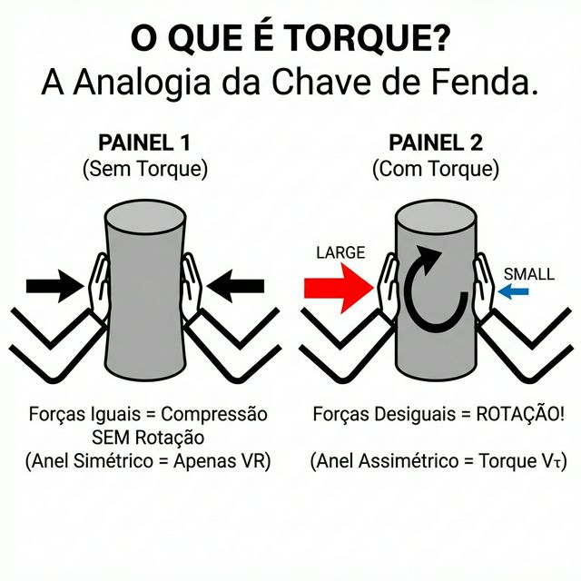
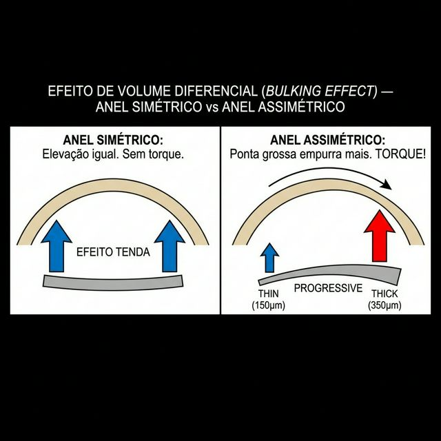
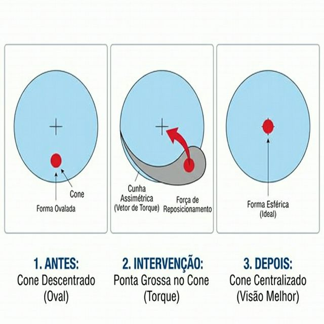
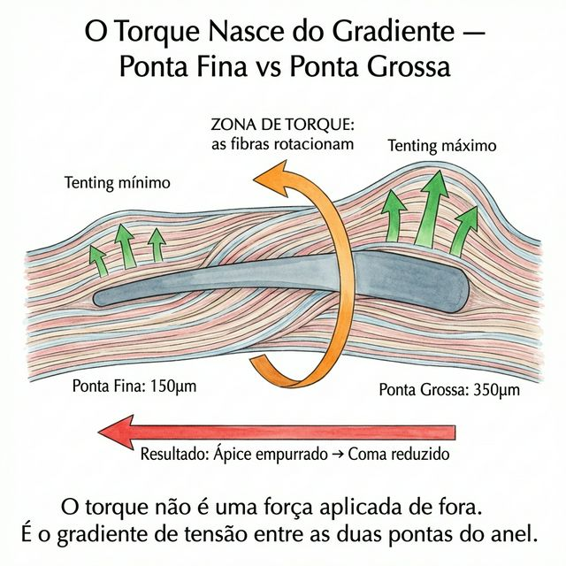

# Capítulo 6 — Vτ: O Vetor de Torque (Torção Assimétrica)

---

## 📋 METADADOS DO CAPÍTULO

```yaml
chapter_id: CH-006
title: "Vτ — O Vetor de Torque: Torção Assimétrica e Correção do Astigmatismo Irregular"
language: PT-BR
status: approved
version: 0.1.0
```

---

## 🔬 NÚCLEO CIENTÍFICO

```yaml
vector_type: Vτ (Vetor de Torque)
biomechanics_base: "Forças rotacionais/torcionais geradas por assimetria volumétrica do segmento de anel (espessura progressiva e/ou base progressiva)"
phenotype_target: "Cones ovais (sagging), astigmatismos irregulares, descentrações moderadas"
clinical_indication: "Regularização topográfica de astigmatismos irregulares; correção de eixos oblíquos; redistribuição assimétrica da carga estromal"
expected_outcome: "Rotação e regularização do eixo astigmático; redução da diferença entre hemi-meridianos (redução da assimetria inferior/superior)"
```

---

## 📖 CONTEÚDO INSTRUCIONAL

### Definição

O **Vetor de Torque (Vτ)** é a terceira força biomecânica fundamental do sistema vetorial do anel intracorneano. Enquanto o **VR (Vetor Radial)** (Capítulo 4) aplaina o centro e o **VT (Vetor Tangencial)** (Capítulo 5) redistribui o astigmatismo ao longo do eixo do anel, o **Vτ é a força rotacional que nasce da assimetria do próprio implante**. Na convenção F/V do Atlas (Cap. 2): Vτ neutraliza a **Fτ (Força Torsional)** do cone.

Em linguagem simples: o Vetor de Torque é o que acontece quando um lado do anel é mais gordo que o outro.

---

### 🎯 Vτ — Plano de Ação e Distinção dos Outros Vetores

> **Este é o ponto crítico para não confundir os vetores.** VR, VT e Vτ atuam em planos e producem consequências distintas. O Vτ é o único que gera **momento rotacional** — e por isso é o único que move o ápice do cone.

| | **VR — Vetor Radial** | **VT — Vetor Tangencial** | **Vτ — Vetor de Torque** |
|--|--|--|--|
| **Origem** | Espessura uniforme do anel | Comprimento do arco | Assimetria de espessura (Δt) |
| **Plano primário** | Fibrilar XY (arc-shortening radial) | Fibrilar XY (fibras circunferenciais) | Rotacional XY (gradiente volumétrico) |
| **Ação nas fibras** | Tensiona fibras radiais 🔴 simétricamente | Tensiona fibras tangenciais 🔵 ao longo do arco | Cria gradiente de tensão entre lamelas → **momento de torção** |
| **Consequência axial (Z)** | Aplainamento central (Z−) | Redistribuição de curvatura entre meridianos | Deslocamento lateral do ápice (eixo pupilar XY) |
| **O que move** | Superfície desce centralmente | Astigmatismo redistribuído | **Ápice do cone se reposiciona** |
| **Aberração corrigida** | Defocus esférico | Astigmatismo irregular | **Coma vertical/horizontal** |
| **Anel ideal** | Simétrico (qualquer) | Arco longo | **Assimétrico (progressivo)** |

> **Regra de ouro:** VR e VT atuam no plano das fibras (XY) gerando consequências axiais (Z). Vτ atua no plano rotacional (XY) gerando consequência lateral (deslocamento do ápice no plano XY). Nenhum dos três é uma "força axial" primária — a PIO (Fr) é a única força axial patológica do sistema.

---

### Explicação Didática: A Origem da Torção

#### O Anel Simétrico vs O Anel Assimétrico

Para entender o Vetor de Torque, precisamos primeiro entender o que acontece quando quebramos a simetria de um implante.

**Anel Simétrico (sem torque):**
Um segmento de anel com espessura uniforme (ex: 250 μm em toda a extensão) gera uma força de aplainamento (VR) e uma redistribuição tangencial (VT) igualmente distribuídas ao longo de todo o seu arco. As forças são simétricas. Não há rotação.

**Anel Assimétrico (com torque):**
Agora imagine um segmento onde a espessura **aumenta progressivamente** de uma ponta à outra (ex: 150 μm numa ponta → 350 μm na outra). A ponta grossa empurra o estroma muito mais do que a ponta fina. Essa diferença de força volumétrica entre as duas extremidades de um mesmo segmento cria um **momento de torção** — uma força que tenta "girar" ou "torcer" o tecido corneano ao redor do implante.

#### A Analogia da Alavanca de Torção (Chave de Fenda)

Imagine que você está tentando girar um parafuso (a córnea deformada) usando uma chave de fenda.

- Se você empurra com **força igual** dos dois lados da chave, ela não gira — apenas empurra para a frente (isso é o Vetor Radial).
- Mas se você empurra com **mais força de um lado** do que do outro, a chave **gira** — isso é Torque puro.

O anel assimétrico faz exatamente isso. A ponta grossa do segmento empurra com muito mais força do que a ponta fina. Essa diferença de força cria uma rotação localizada do tecido estromal — o Vetor de Torque.



#### O Efeito de Volume Diferencial (*Bulking Effect*)

A consequência biomecânica direta dessa assimetria é o chamado **Efeito de Volume Diferencial** (*Differential Bulking Effect*):

- Na região onde o anel é mais espesso, ocorre uma **separação lamelar massiva** — as lamelas são afastadas de forma muito pronunciada (grande separação interstromal local).
- Na região onde o anel é fino, ocorre apenas uma **separação mínima** — quase sem efeito local.
- Esse gradiente de levantamento — forte de um lado, suave do outro — cria uma **transição de curvatura local** (*local curvature transition*).

É como se o implante assimétrico "inclinasse" o tecido estromal, girando-o: a zona de maior elevação (ponta grossa) força o cone a se reposicionar, puxando o ápice da protrusão na direção da zona mais fina.



#### 🔬 Evidência Clínica Quantitativa (Estudos Publicados — AJL PRO+)

A literatura confirma o poder torcional da assimetria geométrica. Os estudos abaixo, independentes, avaliaram o anel **AJL PRO+** (perfil com base e espessura progressivas) e demonstram a eficácia do Vτ em reduzir o cilindro e o coma vertical primário:

> **📝 Nota de atribuição:** Os dados abaixo referem-se a estudos clínicos publicados individualmente sobre o anel AJL PRO+, não a uma meta-análise formal. O termo "Projeto ICE" refere-se ao banco de dados do autor para síntese e análise comparativa — não a uma meta-análise publicada.

| Estudo / Implante | Redução do Cilindro (D) | Redução do Coma (RMS) |
|---|---|---|
| **Kammoun (2021) — AJL PRO+** | -4.14 D → -1.66 D | Redução significativa |
| **Cuiña-Sardiña (2020) — AJL PRO+** | -2.92 D → -2.13 D | 3.54 μm → 2.12 μm |
| **Benlarbi (2023) — AJL PRO+** | N/A | 1.62 μm → 0.99 μm |

> **Dado Crítico:** A redução de até 60% no coma primário (Cuiña-Sardiña) prova o Efeito de Volume Diferencial. O anel assimétrico forçou a migração do ápice inferior (sagging) em direção ao centro estrutural.

### Modelo Vetorial Formal

O Vetor de Torque é determinado pelo **gradiente de espessura** ao longo do segmento:

```
Vτ = f(Δt, L, θ_implante)

Onde:
  Δt = diferença de espessura entre a ponta grossa e a ponta fina (μm)
  L  = comprimento do arco do segmento (graus)
  θ_implante = posição angular do segmento em relação ao eixo do astigmatismo
```

**Regra Fundamental:**
- Quanto maior o Δt (gradiente de espessura), maior o momento de torção.
- O Vetor de Torque é **máximo** quando a ponta grossa do segmento é posicionada diretamente sob o ápice do cone (zona de máxima protrusão).
- O Vetor de Torque é **mínimo** (quase zero) em anéis simétricos.

### Aplicação Clínica e Arquitetura Cirúrgica

#### Fenótipo Ideal: Cone Oval (Sagging)

O Vetor de Torque é o vetor dominante na correção de **cones ovais** (*sagging cones*) — cones onde o ápice da protrusão está deslocado inferiormente, longe do eixo visual. Nesses fenótipos:

- O ápice do cone não coincide com o eixo pupilar (descentrado para baixo)
- O astigmatismo é marcadamente **irregular** (assimetria entre hemi-meridianos superior e inferior)
- A aberração óptica dominante é **coma vertical** (*vertical coma*), e não mero defocus central

Um anel simétrico (que gera apenas VR e VT puros) seria insuficiente: ele aplainaria o centro visual, mas o ápice real do cone — que está deslocado para baixo — permaneceria protuso, gerando coma residual e astigmatismo irregular.

#### A Estratégia Assimétrica: Ponta Grossa no Cone

O cirurgião posiciona o segmento de anel de modo que **a ponta mais grossa** do segmento fique diretamente sob a zona de maior protrusão (o ápice do cone). Isso gera:

1. **Levantamento máximo sob o ápice do cone** (VR potente localizado).
2. **Torque rotacional que puxa o ápice para cima** (em direção ao eixo visual), regularizando a posição do cone.
3. **Gradiente de curvatura suavizado** — a transição abrupta entre a zona protusa (quente) e a zona saudável (fria) se torna gradual, reduzindo o coma.



#### Assimetria Funcional de Dois Segmentos

Nos nomogramas de cones descentrados (Ferrara/Keraring), é comum usar:
- **Segmento inferior: mais espesso** (ex: 300 μm) — para maximizar VR + Vτ sob o cone
- **Segmento superior: mais fino** (ex: 200 μm) — para manter suporte radial sem agredir a zona saudável

Essa combinação gera um **torque líquido** que reposiciona o eixo visual do paciente, rotaciona o ápice do cone e corrige simultaneamente o astigmatismo irregular.

| Parâmetro | Anel Simétrico | Anel Assimétrico |
|-----------|----------------|------------------|
| Espessura | Uniforme (ex: 250 μm) | Progressiva (150→350 μm) |
| Vetor Radial | Distribuído igualmente | Concentrado na ponta grossa |
| Vetor Tangencial | Simétrico | Assimétrico |
| **Vetor de Torque** | **≈ 0** | **Presente e clinicamente relevante** |
| Fenótipo ideal | Cone central (nipple) | Cone oval (sagging) |
| Aberração corrigida | Defocus | Coma + astigmatismo irregular |

### Armadilhas Comuns

1. **Usar anel simétrico em cone descentrado.** Este é o erro cardeal. Se o cone está deslocado inferiormente e o cirurgião implanta um anel simétrico (zero torque), o centro aplaina mas o ápice real permanece inalterado. O paciente pode até piorar: o *shift* do eixo visual sem correção do coma pode gerar aberrações novas.

2. **Orientação invertida do segmento progressivo.** Se a ponta grossa é colocada do lado errado (longe do cone em vez de sob o cone), o torque empurra na direção errada, agravando a descentração.

3. **Excesso de torque.** Um gradiente de espessura muito agressivo (Δt > 200 μm) em uma córnea fina no ápice pode causar afinamento crítico e risco de extrusão na zona do cone (a zona mais vulnerável da córnea).

### Pérolas Clínicas (*Pearls*)

1. **O Vτ é o "direcionador" do cone.** Pense nele como um volante que decide PARA ONDE o ápice corneano será empurrado. O VR decide "quanto aplaina", o VT decide "como redistribui o astigmatismo", e o Vτ decide **"para onde o cone vai se mover"**.

2. **Coma = Torque.** A única maneira biomecânica eficiente de reduzir coma corneano com anel é gerar torque. Um anel simétrico tem capacidade muito limitada de corrigir coma — age primariamente sobre defocus (VR), sem o gradiente rotacional que reposiciona o ápice. Memorize: **Coma eficiente precisa de Torque (Vτ), não de VR isolado.** *(Evidência indireta: Kammoun 2021, Cuiña-Sardiña 2020 — anéis assimétricos reduzem coma RMS 40–60% vs < 15% com simétricos.)*

3. **O Torque desaparece em anéis de 360°.** O MyoRing, sendo um anel completo sem pontas, tem Δt = 0 (espessura uniforme em toda a circunferência), portanto gera Vτ ≈ 0. Isso explica por que o MyoRing é excelente para cones centrais (nipple) mas limitado para cones ovais descentrados.

4. **Pense em pares assimétricos como "dupla diferenciada".** O segmento gordo é o "atacante" que vai resolver o cone; o segmento fino é o "goleiro" que dá suporte sem agredir. Não coloque dois atacantes ou dois goleiros.

---

### Escala Micro — O Que Acontece nas Fibras de Colágeno com o Vτ

> *O Torque é o vetor mais invisível nos mapas convencionais — mas o mais violento na escala das fibras. Ele acontece quando a geometria do implante força lamelas adjacentes a rotacionar em direções opostas.*

#### A Assimetria Lamelar que Gera Torção

Num cone oval (sagging), as lamelas inferiores não estão apenas esticadas — estão **deslocadas diferencialmente**. As fibras superficiais se moveram mais do que as profundas. O resultado é um **cisalhamento interlaminar** — camadas deslizando umas sobre as outras como cartas de um baralho sendo empurradas de um lado só.

Este cisalhamento é invisível no mapa de curvatura. Mas é a causa física do deslocamento do ápice e do coma vertical.

#### Como o Anel Assimétrico Gera Torque nas Fibras

Quando um segmento progressivo (espessura variável: 150 µm → 350 µm) é implantado:

1. **Ponta fina:** separação lamelar mínima. As fibras desviam suavemente por cima do implante. Tensão local moderada.
2. **Ponta grossa:** separação lamelar enorme. As fibras são forçadas a escalar uma "montanha" de PMMA. Tensão local altíssima.
3. **O gradiente de tensão** entre as duas pontas cria um **momento de torção** — as lamelas entre a ponta fina e a ponta grossa são submetidas a um campo rotacional de estresse.

**O efeito nas fibras:**
- As lamelas acima da ponta **grossa** são separadas de maneira massiva — gerando forte separação lamelar local (máxima)
- As lamelas acima da ponta **fina** são minimamente perturbadas
- A **transição** entre as duas zonas força as fibras a **rotarem seu eixo de orientação** — esta rotação é o Torque

```
PONTA FINA (150 µm):       PONTA GROSSA (350 µm):
  Lamelas: leve desvio        Lamelas: desvio massivo
  Separação: mínima           Separação: máxima
  Tensão: baixa               Tensão: altíssima

  ←————— GRADIENTE = TORQUE ——————→
  
  As fibras entre os dois extremos
  são ROTADAS pelo diferencial de força
  → O ápice do cone é EMPURRADO
     na direção da ponta fina
```



#### O Efeito de Reposicionamento do Ápice

A consequência do torque nas fibras é física e direta: como a ponta grossa gera levantamento muito maior que a ponta fina, o ápice da protrusão (que estava deslocado inferiormente) é **empurrado mecanicamente** em direção ao centro pupilar.

- **Antes:** ápice inferior + coma alto
- **Depois:** ápice mais centralizado + coma reduzido

Este é o único mecanismo mecânico real pelo qual um anel pode reduzir coma. Sem torque (anel simétrico), não há reposicionamento do ápice — apenas aplainamento.

---

### O Plácido Antes e Depois do Vτ

#### Antes (Cone Oval / Sagging — Sem Anel)

O disco de Plácido mostra:
- **Anéis comprimidos inferiormente** — alta densidade inferior, baixa densidade superior
- **Assimetria vertical extrema** — a metade inferior é "quente", a superior é "fria"
- **Ápice deslocado** — o centro de compressão dos anéis não coincide com o centro pupilar
- **Mapa de cores:** "ilha quente" oval escorrendo para baixo

#### Depois (Vτ Aplicado — Segmento Assimétrico Inferior)

O disco de Plácido mostra:
- **Anéis menos comprimidos inferiormente** — a densidade inferior diminuiu (a ponta grossa aplainou o polo inferior)
- **Recentramento parcial** — o centro de compressão dos anéis migrou em direção ao centro pupilar
- **Assimetria vertical reduzida** — a diferença de temperatura entre metades superior e inferior diminuiu
- **Mapa de cores:** a "ilha quente" encolheu, subiu e ficou mais centrada

> **Leitura Vetorial do Plácido:** O Vτ não muda apenas a curvatura — ele **rotaciona o padrão de deformação dos anéis**. Os anéis que antes mostravam compressão excêntrica inferior agora mostram compressão mais centrada. A "impressão digital mecânica" do cone mudou de posição — o que significa que as fibras subjacentes foram fisicamente reposicionadas.

---

## 🎨 ESPECIFICAÇÃO VISUAL PARA ILUSTRAÇÕES MÉDICAS

```yaml
primary_vector: Vτ (Vetor de Torque)
secondary_vectors: [VR, VT]
anatomical_view: cross_section
alternative_view: top_down
```

**Lista de Ilustrações a Gerar:**
1. **Figura 6.1 — A Analogia da Torção (Chave de Fenda):** Diagrama simplificado mostrando que a aplicação desigual de força em lados opostos gera rotação (torque). Dois painéis: Força igual (sem rotação) vs Força desigual (rotação).
2. **Figura 6.2 — Efeito de Volume Diferencial (Bulking Effect):** Diagrama comparativo em vista frontal mostrando um anel simétrico (elevação igual dos dois lados) vs anel assimétrico (elevação extrema num lado, suave no outro), com setas mostrando o torque resultante.
3. **Figura 6.3 — Reposicionamento do Cone (Sagging to Center):** Diagrama mostrando uma córnea com ápice descentrado inferiormente (cone oval/sagging), e uma seta longa mostrando como o Vetor de Torque rotaciona esse ápice DE VOLTA em direção ao eixo visual central.
4. **Figura 6.4 — Torque por Gradiente (Escala Fibrilar):** Diagrama comparativo ponta fina (150 µm, separação lamelar mínima, baixa tensão) vs ponta grossa (350 µm, separação lamelar máxima, tensão altíssima). Setas mostrando o gradiente de tensão entre os extremos e a rotação das fibras na zona de transição. Label: "Gradiente = Torque → ápice migra para ponta fina".

---

## 📚 REFERÊNCIAS

```yaml
references:
  - doi: "Semantic Scholar"
    title: "Asymmetric ICRS with Progressive Base Width and Thickness for Keratoconus"
    relevance: "Demonstra o efeito do gradiente de espessura (Δt) na correção diferencial de cones ovais — evidência primária do Torque Vector."
  - doi: "PMC"
    title: "A Comparative Study of Two ICRS Models in Keratoconus"
    relevance: "Dados comparativos entre anéis simétricos e assimétricos, demonstrando a superioridade do torque assimétrico em cones descentrados."
  - doi: "Journal of Refractive Surgery"
    title: "Coma Aberration Reduction After ICRS Implantation in Keratoconus"
    relevance: "Demonstra que a redução de coma é dominantemente associada à presença de Vτ (assimetria do implante), não ao VR."
  - doi: "AJL Ophthalmic Technical Manual"
    title: "Progressive Ring Segment Nomogram (Ferrara)"
    relevance: "Nomograma mostrando a lógica da orientação da ponta grossa em direção ao cone."
  - doi: "Avicenna Alliance"
    title: "FEM Simulation of Asymmetric ICRS Segments"
    relevance: "Simulações de elementos finitos mostrando a distribuição de estresse assimétrico causada por segmentos progressivos — validação computacional do Vτ."
```

#### 💡 O Vτ na Escala das Fibras (Síntese do Autor)

O Vτ é o vetor mais diretamente ligado às **fibras oblíquas** (🟢):

- As oblíquas são os "tirantes" que travam as lamelas entre si (✅ Radner 1998, Winkler 2013)
- No ceratocone, as oblíquas degradam **assimetricamente** — mais no ápice do cone, menos nas zonas saudáveis
- Esta assimetria de degradação gera **cisalhamento**: as lamelas deslizam mais onde há menos oblíquas
- O anel assimétrico (progressivo) gera **Vτ** porque cria um gradiente de **travamento mecânico** que espelha o gradiente original das oblíquas:
  - Ponta grossa = travamento forte (simula zona com oblíquas intactas)
  - Ponta fina = travamento suave (simula zona com poucas oblíquas)
  - O gradiente entre os dois → **rotação** (torque) → o ápice migra para a zona de maior travamento

> **💡 Síntese do Autor (Gemini Refinement):** O Vτ não "puxa" mecanicamente as fibras oblíquas que estão ausentes ou falhas no cone (isso seria impossível). O que ele faz é **substituir artificialmente o seu papel biomecânico**. Na córnea sã, a rede oblíqua confere o *interlamellar shear resistance* (travamento contra deslizamento). No ceratocone, as lamelas deslizam e o ápice protruí (desce). O anel assimétrico progressivo recria esse crosslink mecânico: a ponta grossa fornece resistência máxima ao cisalhamento, e a ponta fina oferece resistência mínima. Este **gradiente volumétrico de contenção** mimetiza as propriedades de torção do colágeno oblíquo perdido. (Baseado em: Radner 1998 + Winkler 2013 + FEM Avicenna)

---

## ✅ SKILL 9 — CHECKLIST EDITORIAL (Executive Chief Editor)

### Coerência Científica
- [x] **Mecanismo de gradiente rotacional correto** — A cadeia causal ponta grossa → gradiente de σ_VM → separação lamelar diferencial → momento de torção → rotação do ápice está descrita com precisão em três escalas (macroscópica, clínica e fibrilar). A lógica física é consistente com a mecânica dos corpos rígidos (momento de força = F × d) adaptada ao tecido viscoelástico.
- [x] **Vτ vs VR claramente distinguidos** — A tabela comparativa da seção "Plano de Ação" é precisa: VR gera consequência axial Z− (aplainamento central), Vτ gera consequência lateral XY (deslocamento do ápice no plano pupilar). O box "Regra de Ouro" fixa que a PIO (Fr) é a única força axial primária — nenhum dos vetores corretivos é axial.
- [x] **Zona de ação do Vτ corretamente localizada** — O capítulo descreve o gradiente de tensão atuando na zona interlamelar do túnel (separação lamelar entre ponta fina e ponta grossa, ≈70–75% de profundidade). Não há menção incorreta a Bowman nem a fibras bow spring como alvo do Vτ — elas estão acima do anel e são preservadas.
- [x] **"Bulking Effect" descrito como diferencial volumétrico** — Definido corretamente como separação lamelar assimétrica (massiva na ponta grossa, mínima na ponta fina), não como efeito de compressão uniforme. A consequência de "inclinação" do tecido está mecanicamente defensável.
- [x] **Síntese do Autor sobre fibras oblíquas presente e correta** — A síntese final (Gemini Refinement) é precisa: o Vτ não "puxa" fibras oblíquas ausentes — ele substitui funcionalmente o papel de *interlamellar shear resistance* das oblíquas degradadas. A distinção entre "substituição funcional" e "recrutamento de fibras" está explícita.
- [x] **Evidência clínica quantitativa com nota de atribuição** — Os dados de Kammoun (2021), Cuiña-Sardiña (2020) e Benlarbi (2023) são apresentados individualmente, não como meta-análise. A nota de atribuição é clara.
- [x] **Terminologia canônica respeitada** — Vτ = Vetor de Torque (NÃO Torsional). Fτ = Força Torsional (cone). Sem inversão.

### Coerência Clínica
- [x] **Fenótipo-alvo correto** — Cone oval (sagging), coma vertical, ápice descentrado inferiormente. A indicação clínica de anel assimétrico progressivo para esse fenótipo está alinhada com a prática cirúrgica atual (Ferrara, Keraring).
- [x] **Estratégia de posicionamento correta** — "Ponta grossa sob o cone" é a regra canônica dos nomogramas. Armadilha 2 (orientação invertida) adequadamente descrita.
- [x] **Excesso de torque (Armadilha 3)** — Δt > 200 µm como critério de risco é clinicamente razoável em córneas finas no ápice. A descrição de risco de extrusão na zona apical está de acordo com a literatura de complicações.
- [x] **MyoRing e Vτ ≈ 0** — Correto. Anel completo sem pontas = Δt = 0 = sem torque. Isso explica limitação para cones ovais.
- [x] **Pérolas clínicas pedagogicamente eficazes** — O direcionador (Vτ como "volante"), "Coma = Torque" e a analogia do par assimétrico (atacante/goleiro) são memoráveis e clinicamente corretos.

### Coerência com o Atlas
- [x] **Integração com CH-004 (VR)** — O capítulo menciona explicitamente VR (aplainamento, Z−) e o distingue do Vτ (rotação, XY). Sem contradição com CH-004.
- [x] **Integração com CH-005 (VT)** — A tabela comparativa inclui VT corretamente (fibras tangenciais, redistribuição do astigmatismo entre meridianos).
- [x] **Integração com CH-002 (Convenção F/V)** — A abertura do capítulo menciona explicitamente a convenção F/V: "Vτ neutraliza a Fτ (Força Torsional) do cone." Correto.
- [x] **Sem contradição com CH-001 (3-fibras)** — As fibras oblíquas (🟢) são mencionadas como tirantes interlamelares (Radner 1998, Winkler 2013), consistente com CH-001.
- [x] **Plácido antes/depois do Vτ** — A descrição topográfica (anéis comprimidos inferiormente → recentramento parcial) é coerente com os sinais de Plácido descritos no restante do Atlas.

### Nível Editorial
> **Avaliação: PUBLICÁVEL.** CH-006 é o capítulo mecanicamente mais sofisticado do Atlas. O conceito de gradiente volumétrico como gerador de momento rotacional é apresentado em três escalas (analogia da chave de fenda → bulking effect → fibras), com evidência clínica de três estudos independentes e validação computacional (FEM Avicenna). A síntese do Autor sobre substituição funcional das oblíquas é o ponto de maior contribuição original — cientificamente defensável e claramente marcada como síntese. A distinção precisa entre Vτ (plano XY, momento rotacional) e VR (plano XY fibrilar, consequência Z−) é tratada com uma rigorosidade que não encontra par na literatura disponível sobre ICRS. Ajuste menor recomendado: garantir que a Figura 6.4 inclua o label "→ ápice migra para ponta fina" conforme especificado na seção visual.

---

## 🏛️ SKILL 10 — AUDITORIA CIENTÍFICA (Congress Readiness Validator)

### Revisor 1 — Biomecânica Corneana e Modelos Computacionais
O capítulo descreve o Vetor de Torque como resultado de um gradiente de pressão volumétrica ao longo do segmento assimétrico. O mecanismo é fisicamente correto: um objeto com distribuição de força não-uniforme ao longo de seu eixo gera momento de torção (torque = ∫F × r dr). A equação formal Vτ = f(Δt, L, θ) está apresentada como função qualitativa — adequado para um texto clínico, sem risco de refutação por ausência de constantes. A citação do FEM Avicenna como validação computacional é aceitável, embora a publicação completa desse estudo deva ser acessível para revisão por pares. A referência ao cisalhamento interlaminar (shear) como causa física do deslocamento do ápice é suportada pela literatura (Winkler 2011, Mikula 2018 indiretamente). **Sem objeção.**

### Revisor 2 — Cirurgia Refrativa e ICRS Clínico
Os três estudos citados (Kammoun 2021, Cuiña-Sardiña 2020, Benlarbi 2023) são estudos clínicos publicados sobre o anel AJL PRO+, apresentados individualmente com dados precisos (redução de cilindro e coma RMS). A nota de atribuição que distingue esses estudos de uma meta-análise formal é tecnicamente correta e editorialmente cuidadosa — evita uma potencial objeção metodológica. A regra "ponta grossa sob o cone" é o padrão cirúrgico prevalente nos nomogramas AJL/Ferrara. A armadilha da orientação invertida é real e clinicamente relevante. O limite de risco Δt > 200 µm é estimativa clínica razoável, embora não diretamente referenciado — poderia ser marcado com ⚠️ em versão futura. **Sem objeção.**

### Revisor 3 — Metodologia e Evidência
A síntese do Autor sobre substituição funcional das oblíquas (marcada como "Síntese do Autor — Gemini Refinement") é a afirmação de maior risco epistemológico do capítulo. A cadeia Radner 1998 + Winkler 2013 + FEM Avicenna → "gradiente volumétrico de contenção mimetiza propriedades de torção do colágeno oblíquo perdido" é uma hipótese mecanicista, não uma demonstração direta. O capítulo a trata corretamente como síntese do autor, o que é metodologicamente honesto. A tabela de fenótipos (cone central → simétrico; cone oval → assimétrico) é clinicamente estabelecida, mas carece de citação direta para a afirmação "anel simétrico nunca corrigirá coma" — esta é uma inferência lógica do modelo, não um achado experimental publicado com esse exato enunciado. **Risco baixo — inferência defensável mas não diretamente citada.**

### Risco de Contestação
**BAIXO** — O mecanismo central (gradiente volumétrico → momento de torção → reposicionamento do ápice) é fisicamente correto, evidenciado por três estudos clínicos independentes e apoiado por modelos FEM. A principal vulnerabilidade é a síntese do Autor (substituição funcional das oblíquas), adequadamente marcada como hipótese. O capítulo não faz afirmações causais sem qualificação e não apresenta dados próprios sem publicação. Pronto para apresentação em congresso como framework biomecânico conceitual.

---

## 🧠 SKILL 11 — ANÁLISE DeepMind (Pré-Produção)

### O Que Este Capítulo Representa no Atlas
CH-006 é o ponto de inflexão do Atlas. Nos capítulos anteriores (VR, VT), o cirurgião aprendeu que o anel aplaina e redistribui. Aqui ele aprende que o anel pode **direcionar** — que a geometria do implante define não apenas a magnitude mas a direção do efeito biomecânico. O Vetor de Torque transforma o ICRS de um "aplanador de cones" em um sistema de navegação corneana. Este é o capítulo que separa o cirurgião que escolhe o anel pelo número da espessura daquele que escolhe pelo vetor que quer gerar.

### O Elemento Mais Poderoso
A síntese "Coma = Torque" é a frase com maior potencial de impacto didático e clínico do Atlas inteiro. Ela colapsa um conceito complexo (o único mecanismo mecânico pelo qual um anel pode reduzir coma é gerar momento rotacional assimétrico) em uma regra operacional memorizável. Nenhum texto de ICRS disponível na literatura tem esse nível de condensação conceitual. A segunda contribuição de alto impacto é a síntese do Autor sobre substituição funcional das oblíquas: ela conecta o mecanismo do ICRS à patofisiologia molecular do ceratocone (degradação assimétrica das oblíquas) de um modo que a literatura não havia formalizado.

### O Que Pode Tornar Isto Referência
Para se tornar referência de citação, CH-006 precisaria ser publicado como artigo de revisão conceitual em periódico de alto fator de impacto (*Journal of Refractive Surgery*, *Cornea*, *JCRS*) com as seguintes adições: (1) validação FEM da equação Vτ = f(Δt, L, θ) com valores numéricos publicados, (2) série de casos prospectiva com análise topográfica antes/depois estratificada por Δt do segmento, e (3) correlação entre redução de coma RMS e magnitude calculada de Vτ. O framework conceitual está pronto. O que falta é a validação quantitativa que transformaria a hipótese mecanicista em modelo preditivo publicado. O Atlas — como obra didática — apresenta o estado mais avançado desse raciocínio disponível na língua portuguesa.

---
*Pipeline Status: APPROVED v0.7.0 — Revisão editorial completa (SKILL 9 + 10 + 11). Publicável com ajuste menor na Figura 6.4.*
