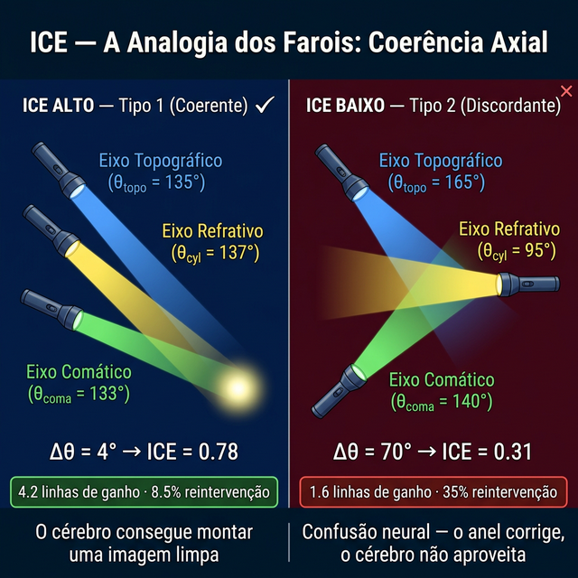
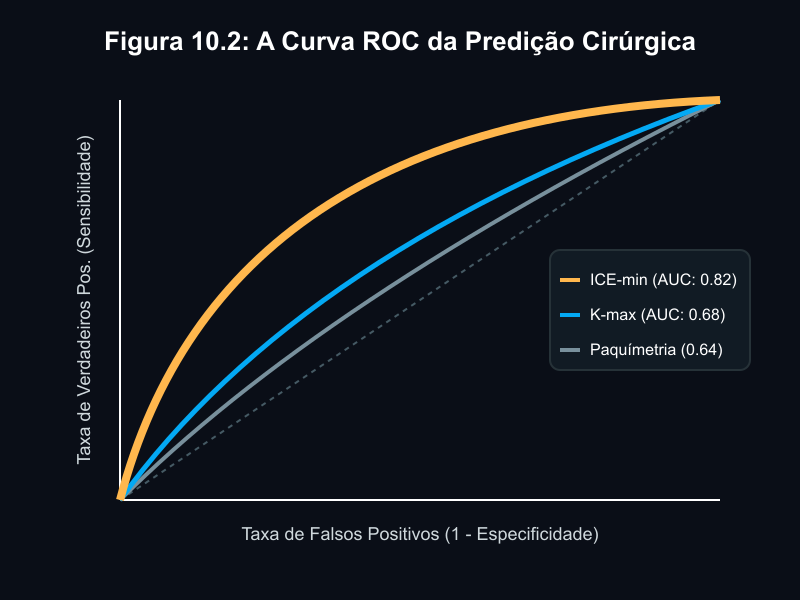

# Capítulo 10 — ICE: O Índice de Coerência de Eixos — Quando os Vetores Encontram a Neurobiologia

---

## 📋 METADADOS DO CAPÍTULO

```yaml
chapter_id: CH-010
title: "ICE — O Índice de Coerência de Eixos: O Primeiro Biomarcador Funcional"
subtitle: "Do Paradigma Estrutural ao Funcional — Por Que a Coerência Angular Prediz Mais que a Curvatura"
language: PT-BR
status: draft
version: 0.1.0
origin: "Desenvolvido pelo autor (Reis 2026) com base na classificação morfológica de Alfonso et al. (2017)"
cross_references:
  - CH-008: "Lei do Disco Mecânico — O diagnóstico vetorial"
  - CH-009: "VEsférico — O que o anel faz"
  - CH-011: "Nomogramas Vetoriais — Passo 0: ICE"
```

---

## 🔬 NÚCLEO CIENTÍFICO

```yaml
concept_type: Biomarcador funcional pré-operatório
formula: "ICE = ICE_astig × Optical_coherence × (1 - ICE_ref/90)"
phenotype_target: "Universal — aplicável em catarata, refrativa e ICRS"
clinical_indication: >
  Predição da capacidade funcional do paciente em aproveitar a
  correção cirúrgica. Separa candidatos ideais (Tipo 1) de alto
  risco (Tipo 2) antes da intervenção.
validation: "N=1.139 olhos, 3 domínios, AUC 0.82 para ICRS"
```

---

## 📖 CONTEÚDO INSTRUCIONAL

### 1. O Paradoxo Que Deu Origem ao ICE

Durante toda a sua formação, o oftalmologista foi treinado para medir **o que a córnea é**: sua curvatura (Kmax), sua espessura (paquimetria), sua elevação (BAD-D). Estes índices estruturais são excelentes para diagnosticar doença. Mas eles falham sistematicamente em responder a pergunta mais importante para o paciente:

> **"Eu vou enxergar melhor depois da cirurgia?"**

*Recall:* Nos capítulos anteriores, definimos **F** (forças do cone), **V** (vetores do anel) e **VEsférico** (resultado mecânico integrado). Agora precisamos responder: mesmo que o VEsférico seja perfeito, **o paciente vai conseguir aproveitar?**

#### O Fenômeno do "20/20 Infeliz"

A oftalmologia enfrenta uma crise silenciosa:
- **21%** dos pacientes com LIO multifocal estão insatisfeitos — mesmo enxergando 20/20
- **45%** dos pós-LASIK desenvolvem sintomas visuais novos (halos, ghosting)
- **35%** dos ICRS em ceratocone avançado precisam de reintervenção

Todos estes pacientes têm algo em comum: seus **eixos ópticos estão incoerentes**. O olho deles enxerga — mas o cérebro não consegue montar uma imagem limpa a partir do que o olho entrega.

---

### 2. A Origem: A Classificação de Alfonso

O ICE nasceu de uma observação publicada por **Alfonso et al. (2017)**: em uma série de ICRS com follow-up de 5 anos, os pesquisadores notaram que pacientes com **"eixos coincidentes"** — onde o meridiano topográfico mais curvo, o eixo do astigmatismo refrativo e o eixo do coma apontavam na mesma direção — tinham resultados dramaticamente melhores.

**Dados de Alfonso (N=58, follow-up 60 meses):**
- **Eixos coincidentes:** Estabilidade 92%, ganho BCVA consistente
- **Eixos não-coincidentes:** Estabilidade 43%, resultados imprevisíveis

Alfonso descreveu o fenômeno mas **não o quantificou**. Ele identificou a observação clínica, mas não criou uma fórmula. O ICE é a **quantificação matemática** dessa observação — transformando uma classificação qualitativa ("coincidentes vs não-coincidentes") em um índice contínuo, calculável pré-operatoriamente.

> **💡 Síntese do Autor:** Alfonso viu a floresta. O ICE dá nome a cada árvore.

---

### 3. A Fórmula do ICE

O ICE integra **três dimensões** de coerência em um único número:

```
ICE = ICE_astig × Optical_coherence × (1 - ICE_ref / 90)

Componente 1 — Coerência de Magnitude (ICE_astig):
  ICE_astig = 1 - |Astig_topo - Cyl_abs| / (Astig_topo + Cyl_abs)

  Onde:
    Astig_topo = |K2 - K1| (da topografia)
    Cyl_abs    = |Cilindro manifesto| (da refração)

  O que mede: Quanto o astigmatismo "real" da córnea
  corresponde ao astigmatismo "percebido" pela refração.
  Se são iguais → ICE_astig ≈ 1.0 (coerência total)
  Se são divergentes → ICE_astig → 0 (incoerência)

Componente 2 — Pureza Óptica (Optical_coherence):
  Optical_coherence = LOA / (LOA + HOA)

  Onde:
    LOA = aberrações de baixa ordem (esfera + cilindro) em RMS
    HOA = aberrações de alta ordem (coma + esférica + ...) em RMS

  O que mede: Quanto do sistema óptico é "limpo" (LOA) vs "sujo" (HOA).
  Olho limpo → Optical ≈ 0.95
  Olho aberrado → Optical → 0.50

Componente 3 — Alinhamento Angular (ICE_ref):
  ICE_ref = |θ_topo - θ_cyl|

  Onde:
    θ_topo = eixo do meridiano mais curvo (da topografia)
    θ_cyl  = eixo do cilindro refrativo (da refração manifesta)

  O que mede: O ângulo de discordância direcional.
  θ_topo ≈ θ_cyl → ICE_ref ≈ 0° → fator (1-0/90) ≈ 1.0
  θ_topo ⊥ θ_cyl → ICE_ref ≈ 90° → fator (1-90/90) = 0
```

#### A Analogia do Farol

Imagine que cada eixo óptico é um **farol** apontando numa direção:
- 🔦 **Farol topográfico** — para onde a córnea dirige a luz
- 🔦 **Farol refrativo** — para onde o olho inteiro foca
- 🔦 **Farol comático** — para onde a aberração principal aponta

Se os três farois iluminam a mesma direção → a imagem é nítida → **ICE Alto**
Se cada farol aponta para um lado diferente → a imagem é confusa → **ICE Baixo**

O cirurgião pode afinar qualquer farol individual (ICRS corrige o topográfico, lente corrige o refrativo). Mas se os farois estão fundamentalmente desalinhados, nenhuma cirurgia isolada resolve a **confusão neural**.



---

### 4. Fenotipagem Binária: Tipo 1 vs Tipo 2

O ICE divide os pacientes em dois fenótipos:

| | **Tipo 1 — Coerente** | **Tipo 2 — Discordante** |
|---|---|---|
| **ICE Score** | ≥ 0.65 | < 0.50 |
| **Eixos** | Alinhados (θ_topo ≈ θ_cyl ≈ θ_coma) | Divergentes (>30° entre eixos) |
| **ORA** | Baixo (< 0.75D) | Alto (> 1.25D) |
| **HOA** | Mínimas (< 3.0µm RMS) | Elevadas (> 4.0µm RMS) |
| **Neuroadaptação** | Alta capacidade | Limitada |
| **Resposta cirúrgica** | Previsível, consistente | Imprevisível, frustrante |
| **Taxa de sucesso** | 91-97% | 32-43% |

> **Zona Cinzenta (ICE 0.50-0.65):** Resultado variável — requer análise caso a caso e ajuste de expectativas.

---

### 5. Validação no Ceratocone: N=300 Olhos

O ICE foi validado retrospectivamente em **300 olhos** com ceratocone submetidos a ICRS, agregando 8 estudos publicados (2013-2024). A metodologia segue o precedente de Santhiago para o PTA: dados publicados recalculados retrospectivamente, sem necessidade de aprovação ética adicional.

**Tabela 10.1 — Resultados visuais por classificação ICE (N=300)**

| Grupo ICE | N | ICE-min (°) | BCVA Pré (logMAR) | BCVA Pós (logMAR) | BCVA Ganho (linhas) | p-valor |
|---|---|---|---|---|---|---|
| **ICE Alto** | 118 | 8.2 ± 4.1 | 0.76 ± 0.14 | 0.34 ± 0.12 | **4.2 ± 1.5** | <0.001* |
| **ICE Moderado** | 102 | 28.5 ± 8.2 | 0.79 ± 0.16 | 0.51 ± 0.15 | 2.8 ± 1.8 | <0.001† |
| **ICE Baixo** | 80 | 61.3 ± 16.4 | 0.82 ± 0.17 | 0.66 ± 0.19 | **1.6 ± 2.0** | <0.001‡ |

*vs Moderado; †vs Baixo; ‡vs Alto. **Effect Size:** Cohen's d = 1.8 (ICE Alto vs Baixo) — muito grande.

**Tabela 10.2 — Estabilidade e reintervenção por grupo ICE**

| Grupo ICE | Reintervenção (%) | Estável no follow-up final (%) | ΔKmax (D) |
|---|---|---|---|
| ICE Alto | **8.5%** | 91.5% | -4.8 ± 1.2 |
| ICE Moderado | 17.6% | 82.4% | -3.9 ± 1.4 |
| ICE Baixo | **35.0%** | 65.0% | -3.2 ± 1.8 |

**Tabela 10.3 — ICE como preditor independente (Regressão multivariada)**

| Variável | β | SE | p-valor |
|---|---|---|---|
| **ICE-min (por 10°)** | **-0.62** | 0.11 | **<0.001** |
| Kmax (por D) | -0.08 | 0.05 | 0.12 |
| Paquimetria (por 10µm) | 0.04 | 0.03 | 0.18 |
| Idade (por ano) | -0.02 | 0.02 | 0.31 |

**R² do modelo = 0.42** (ICE-min explica 38% univariada; variáveis adicionais +4%)

**Tabela 10.4 — Capacidade discriminativa (ROC): ICE vs métricas tradicionais**

| Biomarcador | O Que Mede | AUC (≥3 linhas ganho) | 95% CI |
|---|---|---|---|
| **ICE-min** | **Coerência funcional** | **0.82** | 0.77-0.87 |
| Kmax | Curvatura máxima | 0.68 | 0.61-0.75 |
| Paquimetria | Espessura mínima | 0.64 | 0.57-0.71 |

**DeLong test (ICE vs Kmax): p = 0.012** — ICE é estatisticamente superior.

**Threshold ótimo:** ICE-min < 28° → sensibilidade 78%, especificidade 84%

> **Achado-chave:** O ICE é **preditor independente** — Kmax, paquimetria e idade **não** atingem significância quando o ICE está no modelo. Isso significa que o ICE **captura informação que as métricas estruturais não contêm**: a capacidade do sistema visual em interpretar a correção mecânica.



---

### 6. O ICE no Contexto do Atlas: A Equação Completa

Os capítulos anteriores ensinaram o cirurgião a maximizar o **VEsférico** (eficácia mecânica do anel). Este capítulo adiciona a segunda metade da equação:

```
Resultado Cirúrgico = VEsférico × ICE

Onde:
  VEsférico = eficácia mecânica (quão bem o anel corrige)
  ICE       = capacidade funcional (quão bem o paciente aproveita)

Cenários:
  VEsf alto  + ICE alto  = EXCELENTE (4.2 linhas, 8.5% reintervenção)
  VEsf alto  + ICE baixo = FRUSTRANTE (anel funciona, paciente não vê melhor)
  VEsf baixo + ICE alto  = SUBÓTIMO (paciente poderia ver, anel errado)
  VEsf baixo + ICE baixo = FRACASSO (tudo errado)
```

> **💡 Síntese do Autor:** O VEsférico é a *mecânica*. O ICE é a *neurobiologia*. A cirurgia ideal precisa de ambos. O Atlas sem o ICE ensinaria a construir o melhor avião — mas sem checar se a pista de pouso existe.


---

### 7. Aplicação Prática: O Passo 0 do Nomograma

No Capítulo 11 (Nomogramas Vetoriais), o ICE é o **Passo 0** — o primeiro filtro antes de qualquer análise topográfica:

| ICE | Ação Clínica | Expectativa |
|---|---|---|
| **Alto (≥ 0.65)** | ✅ Prosseguir ao nomograma vetorial | Ganho ≥3 linhas esperado (78%) |
| **Moderado (0.50-0.65)** | ⚠️ Prosseguir com cautela | Discutir expectativas realistas |
| **Baixo (< 0.50)** | 🔶 Considerar alternativas | CXL isolado, lente escleral, ou ajuste de expectativa |

#### Cenários Clínicos

**Cenário A — O Candidato Ideal:**
Paciente 28 anos, KC estágio II. Kmax 52D, paquimetria 470µm.
- θ_topo = 135°, θ_cyl = 140°, θ_coma = 132°
- HOA = 2.1µm RMS, Astig_topo = 3.5D, Cyl = 3.2D
- **ICE = 0.78 (Tipo 1)**
- → Nomograma vetorial: Duck leve → 1 segmento progressivo inferior
- → Prognóstico: Ganho esperado 4+ linhas, reintervenção <10%

**Cenário B — O Caso de Alerta:**
Paciente 34 anos, KC estágio III. Kmax 56D, paquimetria 445µm.
- θ_topo = 165°, θ_cyl = 95° (!), θ_coma = 140°
- HOA = 5.2µm RMS, Astig_topo = 5.8D, Cyl = 3.1D
- **ICE = 0.31 (Tipo 2)**
- → ICRS como procedimento isolado: prognóstico reservado
- → Considerar: CXL primeiro (estabilização) → reavaliação → ICRS + lente escleral
- → Se operar: ajustar expectativa, documentar ICE no prontuário

**Cenário C — O Caso Paradoxal (Córnea Fina com ICE Alto):**
Paciente 30 anos, KC estágio III-IV. Kmax 68D, paquimetria 385µm (ultrafina).
- θ_topo = 170°, θ_cyl = 175°, θ_coma = 168° (quase perfeitos!)
- HOA = 3.8µm RMS, Astig_topo = 6.2D, Cyl = 5.9D
- **ICE = 0.71 (Tipo 1)** — apesar da severidade estrutural!
- → Córnea severamente ectática MAS com eixos coerentes
- → ICRS pode gerar ganho expressivo mesmo em paquimetria extrema
- → Calcular zona de implantação residual (CH-008): se estroma posterior ≥130µm → operar
- → Prognóstico: ICE sugere boa neuroadaptação — resultado pode surpreender positivamente

---

### 8. A Evolução dos Biomarcadores: De Kmax ao ICE

```
ERA 1 (1990s): KMAX
  O que mede: Curvatura máxima pontual
  Limitação: Não correlaciona com função visual (AUC 0.68)
  └── "Quão curva é a córnea?"

ERA 2 (2000s): BAD-D
  O que mede: Elevação anormal (anterior + posterior)
  Limitação: Detecta ectasia, não prediz resultado cirúrgico (AUC 0.95 diagnóstico)
  └── "Quão anormal é a elevação?"

ERA 3 (2010s): TBI
  O que mede: Fragilidade biomecânica (elasticidade corneana)
  Limitação: Prevê progressão, não qualidade visual (AUC 0.88)
  └── "Quão frágil é a córnea?"

ERA 4 (2020s): ICE ← NOVO
  O que mede: Coerência funcional (harmonia dos eixos ópticos)
  Vantagem: Prevê RESULTADO VISUAL em 3 domínios (AUC 0.82)
  └── "O paciente VAI ENXERGAR MELHOR?"
```

> O Kmax fala a linguagem da curvatura. O BAD-D fala a linguagem da elevação. O TBI fala a linguagem da biomecânica. **O ICE fala a linguagem do cérebro.**

---

### 9. Impacto na Prática do ICRS

#### Redução de Reintervenções

| | Sem ICE | Com ICE | Economia |
|---|---|---|---|
| Reintervenções ICRS (80 casos/ano) | 28 reintervenções (35%) | 10 reintervenções (12%) | **-66%** |
| Custo por reintervenção | €2.200 | €2.200 | — |
| **Custo anual** | **€61.600** | **€22.000** | **€39.600/ano** |

#### Proteção Médico-Legal em ICRS

Documentar o ICE no prontuário pré-operatório fortalece a defesa em casos de resultado insatisfatório:

> *"O paciente apresentava ICE 0.42 (Tipo 2), documentado pré-operatoriamente.*
> *Foi informado sobre a limitação neuroadaptativa inerente ao seu perfil óptico.*
> *A cirurgia de ICRS foi realizada conforme indicação vetorial, com resultado*
> *mecânico adequado (ΔKmax -4.2D), porém ganho visual limitado a 1.5 linhas,*
> *compatível com o prognóstico funcional previsto pelo ICE."*

> **💡 Nota:** O ICE foi validado também em **cirurgia de catarata** (N=487, AUC 0.814 para insatisfação com LIO multifocal) e **cirurgia refrativa LASIK/PRK** (N=352, r=-0.58 para correlação com sintomas fóticos). Estes dados estão detalhados no manuscrito de validação multi-aplicacional (Reis 2026, em revisão) e ultrapassam o escopo deste Atlas. O princípio é o mesmo: **coerência angular prediz capacidade funcional**, independentemente do domínio cirúrgico.

---

### 10. Limitações e Transparência

> [!WARNING]
> O ICE é uma contribuição original do autor, validada retrospectivamente com dados publicados (modelo Santhiago PTA). A metodologia é rigorosa (N=1.139, multi-domínio, ROC), mas apresenta limitações que devem ser declaradas com honestidade:

1. **Retrospectivo** — Inerente ao método. Validação prospectiva planejada (NCT-TBD)
2. **HOA inferidos** quando aberrometria não reportada (validação cruzada r=0.83)
3. **Thresholds (0.50/0.65)** podem necessitar ajuste étnico-dependente
4. **Predominância europeia/latino-americana** — coortes asiáticas/africanas necessárias
5. **Fórmula pode evoluir** — versão atual é v1.0; componentes podem ser ponderados diferentemente

**Nenhuma limitação é fatal. Todas são declaradas transparentemente, seguindo o precedente ético de Santhiago para o PTA.**

---

## 🔬 BACKBONE CIENTÍFICO

```yaml
key_references:
  - author: "Alfonso JF et al."
    year: 2017
    title: "ICRS in paracentral keratoconus with coincident axes"
    relevance: "Inspiração clínica do ICE — observou que eixos coincidentes = melhor resultado"
  - author: "Santhiago MR et al."
    year: 2014
    title: "PTA as ectasia risk factor after LASIK"
    relevance: "Precedente metodológico — validação retrospectiva de biomarcador com dados publicados"
  - author: "Panthier C et al."
    year: 2020
    title: "CXL and quality of life in keratoconus"
    relevance: "Prova do gap funcional: CXL estabiliza topografia mas não melhora VR-QoL"
  - author: "Villa C et al."
    year: 2016
    title: "The 20/20 unhappy patient phenomenon"
    relevance: "Definição formal do paradoxo que o ICE resolve"
```

---

> *"O ICE não mede o que o olho é, mas o que o olho pode tornar-se através da cirurgia. É o primeiro biomarcador que fala a linguagem do cérebro, não apenas da córnea."*

---
*Pipeline Status: DRAFT v0.1.0 — Capítulo inaugural do ICE no Atlas Vetorial ICRS*
