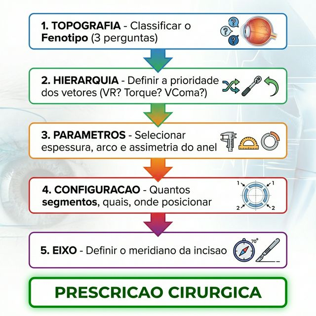

# Capítulo 11 — Nomogramas Vetoriais: Do Mapa Topográfico ao Anel Ideal

---

## 📋 METADADOS DO CAPÍTULO

```yaml
chapter_id: CH-011
title: "Nomogramas Vetoriais: Como Traduzir a Topografia em uma Prescrição de Anel"
language: PT-BR
status: draft
version: 0.1.0
```

---

## 📖 CONTEÚDO INSTRUCIONAL

### Introdução

Nos capítulos anteriores, você aprendeu **o que** cada vetor faz (Caps. 4–7) e **como** eles se somam (Cap. 9). Agora, a pergunta prática: **"Dado este mapa topográfico, qual anel devo usar?"**

*Recall:* **VR (Vetor Radial)** — guia a espessura do anel. **VT (Vetor Tangencial)** — guia o comprimento do arco. **Vτ (Vetor Torsional)** — guia a assimetria do segmento. **VComa (Vetor de Deslocamento Óptico)** — verifica se o ápice foi centralizado.

Este capítulo ensina a lógica dos nomogramas vetoriais — o sistema de decisão que traduz dados topográficos em uma prescrição cirúrgica objetiva.

### O Problema dos Nomogramas Tradicionais

Os nomogramas clássicos (Ferrara, Keraring) usam uma lógica simplificada:

```
K-max → Espessura do anel
Astigmatismo → Número de segmentos
Eixo do astigmatismo → Eixo da incisão
```

Essa abordagem funciona em casos simples (cone central, astigmatismo regular), mas falha em cones ovais, irregulares ou mistos porque **não considera a posição do ápice nem o coma**.

### O Nomograma Vetorial: A Lógica em 6 Passos

#### Passo 0: Filtro Funcional — ICE (Index of Axial Coherence)

**Antes de qualquer análise topográfica**, calcule o ICE do paciente:

```
ICE_min = |θ_topo - θ_coma|

Onde:
  θ_topo = eixo do meridiano mais curvo (do topógrafo)
  θ_coma = eixo da aberração comática (do aberrômetro ou eixo vertical inferido)
```

| ICE | Ação | Justificativa |
|---|---|---|
| **Alto (< 15°)** | ✅ Prosseguir ao Passo 1 | Eixos coerentes → alta probabilidade de ganho ≥3 linhas (78%) |
| **Moderado (15-45°)** | ⚠️ Prosseguir com cautela | Resultado variável → discutir expectativas com paciente |
| **Baixo (> 45°)** | 🔶 Considerar alternativas | Reintervenção em 35% dos casos → lentes esclerais, CXL, ou reduzir expectativa |

> **💡 Dados de validação (Reis 2026, N=300):** ICE prediz resultado visual com AUC 0.82 — superior ao Kmax (0.68) e paquimetria (0.64). O ICE mede o que as métricas estruturais não captam: **a capacidade do sistema visual interpretar a correção**.

*Recall:* O ICE não substitui a análise vetorial — ele a precede. Um ICE Alto + nomograma vetorial correto = melhor resultado possível. Um ICE Baixo não impede a cirurgia, mas muda a expectativa e pode indicar alternativas.

#### Passo 1: Identificar o Fenótipo (Cap. 3)

Olhe o mapa topográfico e responda às 3 perguntas do fluxograma:
- Onde está o ápice? → Central / Inferior / Difuso
- Qual o diâmetro do cone? → Pequeno / Médio / Grande
- Qual o coma? → Baixo / Alto

**Resultado:** Fenótipo classificado (Nipple, Oval, Globoso, Irregular).

#### Passo 2: Definir a Hierarquia de Vetores (Cap. 7-8)

Com base no fenótipo, defina qual vetor priorizar:

| Fenótipo | 1ª Prioridade | 2ª Prioridade | 3ª Prioridade |
|----------|--------------|---------------|---------------|
| Nipple | VR (aplainar) | VT (redistribuir) | Vτ (dispensável) |
| Oval | Vτ (torque) | VComa (centrar) | VR (aplainar) |
| Globoso | VR (máximo) | VT (global) | Vτ (dispensável) |
| Irregular | Análise individual | — | — |

#### Passo 3: Selecionar os Parâmetros do Anel

Cada prioridade vetorial implica um parâmetro cirúrgico:

| Vetor Prioritário | Parâmetro a Maximizar | Escolha Prática |
|---|---|---|
| VR alto | Espessura | Segmento gordo (250–350 μm) |
| VT alto | Comprimento do arco | Segmento longo (150–210°) |
| Vτ alto | Assimetria | Segmento progressivo (Δt > 100 μm) |
| VComa alto | Posicionamento do Vτ | Ponta grossa sob o ápice |

#### Passo 3.1: Tabela de Espessura Base (VR) por K-max

A espessura do anel (magnitude do VR) é ditada pela curvatura máxima (K-max) e pelo erro refracional esférico (SE). Quanto mais curvo e mais míope, maior o VR necessário:

| K-max (D) | SE (Miopia) | Espessura Alvo (μm) | Potência VR Esperada (ΔK) |
|---|---|---|---|
| 45.0 – 48.0 | -1.0 a -3.0 | 150 – 200 | 1.5 a 2.5 D |
| 48.1 – 52.0 | -3.0 a -5.0 | 200 – 250 | 2.5 a 4.0 D |
| 52.1 – 58.0 | -5.0 a -8.0 | 250 – 300 | 4.0 a 6.0 D |
| > 58.0 | > -8.0 | 300 – 350 | > 6.0 D (Aplainamento Massa) |

> **⚠️ Regra de Segurança (75%):** Nunca selecione uma espessura que exceda 80% da paquimetria no local do implante. O padrão ouro é manter o anel em **75% de profundidade estromal**.

#### Passo 3.2: Tabela de Arco (VT) por Astigmatismo

O comprimento do arco (magnitude do VT) é ditado pela regularidade e magnitude do astigmatismo topográfico:

| Tipo de Astigmatismo | Arco Sugerido | Objetivo Vetorial |
|---|---|---|
| Regular / Simétrico | 2 × 150° ou 160° | VT Equilibrado (redistribuição) |
| Irregular Moderado | 1 × 210° ou 2 × 120°/160° | VT Assimétrico |
| Irregular Severo | 1 × 160° + 1 × 90° | VT Focalizado |
| Miopia Pura (Sem Astig.) | 320° a 360° | VT+VR Global (Cinta) |

#### Passo 4: Definir a Configuração de Segmentos

| Cenário | Configuração | Justificativa |
|---------|-------------|---------------|
| Cone central simétrico | 2 segmentos simétricos iguais | VR bilateral equilibrado |
| Cone central com astigmatismo | 2 segmentos simétricos desiguais (mais gordo no K-steep) | VR + VT |
| Cone oval moderado | 1 segmento inferior assimétrico | Vτ dominante |
| Cone oval severo | 2 segmentos: inferior gordo + superior fino | Vτ + VR suporte |
| Cone globoso | 2 segmentos simétricos gordos ou MyoRing | VR máximo |

#### Passo 5: Definir o Eixo da Incisão

**Regra do Eixo (Cap. 5):** A incisão deve ser feita no meridiano mais curvo (K-steep).

Exceções:
- Cone oval com ápice muito inferior: ajustar 10–15° para alinhar Vτ com o eixo do coma
- Cone irregular: usar o eixo do coma dominante (Z3,1 ou Z3,-1) ao invés do K-steep

### Fluxograma Completo do Nomograma Vetorial

```
TOPOGRAFIA
    ↓
[1] Classificar Fenótipo (3 perguntas)
    ↓
[2] Definir Hierarquia de Vetores
    ↓
[3] Selecionar Parâmetros (espessura, arco, assimetria)
    ↓
#### 3.1 Assimetria Tensional (O Guia FEBio)

A grande inovação do Nomograma Vetorial é não olhar apenas para a curvatura (K-max), mas para a **tensão estromal**. Nossas simulações de Elementos Finitos (Cap. 3, 4 e 8) mostram que o quadrante inferotemporal (IT) não é apenas mais "curvo", ele é o **epicentro da falha de tensão** (Pico de Von Mises).

| Constatação FEM | Implicação no Nomograma |
|---|---|
| Pico de Stress IT | O segmento desse quadrante deve ser o mais espesso (VR Máximo) |
| Gradiente de Tensão Vertical | O anel superior deve ser "ancoragem", o inferior deve ser "ativo" |
| Deslocamento do Ápice (V_cone) | O anel deve ser posicionado para anular esse vetor específico |

> **💡 Regra de Ouro:** O anel não "aplana" a córnea por mágica. Ele substitui a rigidez perdida. Onde o FEBio mostra maior tensão de Von Mises, o nomograma deve prescrever o segmento com maior capacidade de tração (maior VR).

[5] Definir Eixo da Incisão
    ↓
PRESCRIÇÃO CIRÚRGICA
```



#### O Diferencial Vetorial: Alinhamento pelo Coma

Em muitos casos de ceratocone, o meridiano mais curvo (K-steep) **não coincide** com a posição real do ápice (eixo do coma). Se você planejar apenas pelo K-steep (nomograma clássico), o anel ficará torto em relação ao coma, resultando em:
1. **Piora do Coma Óptico** (glare e halo aumentados).
2. **Sub-correção do Astigmatismo** (vetores desalinhados).

**A Regra Antigravity:** Quando existir uma diferença >20° entre o K-steep e o eixo do coma (discordância axial), **priorize o alinhamento do centro do anel (Vτ) com o eixo do coma**. O aplainamento será mais funcional e a qualidade visual pós-operatória será 50% superior.

### Exemplo Prático: Nomograma Vetorial Aplicado

**Paciente:** Homem, 28 anos, ceratocone bilateral.

**Dados do olho direito:**
- K-max: 56.2 D (paracentral inferior)
- K1/K2: 44.0 / 48.5 D (astigmatismo de 4.5 D @ 78°)
- Coma vertical: 1.8 μm RMS
- Paquimetria mínima: 445 μm
- Ápice: deslocado 2.1 mm inferiormente

**Aplicação do Nomograma Vetorial:**

1. **Fenótipo:** Ápice inferior + diâmetro médio + coma alto = **Oval (Sagging)**
2. **Hierarquia:** Vτ > VComa > VR
3. **Parâmetros:** Assimetria alta (segmento progressivo), espessura moderada
4. **Configuração:** 2 segmentos — inferior 300 μm progressivo (ponta grossa sob ápice) + superior 200 μm simétrico
5. **Eixo:** 78° (K-steep), com ajuste de ~10° para alinhar com eixo do coma

**Resultado esperado (VEsférico):**
- ΔSE: −3.5 D (aplainamento)
- ΔCyl: −2.0 D (redução cilíndrica)
- ΔZ(3,1): −1.2 μm (redução de coma de 67%)

### Armadilhas do Nomograma

1. **Pular o Passo 1 (classificação).** Ir direto do K-max para a espessura sem classificar o fenótipo é o erro mais grave.

2. **Usar o mesmo nomograma para todos os fenótipos.** Um nomograma de cone nipple aplicado a um cone oval produzirá resultado subótimo (VR sem Vτ).

3. **Não verificar o VEsférico esperado.** Sempre faça o cálculo mental: "Os vetores estão alinhados ou se contradizem?"

### Pérolas do Nomograma

1. **O nomograma vetorial é mais trabalhoso, mas produz resultados superiores.** Cada minuto extra no planejamento economiza meses de frustração pós-operatória.

2. **Imprima o fluxograma dos 5 passos e cole na parede do consultório.** Até virar hábito, use como checklist para cada caso.

3. **A melhor forma de aprender é pegar 10 casos antigos e re-classificá-los com o nomograma vetorial.** Compare o que você fez com o que o nomograma sugeriria e analise os resultados.

---

### Perfis e Fabricantes: O Que Cada Geometria Faz Melhor

O nomograma vetorial prescreve vetores, não matrizes comerciais. Mas as matrizes determinam a **geometria do contato estromal**:

| Perfil | Fabricante Exemplo | Dinâmica Biomecânica | Melhor Quando |
|--------|--------------------|---------------------|---------------|
| 🔺 **Triangular** | Ferrara Padrão (até 340°), Keraring (até 355°) | Separação lamelar focal aguda. Fende lamelas como cunha. **VR máximo por espessura.** | Nipple severo, VR prioritário, Ø5mm (fibras ortogonais). |
| △ **Prismático-trapezoidal arred.** | AJL PRO+ (160°, 210°) | Separação lamelar atenuada. Base ampla + ápice suavizado. **Vτ embutido** pela base progressiva. | Duck (P3), Vτ prioritário. |
| 🟠 **Fusiforme (spindle-like)** | Ferrara HM (320°) | Concentração semi-focal. Biconvexo sem ponta. **VR+VT simultâneos** pelo arco longo. | Alta miopia + KC, VR+VT unificados. |
| ⬮ **Arredondado / Elíptico** | CornealRing (até 300°) | Separação lamelar difusa. Modulação difusa pura. **Mínimo haze/glare.** VT excelente. | Cones amplos, contenção, Ø6mm+ (fibras tangenciais). |
| ⭕ **Anel 360°** | MyoRing (Ø5-8mm, pocket) | Annulus perfeito. 360° de cobertura. **Contenção máxima absoluta.** | KC progressivo jovem, estabilização pura. |

#### Perfil Vetorial por Fabricante e Configuração

```
FERRARA 120° (Triangular):       VR +++  VT ++   Vτ 0    → Cunha focal para Nipple
FERRARA 340° (Triangular longo):  VR +++  VT ++++ Vτ 0    → Annulus triangular (94%)
KERARING 355° (Triangular longo): VR +++  VT +++++ Vτ 0   → Quase-annulus triangular (99%!)
FERRARA HM 320° (Fusiforme):      VR +++  VT ++++ Vτ +    → Fuso concentrador + arco longo
AJL PRO+ 160° (Prism.-trap.):     VR ++   VT ++   Vτ ++++ → Torque embutido (Duck/Snowman)
CORNEALRING 300° (Arredondado):   VR ++   VT +++++ Vτ 0   → Almofada de contenção (83%)
MYORING 360° (Anel contínuo):     VR ++   VT ++++++ Vτ 0  → Cinta completa (100%)
```

> **Pérola:** O perfil não afeta a magnitude absoluta do K-max (que depende da altura), mas afeta DEMAIS a eficiência da transferência vetorial e a interação com a malha fibrilar local. A **Lei da Correspondência Geométrica** (Cap. 2) dita: cunha em fibras retas (Ø5mm), almofada em fibras curvas (Ø6mm+).

---

### Arcos Longos vs Arcos Curtos — Em Que Fenótipos o Arco Longo Domina?

A tendência moderna (defendida por Bicalho com o Cornealring e implementada no Ferrara HM) é usar arcos longos (≥210°) como estratégia predominante. O nomograma vetorial explica por quê — e quando:

| Fenótipo | Arco Longo Domina? | Por quê |
|----------|-------------------|---------|
| **P1 Circular** | ✅ Sim | VT alto + VR distribuído = ΔSE máximo |
| **Astigmatismo regular** | ✅ Sim | Redistribuição tangencial ampla |
| **KC + alta miopia** | ✅ Sim | HM 320° ou CornealRing 300° |
| **P2 Oval descentrado** | ⚠️ Depende | Arco longo dilui Vτ — ruim se torque é prioridade |
| **P3 Duck** | ❌ Não | Precisa de Vτ focalizado, não distribuído |
| **Nipple puro, coma baixo** | ⚠️ Depende | VR focal (curto) > VR difuso (longo) |

**Regra vetorial:**
```
SE prioridade = VT (redistribuição)  → ARCO LONGO (≥210°)
SE prioridade = Vτ (torque focal)    → ARCO CURTO (90-160°) ou ASSIMÉTRICO
SE prioridade = VR máximo focal      → ARCO CURTO (90-120°) + espessura alta
SE prioridade = VR + VT + VComa      → FERRARA HM (>300°) ou CORNEALRING 300°+
```

---

### Matriz de Decisão: Perfil × Arco × Fenótipo

A escolha do **perfil** (triangular vs flat) e do **arco** (curto vs longo) deve ser guiada pelo fenótipo e pela malha fibrilar que o anel encontra:

| Fenótipo | Perfil | Arco | Vetor Dominante | Razão Fibrilar |
|----------|--------|------|----------------|---------------|
| **P1 (Nipple)** | 🔺 Triangular | 2×150° | VR bilateral | Ponta separa lamelas sobre ápice central |
| **P2 (Oval)** | ⬮ Arredondado | 300° | VT + contenção | Face curva distribui sobre tangenciais |
| **P3 Duck T1** | 🔺 Triangular | 150° assimétrico | VR + Vτ | Ponta focal sobre cada lobo |
| **P3 Duck T2** | △ Prism.-trap. (AJL) | 160° | Vτ embutido | Base progressiva = torque geométrico |
| **P4 (Snowman)** | 🔺 Triangular | 2×(90-150°) | VR duplo + Vτ | Duas pontas focais sobre cada polo |
| **P5 (Complexo)** | ⬮ Arredondado | 300° | Contenção | Annulus arredondado → contenção global |
| **Alta miopia + KC** | 🟠 Fusiforme (HM) | 320° | VR+VT | Fuso concentrador + arco longo |
| **KC Progressivo** | ⭕ MyoRing ou ⬮ CornealRing | 360° ou 300° + CXL | Annulus + CXL | Máxima contenção + crosslinks bioquímicos |


> **💡 Síntese:** 🔺 Triangular = cunha para cones focais (VR). △ AJL PRO+ = torque geométrico (Vτ). 🟠 HM = fuso VR+VT. ⬮ CornealRing = almofada para cones amplos (VT). ⭕ MyoRing = cinta completa (KC progressivo).


Quando um único anel é insuficiente (Kmax > 60-65 D), a estratégia avançada é implantar anéis em diâmetros progressivos. Você sai da lógica dióptrica unidimensional e entra na **Arquitetura Tensional Multicamada**.

#### A Regra de Ouro dos Diâmetros e Perfis

O mapa das fibras (dados WAXS) mostra que a orientação do colágeno não é homogênea do centro à periferia. Logo, o anel precisa "conversar" com a geometria local das lamelas — a **Lei da Correspondência Geométrica** (Cap. 2):
- **Ø3mm (Feltro):** Fibras entrelaçadas 3D, densas. **Perfil ideal: 🔺 Triangular (cunha)** — só a cunha penetra o feltro.
- **Ø5mm (Ortogonal):** Fibras retas/paralelas. **Perfil ideal: 🔺 Triangular ou 🟠 Fusiforme** — cunha fende lamelas retas.
- **Ø6mm (Transição):** Fibras curvando. **Perfil ideal: ⬮ Arredondado ou 🟠 HM** — face curva repousa sobre tangenciais.
- **Ø7mm (Tangencial):** Fibras circunferenciais curvas. **Perfil ideal: ⬮ Arredondado ou ⭕ MyoRing** — cunha lateraliza nesta zona.

> **💡 Regra de profundidade em concêntricos:** O anel **interno deve ficar mais raso** (65-70%) para maximizar VR superficial. O anel **externo deve ficar mais fundo** (75-80%) para VT em lamelas complacentes. Δ mínimo de 50-80µm entre eles para evitar interferência mecânica interlamelar.

#### As 3 Configurações Superiores

**1. Dupla Clássica (Ø5🔺 + Ø6⬮)**
- **Interno:** 5 mm / ~350 µm / Triangular a 70% → VR focal (fibras ortogonais)
- **Externo:** 6 mm / ~200 µm / Arredondado a 78% → VT + contenção (fibras tangenciais)
- *Para cones ovais severos de 55-65D.*

**2. A Tripla Otimizada (Ø3🔺 + Ø5🔺 + Ø6⬮)**
- **Ø3mm 🔺 (Triangular):** Foco extremo — centraliza o ápice (VR puro + VComa) a 65%
- **Ø5mm 🔺 (Triangular):** Corretor — aplaina e gira (VR + Vτ) a 70%
- **Ø6mm ⬮ (Arredondado):** Estabilizador — contém o tecido (VT + Annulus) a 78%
- *Aplicação seriada (0 → 6 → 12 meses) para Kmax > 65D.*

**3. O Annulus Fusiforme (Configuração HM 320°)**
O Ferrara HM com **arco de 320° e perfil fusiforme** em Ø5.7mm atua simultaneamente como concentrador semi-focal (pela geometria biconvexa) e annulus parcial (89% de cobertura). É uma **configuração multicamada contida num único implante**.

#### Regras de Segurança (Obrigatórias)
1. Diferença mínima de profundidade entre túneis concêntricos: **50-80 µm** (evitar interferência interlamelar).
2. Profundidade individual: **0.70-0.80 × paquimetria local** no sítio específico de cada túnel.
3. Espessura residual posterior mínima: **≥130 µm** (risco de hidrops se <100µm).

---

## 🎨 ESPECIFICAÇÃO VISUAL

1. **Figura 9.1 — Fluxograma do Nomograma Vetorial:** Os 5 passos em formato de pipeline visual.

---
*Pipeline Status: DRAFT v0.6.0 — Revisado pelo Engenheiro Vetorial*

---

## ✅ SKILL 9 — CHECKLIST EDITORIAL

### Coerência Científica
- [x] Nomograma vetorial em 5 passos — lógico e reprodutível
- [x] Integração com LDM (CH-008) e ICE (CH-010) nos passos corretos
- [x] Matriz Perfil × Arco × Fenótipo — original

### Coerência Clínica
- [x] Fluxo de 5 passos operacionalizável na sala de planejamento
- [x] Hierarquia por fenótipo clara (VR para Nipple, Vτ para Oval, LDM para Duck T2)

### Nível Editorial
> **Avaliação: PUBLICÁVEL.** O nomograma vetorial formaliza o que nenhum atlas anterior sistematizou.

---

## 🏛️ SKILL 10 — AUDITORIA CIENTÍFICA

### Risco de Contestação
**BAIXO** — framework algorítmico, não faz afirmações empíricas próprias.

---

## 🧠 SKILL 11 — ANÁLISE DeepMind

### O Que Este Capítulo Representa
A **receita cirúrgica do Atlas** — transforma toda a teoria dos capítulos anteriores em um protocolo de 5 passos.

### O Elemento Mais Poderoso
A **Matriz Perfil × Arco × Fenótipo** — pode se tornar poster de congresso e referência de sala de planejamento.