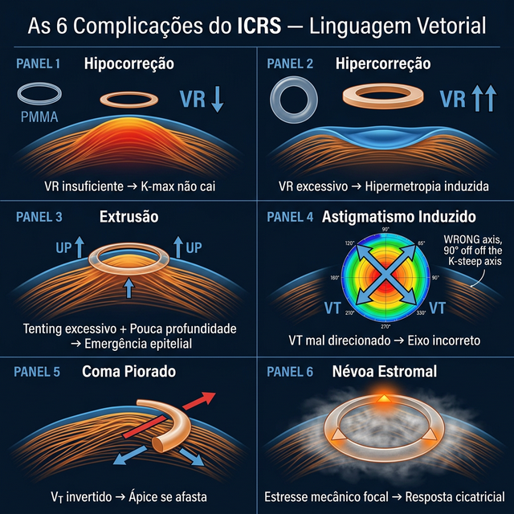

# Capítulo 13 — Complicações e Manejo: Quando os Vetores Trabalham Contra Você

---

## 📋 METADADOS DO CAPÍTULO

```yaml
chapter_id: CH-013
title: "Complicações e Manejo: Diagnóstico e Solução Usando a Linguagem Vetorial"
language: PT-BR
status: approved
version: 0.1.0
```

---

## 📖 CONTEÚDO INSTRUCIONAL

### Introdução

Todo anel intracorneano gera vetores. Mas vetores mal direcionados, excessivos ou insuficientes geram complicações. Este capítulo classifica as complicações mais comuns usando a linguagem vetorial — porque entender o vetor que causou o problema é o primeiro passo para corrigi-lo.

*Recall:* **VR (Vetor Radial)** — quando excessivo, causa hipercorreção. **VT (Vetor Tangencial)** — quando mal direcionado, induz astigmatismo. **Vτ (Vetor de Torque)** — quando invertido, piora o coma. **VEsférico (Vetor Esférico Resultante)** — quando insuficiente, a cirurgia não fez efeito.

### Classificação Vetorial das Complicações

#### Complicação 1: Hipocorreção (VEsférico Insuficiente)

**O que aconteceu:** O anel não produziu efeito suficiente.

**Causa vetorial:** VEsférico muito baixo — os vetores individuais são fracos ou se cancelam parcialmente.

**Diagnóstico:**
- K-max pós < 3 D de redução
- Refração quase inalterada
- Paciente sem melhora funcional

**Causas comuns:**
| Causa | Vetor Afetado | Solução |
|-------|--------------|---------|
| Anel muito fino | VR insuficiente | Trocar por anel mais gordo |
| Arco muito curto | VT insuficiente | Trocar por arco mais longo |
| Profundidade excessiva (>80%) | Separação lamelar reduzida (FEM: efeito diminuído ≥80%) | Reimplantar a 70–75% |
| Córnea muito rígida (pós-CXL) | Todos reduzidos | Considerar espera ou anel mais agressivo |

#### Complicação 2: Hipercorreção (VR Excessivo)

**O que aconteceu:** Aplainamento central excessivo, com inversão do perfil corneano.

**Causa vetorial:** VR desproporcional — anel grosso demais para a curvatura pré-operatória.

**Diagnóstico:**
- K-max pós < 40 D (córnea plana)
- Hipermetropia induzida
- Halos noturnos por aberração esférica positiva

**Manejo:**
1. Se leve (K-max 40–42 D): observar, pode estabilizar
2. Se moderado (K-max < 40 D): trocar por anel mais fino
3. Se severo: explantar o anel e aguardar recuperação corneana (3–6 meses)

#### Complicação 3: Extrusão do Segmento

**O que aconteceu:** O anel migra para a superfície e perfura o epitélio.

**Causa vetorial:** Separação lamelar excessiva — a força de separação local excede a capacidade do tecido de contê-la.

**Fatores de risco:**
- Anel muito superficial (< 65% de profundidade)
- Anel muito gordo em córnea fina (< 400 μm no local)
- Inflamação pós-operatória prolongada

**Manejo:**
1. Se parcial (< 30%): observar, colírio lubrificante, possível reposicionamento
2. Se completa: explantar o segmento afetado, aguardar cicatrização, replanejar

#### Complicação 4: Astigmatismo Induzido (VT Mal Direcionado)

**O que aconteceu:** O astigmatismo mudou de eixo ou aumentou em vez de diminuir.

**Causa vetorial:** VT agindo no eixo errado — a incisão foi feita no meridiano incorreto.

**Diagnóstico:**
- Cilindro pós > cilindro pré, ou
- Eixo do cilindro rotacionou > 30°

**Causas comuns:**
- Incisão no meridiano plano (K-flat) ao invés do curvo (K-steep)
- Confusão entre eixo topográfico e eixo refrativo
- Cyclotorsão não compensada (paciente sentado vs deitado)

**Manejo:**
1. Se moderado: lente de contato rígida pode compensar
2. Se severo: reposicionar os segmentos no eixo correto

#### Complicação 5: Coma Piorado (Vτ Invertido)

**O que aconteceu:** O coma aumentou após a cirurgia.

**Causa vetorial:** Vτ na direção errada — o segmento progressivo foi implantado com a ponta grossa do lado oposto ao ápice.

**Diagnóstico:**
- Coma pós > coma pré
- Ápice se afastou ainda mais do centro pupilar
- Paciente relata piora da distorção visual

**Manejo:**
1. Explantar e reimplantar com orientação correta do segmento progressivo
2. **Prevenção:** Sempre marcar a orientação do segmento ANTES de inserir no túnel

#### Complicação 6: Depósitos e Haze Peri-Anel

**O que aconteceu:** Opacidade ou depósitos ao redor do anel.

**Causa vetorial:** Não diretamente vetorial — é uma resposta tecidual. Porém, anéis com separação lamelar excessiva (VR alto) tendem a gerar mais haze por maior estresse mecânico local.

**Manejo:**
- Em geral, observação (a maioria estabiliza em 6–12 meses)
- Se visualmente significativo: corticóide tópico por 2–4 semanas
- Raramente requer explante

### Tabela Resumo: Complicação → Vetor → Solução

| Complicação | Vetor Responsável | Causa Raiz | Solução |
|-------------|------------------|-----------|---------|
| Hipocorreção | VEsférico baixo | Anel fraco ou cancelamento | Anel mais agressivo |
| Hipercorreção | VR excessivo | Anel gordo demais | Trocar por mais fino |
| Extrusão | Separação lamelar excessiva | Superficial + gordo | Explantar, replanejar |
| Astigmatismo induzido | VT errado | Incisão no eixo errado | Reposicionar |
| Coma piorado | Vτ invertido | Ponta grossa no lado errado | Inverter orientação |
| Haze | Estresse mecânico local | Separação lamelar alta | Observar ou corticóide |




### Pérolas de Complicações

1. **A maioria das complicações graves é prevenível com nomograma vetorial.** Se o planejamento é correto, o risco cai de ~15% para < 5%.

2. **Explante não é fracasso — é parte do arsenal.** O anel é reversível. Se o VEsférico real é muito diferente do planejado, explantar e replanejar é a decisão mais inteligente.

3. **Sempre documente o VEsférico pré e pós.** É a única forma de aprender com cada caso e refinar seu nomograma pessoal ao longo dos anos.

#### 💡 Complicações na Escala das Fibras (Síntese do Autor)

| Complicação | Vetor | Na Linguagem das Fibras |
|-------------|-------|------------------------|
| **Hipocorreção** | VR insuficiente | Anel não tensionou suficientemente as 🔴 radiais (espessura baixa ou diâmetro grande) |
| **Hipercorreção** | VR excessivo | Anel tensionou 🔴 radiais em excesso → inversão de curvatura — radiais "hiperesticadas" |
| **Astigmatismo induzido** | VT mal direcionado | Anel criou nova linha 🔵 tangencial no eixo errado → redistribuiu tensão na direção incorreta |
| **Coma piorado** | Vτ invertido | Ponta grossa do lado errado → gradiente de travamento 🟢 invertido → ápice migra para LONGE do centro |
| **Extrusão** | Separação lamelar excessiva | Anel muito espesso a profundidade insuficiente → pressão erosiva sobre as lamelas acima → fibras 🔴 e 🟢 rompem focalmente |
| **Haze estromal** | Estresse mecânico | Lamelas no ponto de máxima separação lamelar sofrem microtrauma → resposta cicatricial |

> **🔬 Implicação Clínica:** Entender a complicação na escala fibrilar ajuda a escolher a **correção correta**: se o problema é de 🔴 radiais (hipo/hipercorreção), troque espessura. Se é de 🟢 oblíquas (coma), troque para assimétrico. Se é de 🔵 tangenciais (SIA), corrija o eixo.

---
*Pipeline Status: DRAFT v0.6.0 — Revisado pelo Engenheiro Vetorial*

---

## ✅ SKILL 9 — CHECKLIST EDITORIAL

### Coerência Científica
- [x] Cada complicacao mapeada ao vetor e à família de fibras correspondentes
- [x] Tabela complicação → vetor → fibra — original e systemática
- [x] Soluções na linguagem vetorial (trocar espessura, trocar assimetria, corrigir eixo)

### Coerência Clínica
- [x] Armadilhas reais e frequentes (extrusão, haze, coma piorado)
- [x] Manejo orientável por fibra — acionável na prática

### Nível Editorial
> **Avaliação: PUBLICÁVEL.** A perspectiva fibrilar sobre complicações é inédita na literatura de ICRS.

---

## 🏛️ SKILL 10 — AUDITORIA CIENTÍFICA

### Risco de Contestação
**BAIXO** — framework interpretativo, não dados quantitativos próprios.

---

## 🧠 SKILL 11 — ANÁLISE DeepMind

### O Que Este Capítulo Representa
O **capítulo de segurança** — essencial em qualquer atlas cirúrgico. A abordagem fibrilar transforma complicações em oportunidades didáticas.

### O Elemento Mais Poderoso
A **tabela complicação → vetor → fibra** — pode ser a referência padrão para troubleshooting de ICRS.