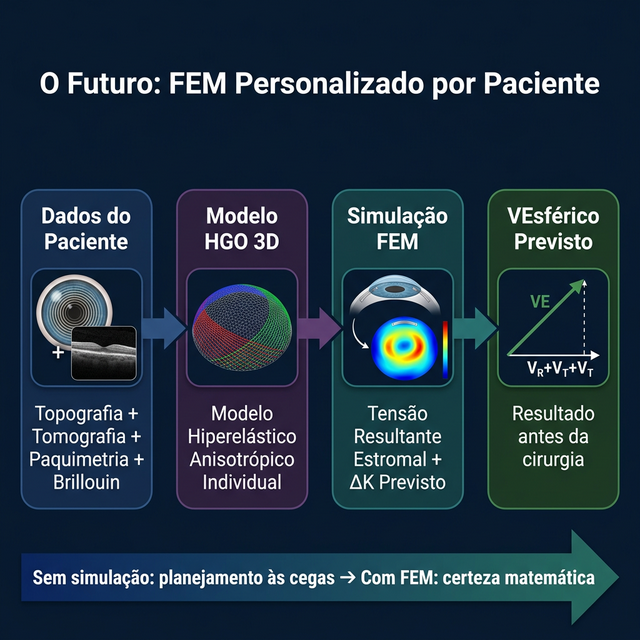
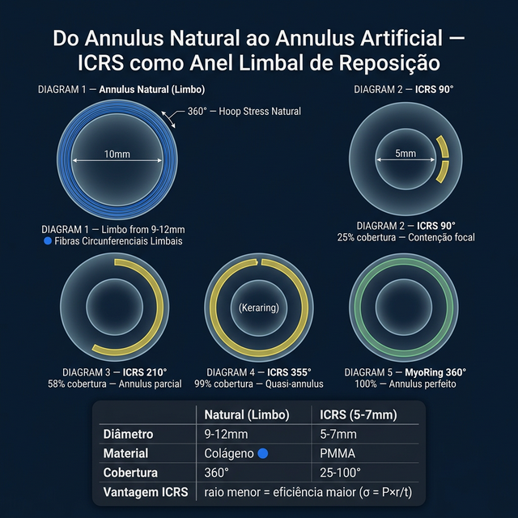
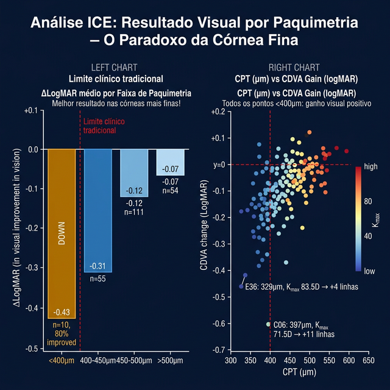

# Capítulo 13 — O Futuro dos Anéis Intracorneanos: Para Onde os Vetores Nos Levam

---

## 📋 METADADOS DO CAPÍTULO

```yaml
chapter_id: CH-013
title: "O Futuro dos Anéis Intracorneanos: Novas Tecnologias, Simulações e Personalização Vetorial"
language: PT-BR
status: draft
version: 0.1.0
```

---

## 📖 CONTEÚDO INSTRUCIONAL

### Introdução

O sistema vetorial que apresentamos neste Atlas é uma ferramenta conceitual e clínica. Mas ele também é a base para a próxima geração de tecnologias em anéis intracorneanos. Este capítulo final olha para o futuro — o que já está sendo desenvolvido e como o paradigma vetorial moldará a próxima década da cirurgia refrativa corneana.

*Recall:* O Atlas define **F** (forças do cone: Fr, Ft, Fτ) como o problema que você lê no Plácido, **V** (vetores do anel: VR, VT, Vτ) como a correção que você prescreve, o **VEsférico** como o resultado integrado, e o **ICE** como o filtro funcional que prediz a capacidade de resposta do paciente. O futuro é maximizar V = −F com precisão personalizada.

### 0. Do Paradigma Estrutural ao Funcional: O ICE como Divisor de Águas

A evolução dos biomarcadores em cirurgia corneana seguiu uma trajetória clara:

```
Kmax (curvatura)       →  BAD-D (elevação)     →  TBI (biomecânica)
    "Onde está?"            "Quão alto está?"        "Quão frágil é?"
      ↓                        ↓                        ↓
  Estrutural              Estrutural              Estrutural
      ↓                        ↓                        ↓
  Detecta doença          Quantifica doença       Prevê progressão

                         → ICE (coerência axial)
                             "Quem vai responder?"
                                    ↓
                              FUNCIONAL ← NOVO!
                                    ↓
                              Prevê resultado visual
```

O **ICE (Index of Axial Coherence)** é o primeiro biomarcador que fala a **linguagem do cérebro, não apenas da córnea**. Ele mede se os eixos ópticos do paciente (topográfico, comático, refrativo) estão coerentes — uma condição necessária para que o córtex visual possa aproveitar a correção mecânica do ICRS.

**Dados de validação (Reis 2026):**
- **N=1.139 olhos** validados em 3 domínios independentes (Catarata, Refrativa, ICRS)
- **ICRS (N=300):** ICE prediz ganho ≥3 linhas com AUC 0.82 (vs Kmax 0.68)
- **ICE Alto** → 4.2 linhas de ganho, 8.5% reintervenção
- **ICE Baixo** → 1.6 linhas de ganho, 35% reintervenção

> **💡 O ICE completa o Atlas:** Os vetores (VR, VT, Vτ) otimizam *como* operar. O ICE otimiza *quem* operar. Juntos, fecham o ciclo **LDM → Vetores → ICE** = Diagnóstico → Planejamento → Prognóstico.

### 1. Simulação por Elementos Finitos (FEM) Personalizada

> **FEM — Finite Element Method (Método dos Elementos Finitos):** Técnica matemática que divide a córnea em milhares de pequenos elementos (triângulos ou tetraedros), atribui propriedades mecânicas a cada um, e calcula numericamente como o tecido deforma quando submetido a uma força — neste caso, o ICRS implantado.

**Estado atual:** Modelos FEM baseados no modelo constitutivo **HGO (Holzapfel-Gasser-Ogden)** já validam os princípios vetoriais em córneas-modelo com alta fidelidade. Dados quantitativos confirmados:

- A **espessura do ICRS** *(ICRS = Intracorneal Ring Segment = segmento de anel intracorneano; a "altura" do anel no plano sagital)* responde por **84%** da variação do **ΔK** *(ΔK = Delta K = variação da ceratometria em dioptrias — o quanto o k-max cai após o anel)*
- **Tensão Resultante Estromal** *(Von Mises stress)* pós-implante: **81–170 kPa** — varia por técnica de inserção (femtossegundo vs. mecânica)
- Profundidade ótima validada por FEM: **75%** da espessura estromal paquimétrica

O futuro é o FEM **personalizado por paciente** — não mais uma córnea-modelo genérica, mas *a sua* córnea, computada antes de você entrar no centro cirúrgico.

---

#### 📐 Glossário do Pipeline FEM Personalizado

| Sigla / Termo | Significado Completo | O Que Fornece ao Modelo |
|--------------|---------------------|------------------------|
| **Topografia** | Mapa de curvatura da superfície anterior (Plácido / Scheimpflug) | A *forma* da córnea em X/Y |
| **Tomografia** | Mapa 3D córnea: superfície anterior, posterior, paquimetria (Pentacam, Galilei) | Espessura em Z — profundidade real para posicionar o anel |
| **Paquimetria** | Medida da espessura corneana em µm (ponto a ponto) | Onde o anel pode ser implantado com segurança |
| **Brillouin** | Microscopia Brillouin — mede rigidez estromal camada a camada (não invasivo) | Módulo elástico real da córnea *deste* paciente — anterior 3× mais rígido que posterior |
| **HGO** | Holzapfel-Gasser-Ogden — modelo matemático hiperelástico anisotrópico | Descreve fibras de colágeno (aniso = direcionais) em matriz mole (hiper = não-linear) |
| **ICRS** | Intracorneal Ring Segment — o segmento de anel de PMMA | O implante virtual colocado no modelo para simular a cirurgia |
| **ΔK** | Delta K — variação de ceratometria (dioptrias) = K-max pré − K-max simulado | Mede o aplainamento previsto pelo FEM |
| **VR, VT, Vτ** | Vetores Radial, Tangencial e Torsional — os 3 vetores primários do anel | O *que* o anel vai fazer (aplainar, redistribuir, torques) |
| **VEsférico** | Vetor Esférico Resultante = raiz quadrada de (VR² + VT² + Vτ²) | O resultado funcional total integrado — o "placar final" da cirurgia |

---

**Como funciona o pipeline:**

```
ETAPA 1 — DADOS DO PACIENTE
Topografia + Tomografia + Paquimetria + Brillouin
→ Gera a geometria 3D real da córnea + propriedades mecânicas individuais
          ↓
ETAPA 2 — MODELO HGO 3D
Córnea dividida em ~50.000 elementos finitos
Fibras 🔴 radiais + 🔵 tangenciais + 🟢 oblíquas mapeadas por WAXS/SHG
Rigidez anterior 3× > posterior (Brillouin)
          ↓
ETAPA 3 — SIMULAÇÃO FEM
ICRS implantado virtualmente (espessura, arco, eixo, profundidade definidos pelo cirurgião)
O solver calcula: deslocamento de cada elemento → ΔK + Tensão Resultante Estromal
          ↓
ETAPA 4 — RESULTADO PREVISTO
VR | VT | Vτ | VEsférico — EM DIOPTRIAS — ANTES DE OPERAR
```

> **Sem FEM:** O cirurgião escolhe o anel com base em nomogramas populacionais → resultado médio esperado.
> **Com FEM personalizado:** O cirurgião simula *este* paciente → VEsférico calculado para *esta* córnea → resultado individualizado.

💡 **Impacto vetorial:** Eliminação do erro de prescrição por variabilidade individual. O nomograma diz "para K-max 52D, use 250µm." O FEM diz "para *esta* córnea de 52D com rigidez anterior 12 kPa e 48% de fibras oblíquas residuais, use 220µm a 73% de profundidade." *Esta capacidade de FEM personalizado ainda não está disponível comercialmente — conceito validado em modelos de pesquisa.*



### 2. Anéis com Geometria Personalizada (Custom Rings)

**Estado atual:** Os anéis disponíveis têm espessuras e arcos em incrementos fixos (150, 200, 250… μm; 90°, 120°, 150°, 160°…). O futuro são anéis **fabricados sob medida** para cada paciente.

**Conceito:**
- O nomograma vetorial calcula o VEsférico ideal
- A partir dele, os parâmetros exatos do anel são definidos (ex: 237 μm, arco de 143°, gradiente de assimetria de 82 μm)
- O anel é fabricado por impressão 3D ou usinagem de precisão

**Impacto vetorial:** Eliminação do compromisso entre o que o vetor pede e o que o catálogo oferece. VEsférico maximizado por design.

### 2.5 A Nova Fronteira: Anéis Concêntricos e o Annulus Artificial Híbrido

**Estado atual:** A cirurgia concêntrica já evoluiu do empirismo ("colocar mais anéis para aplanar mais") para a **Arquitetura Tensional Multicamada Guiada por WAXS** (orientação fibrilar baseada em espalhamento de raios X). 

A teoria estrutural vetorial prediz que o cirurgião do futuro selecionará **geometrias diferentes para diâmetros diferentes**, pareando o perfil à fibra local:
- **Ø3mm (Zona Ortogonal):** Perfis puramente **triangulares** (cunha focal extrema).
- **Ø5mm (Zona Mista):** Perfis **híbridos** ou assimétricos (recrutamento focal + torque).
- **Ø6-7mm (Zona Tangencial):** Perfis puramente **planos** (*flat*) ou arcos ultra-longos atuando como contensor global.

**O Ponto de Inflexão Tecnológico (Insight Gemini Deep Review):** 
A evolução máxima da arquitetura concêntrica talvez nem exija implantes múltiplos. Perfis elipsoidais/prismáticos híbridos de base macro-larga acoplados a arcos quase totais (ex: Ferrara HM 320° a Ø5-6mm) já encapsulam os benefícios da contenção anular tangencial (*annulus artificial*) simultaneamente ao suporte refrativo intrastromal em um **único implante**. O futuro supremo da refrativa corneana não é apenas anéis fabricados por AI, mas usar a *geometria correta* para tensionar a *fibra correta* na *profundidade correta*.

### 3. Inteligência Artificial para Nomogramas Preditivos

**Estado atual:** Nomogramas são baseados em tabelas e experiência do cirurgião. O futuro é a **IA preditiva vetorial**.

**Conceito:**
1. Uma rede neural treinada com milhares de casos (topografia pré → anel usado → resultado pós)
2. A IA aprende a relação entre parâmetros do anel e VEsférico para cada fenótipo
3. Para um novo paciente, a IA sugere o anel ótimo e prevê o VEsférico com alta precisão

**Impacto vetorial:** Democratização do planejamento vetorial — cirurgiões menos experientes terão acesso à sofisticação de nomogramas vetoriais sem anos de curva de aprendizado.

### 4. Combinação ICRS + CXL Guiado por Vetores

**Estado atual:** ICRS e CXL (crosslinking) são frequentemente feitos em sequência. O futuro é a **combinação sinérgica guiada por vetores**.

**Conceito:**
- O ICRS gera os vetores primários (VR, VT, Vτ)
- O CXL é aplicado de forma assimétrica (topography-guided) para "travar" os vetores na posição ideal
- O padrão de UV do CXL é definido pelo VEsférico desejado

**Impacto vetorial:** O CXL deixa de ser apenas "estabilizador" e passa a ser um amplificador e fixador dos vetores do anel.

### 5. Novos Materiais e Biocompatibilidade

**Tendências:**
- Anéis de materiais biocompatíveis avançados (hidrogéis inteligentes, polímeros de memória de forma)
- Possibilidade de anéis com espessura ajustável pós-implante (expansíveis por laser ou hidratação)
- Anéis biodegradáveis que liberam fármacos (combinação ICRS + drug delivery)

**Impacto vetorial:** Anéis ajustáveis permitiriam "afinar" os vetores no pós-operatório, convergindo iterativamente para o VEsférico ideal.

### 6. Atlas Digital Interativo

**Conceito:** Uma versão digital deste Atlas que permite ao cirurgião:
1. Inserir os dados topográficos do paciente
2. Visualizar os 5 vetores em tempo real sobre o mapa
3. Simular diferentes configurações de anel
4. Ver o VEsférico estimado para cada opção
5. Comparar com casos similares do banco de dados

**Impacto:** O Atlas deixa de ser um livro e vira uma **ferramenta de planejamento cirúrgico**.

### Conclusão: O Paradigma Vetorial

Este Atlas propôs uma mudança de paradigma:

| Abordagem Antiga | Abordagem Vetorial |
|-------------------|-------------------|
| K-max → anel por tabela | Fenótipo → vetores → anel por lógica |
| "Quanto aplainar?" | "Qual vetor priorizar?" |
| Resultado medido em dioptrias | Resultado medido em VEsférico |
| Complicação = azar | Complicação = vetor mal direcionado |
| Experiência do cirurgião = tudo | Experiência + modelo preditivo = melhor |

O sistema vetorial não substitui a experiência clínica — ele a **estrutura, quantifica e potencializa**. Cada caso é uma equação vetorial. Cada anel é uma soma de forças. Cada resultado é um VEsférico.

Que este Atlas seja a primeira pedra de uma nova forma de pensar os anéis intracorneanos.

---

> *"Não basta saber o que fazer. É preciso saber por que aquilo funciona."*
> — Princípio fundamental deste Atlas

### 💡 O Futuro do Modelo 3-Fibras (Síntese do Autor)

O modelo 3-fibras proposto neste Atlas abre portas para inovações que conectam anatomia micro a planejamento cirúrgico:

| Tecnologia Futura | Como o Modelo 3-Fibras Contribui |
|-------------------|--------------------------------|
| **WAXS personalizado** | Mapa de orientação fibrilar do paciente → saber exatamente quais fibras o anel intercepta em cada posição |
| **SHG in vivo** | Mapear oblíquas residuais antes da cirurgia → quantificar o grau de degradação e guiar posicionamento |
| **FEM fiber-aware** | Modelos HGO com dados de fibras do paciente → simulação vetorial com substrato anatômico real |
| **Anéis bioengenheirados** | Material que mimetize as propriedades mecânicas das oblíquas (viscoelástico, não rígido) → "oblíqua artificial perfeita" |
| **CXL guiado por fibras** | Crosslinking direcionado às zonas com mais degradação de oblíquas → reforço seletivo |
| **PTA fibrilar** | Refinar o PTA incorporando dados SHG de oblíquas residuais → preditor mais preciso que paquimetria |

> **Visão:** O cirurgião do futuro verá a córnea como uma **malha de 3 famílias de fibras**. Cada anel será prescrito com base em **qual fibra tensionar, qual criar, qual estabilizar** — não apenas em números de K-max e cilindro. O Atlas Vetorial é o primeiro passo desta transformação.

### 💡 O Conceito do Annulus Artificial (Síntese do Autor)

#### O Annulus Natural (✅ Newton & Meek 1998)

O limbo contém um **annulus de fibras circunferenciais** (🔵) a 360° que mantém a curvatura corneana sob pressão (PIO). Este annulus funciona pelo princípio de **hoop stress** — a mesma física de arcos num barril contendo líquido pressurizado.

#### A Hipótese: Arco Longo = Annulus Artificial

| | Annulus Natural | ICRS Arco Longo |
|--|---------------|----------------|
| Diâmetro | 9-12 mm | 5-7 mm |
| Material | Fibras 🔵 colágeno | PMMA rígido |
| Cobertura | 360° | 90°-355° |
| Função | Conter PIO → curvatura | 💡 Conter PIO → curvatura (diâmetro menor) |

**Vantagem geométrica:** A tensão circunferencial (σ = P × r / t) é proporcional ao raio. Um ICRS a Ø5mm precisa conter **metade da tensão** que o limbo (Ø10mm) → é **mais eficiente** como annulus.

| Arco | Cobertura | Perfil Disponível | Efeito |
|------|----------|---|--------|
| 90° | 25% | Todos | Contenção focal |
| 210° | 58% | Todos | Annulus parcial |
| **300°** | **83%** | ⬮ **CornealRing arredondado** | Annulus arredondado (mínimo haze) |
| **320°** | **89%** | 🟠 **HM fusiforme** | Annulus fusiforme (VR+VT) |
| **340°** | **94%** | 🔺 **Ferrara triangular** | Annulus triangular (alto VR, risco haze) |
| **355°** | **99%** | 🔺 **Keraring triangular** | Quase-annulus completo! |
| **360°** | **100%** | ⭕ **MyoRing** (pocket) | Annulus perfeito |



#### ICRS × CXL — Tala Mecânica + Cura Bioquímica

| | ICRS (Tala) | CXL (Cura) | ICRS + CXL |
|--|------------|-----------|-----------|
| **Mecanismo** | 🟢 Oblíqua artificial (mecânica) | 🟢 Oblíquas novas (bioquímica) | Ambos |
| **Estabilização** | Parcial (74%) | Alta (>95%) | **Máxima** |
| **Duração** | Enquanto implantado | Permanente | Permanente + suporte |

> **🔬 Evidência Clínica de Longo Prazo (Banco ICE):**
> 
> A contenção mecânica promovida pelo ICRS não é temporária. Dados do estudo longitudinal de **Torquetti 2009 (5 anos de follow-up)** demonstram a estabilidade permanente do "Tenting Effect" quando a contenção anular é alcançada:
> - **Pré-op:** K-max 54.07 D
> - **1 mês:** K-max 49.36 D (efeito imediato)
> - **5 anos:** K-max 48.09 D (estabilidade total mantida na meia década seguinte)
> 
> Mesmo assim, o anel sozinho estabiliza em definitivo ~74% dos casos. ICRS + CXL = abordagem sinérgica absoluta: contenção mecânica (Tala) + crosslinks bioquímicos (Cura).

### 💡 Hipótese da Profundidade Diferencial em Anéis Concêntricos (Síntese do Autor)

Nos anéis concêntricos, a regra clínica é: **o anel externo deve ficar mais profundo**. Esta regra é biomecânicamente justificada por 4 razões:

| # | Razão | Evidência |
|---|---|---|
| 1 | Córnea periférica é mais grossa (Ø6=640µm vs Ø5=600µm) → mais espaço | ✅ Anatômico |
| 2 | Menos oblíquas na periferia posterior → lamelas mais complacentes | ✅ Histológico (Winkler 2013) |
| 3 | Interno raso = VR forte (efeito superficial), externo fundo = VT (não precisa efeito superficial) | 💡 Síntese |
| 4 | Profundidades diferentes evitam interferência mecânica entre lamelas compartilhadas | 💡 Síntese |

**Regra proposta:**
- **Interno (Ø5mm):** 65-70% de profundidade (~420µm) → VR máximo
- **Externo (Ø6mm):** 75-80% de profundidade (~500µm) → VT em lamelas complacentes
- **Δ mínimo:** 50-80µm entre os dois → evitar tração dupla
- **Espessura residual mínima:** ≥130µm (segurança endotelial)

---

### 💡 ICRS em Córneas Ultrafinas: Alternativa ao Transplante? (Dados ICE + Síntese do Autor)

A contraindicação clássica para ICRS inclui paquimetria inferior a 400μm no ponto de implantação. Contudo, cirurgiões ao redor do mundo estão implantando anéis em córneas extremamente finas como **última linha antes do transplante** — e os dados sugerem resultados surpreendentes.

#### Evidência do Banco ICE (Khanthik 2024, n=230)

A análise do banco de dados *ICRS Clinical Evidence* por faixa de paquimetria revela um paradoxo:

| Faixa CPT (μm) | n | CDVA Change Média | % Melhoraram | % Pioraram | Kmax Médio |
|---|---|---|---|---|---|
| **< 400** | **10** | **-0.428** | **80%** | **0%** | **70.5 D** |
| 400–450 | 55 | -0.311 | 65% | 16% | 67.1 D |
| 450–500 | 111 | -0.122 | 46% | 15% | 61.8 D |
| > 500 | 54 | -0.070 | 41% | 11% | 58.6 D |

> **O Paradoxo da Córnea Fina:** As córneas mais finas tiveram o **melhor resultado médio**, a **maior taxa de melhora** (80%) e **zero casos de piora visual**. O caso mais extremo — paciente E36, CPT de **329μm**, Kmax 83.5D — ganhou 4 linhas de visão. O paciente C06 (397μm, Kmax 71.5D) ganhou **11 linhas**.



#### Explicação Biomecânica: A Hipótese da Zona de Implantação Residual

Por que córneas ultrafinas respondem paradoxalmente bem ao ICRS? A resposta está na **proporção estromal**:

1. **O afinamento no KC é desproporcionalmente anterior** (ver CH-008, seção 8): Bowman é destruída, o estroma anterior perde até 60% da espessura, mas o **estroma posterior é relativamente preservado** (~16% de perda)
2. **Em uma córnea de 350μm a 75% de profundidade** (~260μm), o anel repousa diretamente no **estroma posterior preservado** — onde as lamelas paralelas mantêm orientação reconhecível
3. **A resposta biomecânica é paradoxalmente mais "limpa"** — o anel interage com lamelas organizadas, não com o caos fibrilar do estroma anterior ceratocônico
4. **O estroma posterior tem menos oblíquas** (Winkler 2013) → menos resistência ao deslocamento lamelar → o anel gera VR e VT com menor estresse mecânico

#### Implicação Clínica

Para pacientes com ceratocone avançado onde o transplante seria a única opção:
- O ICRS em córnea ultrafina pode ser uma **ponte terapêutica** legítima
- ✅ A profundidade relativa (75-80%) se torna ainda mais crítica — *embasamento FEM: Kling & Marcos 2013, IOVS* — erros de profundidade absoluta em córneas finas são menos tolerantes
- A combinação ICRS + CXL é especialmente indicada nestes casos (contenção mecânica + estabilização bioquímica)

> [!WARNING]
> **💡 Síntese do Autor:** Os dados são reais (n=10 ultrafinos), mas o tamanho amostral é pequeno. A hipótese da "Zona de Implantação Residual" é cientificamente defensável e consistente com Winkler/Meek, mas necessita validação prospectiva. Apresentada como hipótese geradora — não como protocolo clínico.

---
*Pipeline Status: DRAFT v0.8.0 — Atualizado com hipótese córneas ultrafinas + dados ICE — FIM DO ATLAS*
