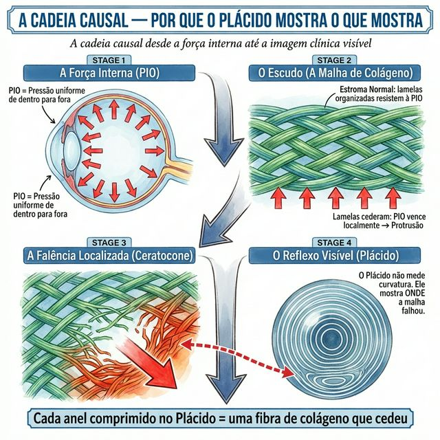
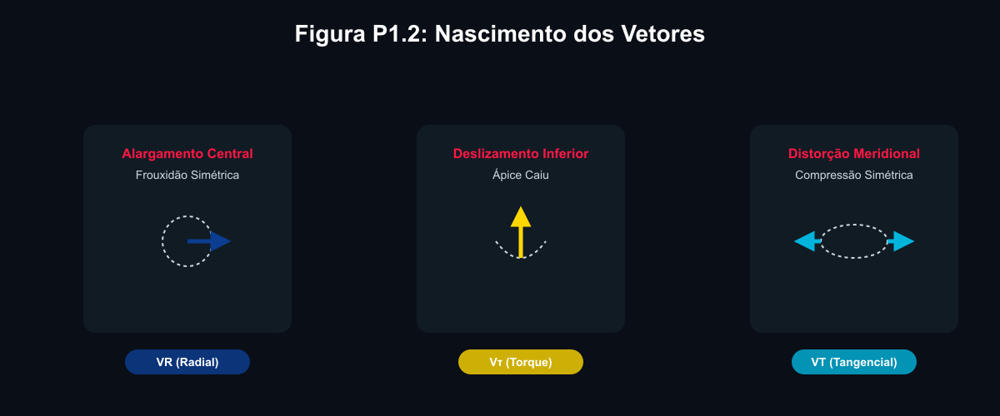

# P1.1 — A Origem: Da Ilusão Topográfica à Verdade Biomecânica

---

## 📋 METADADOS DO CAPÍTULO

```yaml
chapter_id: P1-CH01
title: "O Que os Anéis de Plácido Revelam: A Transição Mental da Curvatura para o Colágeno"
language: PT-BR
status: draft
version: 0.2.0
part: "PARTE I — A Leitura Vetorial dos Anéis de Plácido"
```

---

## 📖 CONTEÚDO INSTRUCIONAL

### A Maior Ilusão da Cirurgia Refrativa

Durante décadas, fomos treinados para olhar para um mapa topográfico e ver uma única coisa: **uma mancha vermelha**.

Fomos ensinados a medir o quão vermelha ela é (K-max) e onde ela está (eixo topográfico mais plano ou mais curvo). E, baseados apenas nisso, aprendemos a fazer incisões e implantar segmentos de PMMA, na esperança de que a mancha ficasse mais verde ou azul na consulta de retorno.

Esta é a leitura topográfica clássica. Ela tem nos servido razoavelmente bem. Mas ela contém uma ilusão perigosa.

**O mapa topográfico de cores não é o problema. Ele é apenas a consequência visual de um problema invisível.**

Um cirurgião de anéis de excelência — o cirurgião para o qual este Atlas foi escrito — não opera manchas coloridas numa tela de computador. Ele não opera o invólucro geométrico do olho. **Ele opera uma malha tridimensional de fibras de colágeno** que perdeu sua guerra estrutural contra a pressão intraocular.

O objetivo deste capítulo é provocar uma ruptura irreversível na forma como você lê um exame.

---

### A Desconstrução do Disco de Plácido

O exame de Plácido projeta anéis de luz sobre o filme lacrimal e mede a distância entre os anéis refletidos. Matematicamente, o computador calcula o gradiente de reflexão, transforma isso em raios de curvatura e, por fim, codifica os números em cores quentes e frias.

Mas olhe mais fundo. Pense na **cadeia de eventos** que antecede o anel de luz refletido:

1.  **A Força Interna:** A pressão intraocular (PIO) empurra todas as paredes do globo uniformemente de dentro para fora.
2.  **O Escudo (A Malha de Colágeno):** O estroma corneano, composto por centenas de lamelas de colágeno empilhadas e entrelaçadas, resiste a essa pressão como uma lona de circo sob tensão máxima.
3.  **A Falência Localizada:** No ceratocone, por um defeito enzimático ou mecânico (coçar os olhos), as pontes entre as lamelas de colágeno se rompem em uma zona específica. As fibras deslizam umas sobre as outras. A "lona de circo" relaxa naquele ponto.
4.  **A Deformação Visível:** Como o colágeno cedeu, a PIO vence a batalha local. A córnea protrai.

**A mancha vermelha no Plácido não diz "aqui a córnea é curva". Ela grita: "AQUI A MALHA DE COLÁGENO SE DESPEDAÇOU".**



---

### O Framework Multi-Escala: O Padrão Ouro deste Atlas

Para entender o que o anel intracorneano realmente fará, a partir de hoje você treinará seu cérebro para visualizar a córnea do paciente, simultaneamente, em **três escalas distintas**.

Este é o **Framework Multi-Escala**, e é a fundação intelectual de cada página das próximas partes deste livro.

#### 1. A Escala MACRO (O Reflexo)
É a vista superior (Top-Down). O mapa de Plácido com seus anéis deformados. É aqui que você identifica o **fenótipo** da doença (P1 a P5). Você lê a distorção morfológica e reconhece: "este paciente tem um cone Duck".

#### 2. A Escala MESO (A Anatomia)
É o corte transversal meridional. É aqui que você enxerga o afinamento estromal localizado e percebe a protrusão física. É a camada onde a decisão cirúrgica de "a qual profundidade colocar o túnel (70-80%)" acontece.

#### 3. A Escala MICRO (A Biomecânica da Malha)
Esta é a escala que separa os mestres dos operadores. É a visão ampliada do estroma. Você visualiza as fibras de colágeno perfeitamente esticadas na periferia, mas perigosamente esgarçadas, relaxadas e caóticas na zona do cone.

É unicamente nesta escala — na Escala Micro — que **os vetores ganham vida**.

---

### A Transição Mental: Nascimento das Forças Vetoriais

Um vetor não é uma flecha colorida desenhada abstratamente por cima do papel do exame impresso.

**O vetor é a manifestação física daquilo que as lamelas de colágeno estão implorando que você faça.**

*   Quando as lamelas centrais se alongam simetricamente como a membrana de um tambor frouxo (Cone Central), elas geram um campo de força radial puxando o tecido para fora. **Você enxerga isso no Plácido.** O que elas precisam? Que você adicione periféricamente volume lamelar para tensioná-las novamente: **O Vetor Radial (VR)**.
*   Quando a malha inferior escorregou em relação à malha superior, o ápice desabou (Cone Oval). Ao analisar a assimetria das fibras, você percebe um momento rotacional de perda de esqueleto estrutural. **Você enxerga isso na distorção do Plácido inferior.** As fibras precisam ser içadas, tracionadas de volta para o norte: **O Vetor de Torque (Vτ)**.
*   Quando a malha se desencontrou criando tensões oblíquas não simétricas, deslocando a qualidade ótica para formar a terrível aberração de coma. **Você enxerga isso na divergência de anéis comprimidos**. As lamelas precisam ser rotacionadas e reconectadas opticamente ao eixo visual pupilar: **O Vetor de Coma (VComa)**.



### E o Anel?

Um anel intracorneano não é apenas um andaime para aplainar o cone.
O implante de PMMA atua como **uma alavanca biomecânica gigante (na Escala Meso)** desenhada para inserir estresse reverso direto **dentro das fibras de colágeno esgarçadas (na Escala Micro)**, transformando o **padrão de curvatura externa (na Escala Macro)**.

1.  **A distorção natural gerou o "Vetor do Problema".**
2.  **A geometria do anel introduz o "Vetor da Solução".**

Se ambos casarem, a força líquida zera. O colágeno retoma a tensão de restinga. O eixo visual se purifica. A visão ressurge.

### Bem-vindo(a) à Mecânica Estrutural

É oficial: você acabou de se demitir do cargo de leitor de manchas coloridas.
Agora, você atua como o engenheiro de estruturas de uma malha viscoelástica milimétrica de colágeno.

No próximo capítulo, dissecaremos visualmente as cinco "impressões digitais" (P1 a P5) de destruição da malha lamelar que definem o ceratocone humano, abrindo caminho para o momento do planejamento perfeito.

---

## 🎨 ESPECIFICAÇÃO VISUAL PARA AS ILUSTRAÇÕES

1.  **Figura P1.1 — O Framework Multi-Escala:**
    Um diagrama tripartido revolucionário, lado a lado:
    *   **Coluna 1 (MACRO):** Imagem do disco de Plácido projetando anéis em uma córnea (ênfase hiper-realista) com uma "mancha vermelha" sobreposta no reflexo. Linhas limpas de astigmatismo irregular.
    *   **Coluna 2 (MESO):** Corte anatômico seccional ("fatia de bolo") da córnea ectásica (fino na frente, normal na base), destacando a topografia anterior protusa e a anatomia da câmara anterior.
    *   **Coluna 3 (MICRO):** Ilustração artística inspirada mas microscopicamente correta das lamelas e fibras estromais de colágeno: densas nas laterais e espaçadas/esgarçadas no ápice.

2.  **Figura P1.2 — O Nascimento Biomecânico do Vetor:**
    Mostrando a relação causa-efeito. O colágeno "rasgando" -> Uma seta vetorial nascendo a partir das fibras -> Resultando no formato do disco de Plácido. *Sem representação topográfica de cor.* Apenas reflexos brancos puros (Plácido) sobre um design azul ciano/marinho focado na trama estrutural.

---

*Pipeline Status: DRAFT v0.2.0*
