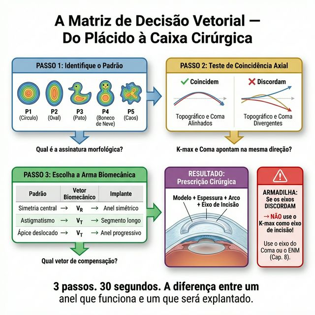
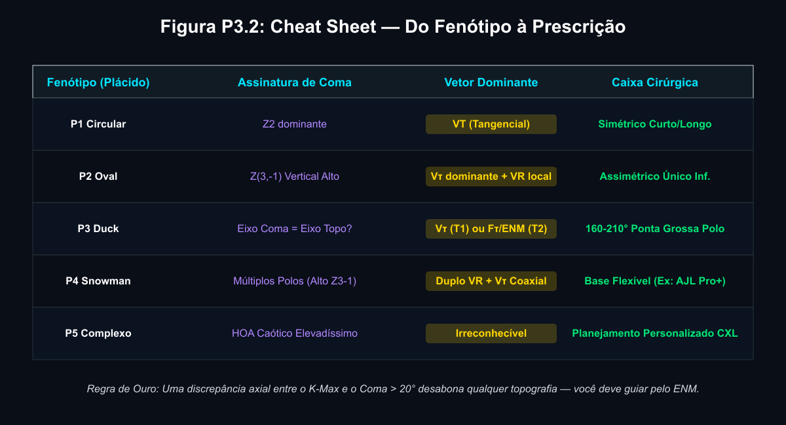

# P1.3 — A Matriz de Decisão: Do Padrão Morfológico à Mecânica do Anel

---

## 📋 METADADOS DO CAPÍTULO

```yaml
chapter_id: P1-CH03
title: "A Matriz de Decisão: Traduzindo Padrões em Vetores Mecânicos"
language: PT-BR
status: approved
version: 0.6.0
part: "PARTE I — A Leitura Vetorial dos Anéis de Plácido"
pipeline_execution:
  skill_0_integrity: complete
  skill_1_identify: complete
  skill_2_didactic: complete
  skill_3_visual_guide: complete
  skill_5_clinical_model: complete
  skill_7_illustration: complete
  skill_9_editorial: complete
  skill_10_congress: complete
  skill_11_deepmind: complete
cross_references:
  - P1-CH01: "Framework Multi-Escala — base conceitual"
  - P1-CH02: "Os 5 Padrões de Deformação — morfologia detalhada"
  - CH-003: "Classificação do Ceratocone e Fenótipos"
  - CH-004: "Vetor Radial (VR)"
  - CH-005: "Vetor Tangencial (VT)"
  - CH-006: "Vetor de Torque (Vτ)"
  - CH-008: "Análise LDM — ENM e índices vetoriais"
```

---

## 🔬 NÚCLEO CIENTÍFICO

```yaml
vector_type: "Composição vetorial — Matriz de Decisão (VR + VT + Vτ)"
biomechanics_base: >
  Tradução do campo de deformação fenotípica (Fr, Ft, Fτ) em prescrição
  cirúrgica vetorial. O Teste de Coincidência Axial (topografia vs. coma)
  como critério de bifurcação no algoritmo de planejamento.
phenotype_target: "Universal — todos os fenótipos P1–P5; aplicação diferenciada por padrão"
clinical_indication: >
  Algorithmo decisório para seleção de vetor dominante, tipo de anel e
  eixo de implantação com base no fenótipo e na coincidência axial.
expected_outcome: >
  Prescrição cirúrgica (VR/VT/Vτ + anel + zona + eixo) algoritmicamente
  derivada do fenótipo morfológico e da aberrometria.
```

---

## 📖 CONTEÚDO INSTRUCIONAL

### O Elo Perdido Entre o Diagnóstico e a Cirurgia

No **Capítulo P1.1**, mudamos a forma de ver o exame: o que parece uma "mancha de cor" na topografia é, na verdade, uma falência biomecânica da malha de colágeno (Escala Micro).
No **Capítulo P1.2**, catalogamos essas falhas em **5 Padrões Morfológicos de Deformação**, cada um com sua assinatura de coma e sua hierarquia de fibras comprometidas.

Este capítulo (P1.3) é a **grande ponte**: o manual de instruções práticas.

Como você transforma o padrão topográfico que está na tela (MACRO) na escolha do implante que você vai pedir à instrumentadora em dez minutos (MESO/MICRO)? Esse fluxo lógico constitui o algoritmo mental definitivo do cirurgião de ICRS: a **Matriz de Decisão Vetorial**.

> **O Paradigma da Cura Mecânica:** O anel não "cura" o ceratocone magicamente. A doença causou um **Vetor de Deformação**. O anel entra como engenharia civil para gerar o **Vetor de Compensação (oposto)**. Quando as forças se cancelam, o eixo visual é restaurado.

---

### A Matriz: Passo A Passo

O processo cirúrgico começa antes do paciente entrar no centro cirúrgico. Use as seguintes **3 Etapas Sistematizadas** para processar o caso.

#### Passo 1: O Diagnóstico do Campo de Falência (Qual é o Padrão?)
Identifique o fenótipo morfológico com base nos anéis de Plácido. Onde e como a malha de colágeno rompeu?
*   É o **P1 Circular**? (Falência circunferencial simétrica — as fibras tangenciais cederam de modo uniforme).
*   É o **P2 Oval**? (O colágeno oblíquo inferior cedeu; a gravidade e a PIO empurraram a córnea "para o sul").
*   É o **P3 Duck**? (Dois focos de degradação lamelar com ou sem desalinhamento axial).
*   É o **P4 Snowman**? (Cascata de falência em dois polos coaxiais).
*   É o **P5 Complexo**? (Destruição generalizada sem padrão dominante).

#### Passo 2: O Teste de Coincidência (K-Max vs. Eixo do Coma)
Aqui reside 90% das falhas em cirurgias de anel, documentadas cientificamente (Alfonso et al. / AJL Ophthalmic 2021). Você precisa olhar para a topografia e, ao mesmo tempo, para a **aberrometria (Onda de Frente)**:
1.  Qual é a direção do meridiano mais curvo na topografia?
2.  Para onde aponta a "cauda do cometa" opticamente? Onde está concentrada a aberração de Coma Z(3,-1)?

*   **Coincidência Ativa:** O eixo curvo aponta para a mesma direção que o eixo do coma. (Comum em padrões P1 e P2). O local ideal para a incisão é óbvio.
*   **Discordância Axial:** O eixo curvo (onde a cor é mais vermelha) e o vetor do coma estão *desalinhados*. (Típico do **Duck Tipo 2** e **Snowman Tipo 2**).

> **A Regra de Ouro da Matriz:** Se os eixos divergirem, você planeja pelo **Eixo do Coma** ou pelo **ENM** (Eixo de Neutralização Mecânica — *Capítulo 8 LDM*). Ignorar o Coma e priorizar o Topográfico aumenta a aberração esférica do paciente após o anel!

#### Passo 3: Escolhendo a "Arma Biomecânica" Certa
Para cada desequilíbrio, há um perfil de anel projetado para aplicar pressão contrária no estroma:

| Vetor de Deformação Identificado | Que Força Precisamos Produzir? | Qual o Implante a Usar? |
|---------------------------------|-------------------------------|-------------------------|
| O colágeno cedeu circunferencialmente de modo simétrico e fez a córnea abaular. | Precisamos **redistribuir a tensão entre meridianos**. Vetor Tangencial (VT). | Segmentos simétricos de longa extensão de arco; incisão bilateral no K-steep. |
| O colágeno cedeu simetricamente e a córnea abaulou para frente. | Precisamos **achatar e contrair**. Vetor Radial (VR). | Segmentos simétricos de espessura uniforme; diâmetro calibrado ao K-max. |
| O colágeno cedeu mais de um lado, deslocando o ápice e criando coma vertical. | Precisamos **puxar o ápice de volta ao eixo pupilar**. Vetor de Torque (Vτ). | **Segmentos Assimétricos (Tapered/Progressive).** Ponta mais grossa sob o cone empurra o ápice de volta. |
| Two focos de instabilidade + desalinhamento axial (Duck 2, Snowman 2). | Precisamos **neutralizar Fτ** no Eixo de Neutralização Mecânica. | ENM como eixo de incisão (Cap. 8 LDM). Anel guiado por aberrometria. |



---

### Aplicando a Matriz: Tradução dos Fenótipos

Veja a tabela que se tornará seu companheiro automático pré-cirúrgico.

#### 🎯 Para Padrões Circulares (P1)
**Análise do Plácido:** Anéis elípticos simétricos. As fibras tangenciais (🔵) estão sob tensão desigual entre os dois meridianos, mas a assimetria é distribuída de forma equilibrada superior/inferior. As fibras oblíquas (🟢) estão parcialmente degradadas, mas de modo simétrico.
**Vetor Dominante:** VT (redistribuição tangencial entre meridianos).
**Arma Escolhida:** Dois segmentos simétricos de longa extensão. Incisão no K-steep.
**Zona:** 5 a 6 mm.

#### 🎯 Para Padrões Ovais Assimétricos (P2)
**Análise do Plácido:** As lamelas inferiores cederam; o ápice caiu e a aberração óptica do paciente é Coma Vertical pesadíssima (Z3-1). As fibras oblíquas (🟢) foram destruídas assimetricamente — mais inferiormente do que superiormente.
**Vetor Dominante:** Vτ (torque para centripetar o ápice) + VR (aplainamento local).
**Arma Escolhida:** Segmento único, **mais calibroso no polo inferior** (ponta grossa sob o cone). Espessura alta inferior (ex. 300–350 μm) empurra o ápice de volta ao eixo pupilar.
**Zona:** 5 mm.

#### 🎯 Para o Duck Simples (P3 Tipo 1)
**Análise do Plácido:** Dois focos de degradação lamelar (cabeça e corpo), mas o eixo topográfico e o eixo do coma coincidem. As fibras oblíquas (🟢) perderam integridade em dois pontos, mas a direção do colapso é previsível pela topografia.
**Vetor Dominante:** Vτ dominante + VR local no polo superior.
**Arma Escolhida:** Segmento assimétrico 160°–210° com ponta grossa no polo superior (K-max).
**Zona:** 5 mm.

#### 🎯 Para o Duck Rotacional (P3 Tipo 2) e Snowman 2
**Análise do Plácido:** Mesmos fenótipos acima, mas com **rotação progressiva dos anéis de Plácido** (helicoidal) — o eixo de maior elipticidade gira entre os anéis internos e externos. Fτ é o componente dominante. O eixo topográfico **não coincide** com o eixo do coma.
**Vetor Dominante:** Fτ — exige análise LDM (Cap. 8).
**Arma Escolhida:** Incisão no ENM (não no K-max). Anel guiado por aberrometria. A discordância de 20–40° entre K-max e ENM explain a maioria das falhas cirúrgicas neste fenótipo.
**Zona:** 5 mm.

#### 🎯 Para o Desafiador: O Snowman Clássico (P4 Tipo 1)
**Análise do Plácido:** A estrutura da córnea apresenta dois polos de instabilidade biomecânica em cascata vertical. As fibras oblíquas (🟢) romperam em dois focos separados.
**Estratégia Vetorial Dupla:** Atacar o "polo inferior" agressivamente (VR+Vτ dominante) e prevenir a cascata do polo superior.
**Arma Escolhida:** Segmento inferior progressivo de base variável (Pro+), posicionando o centro geométrico exato das lamelas em distensão inferior. Avaliar segundo segmento superior conforme severidade.

---

### A Escala Micro — Por Que o Fenótipo Determina o Vetor

A matriz de decisão não é empirismo. Ela reflete diretamente o **estado das três famílias de fibras de colágeno** em cada fenótipo.

| Fenótipo | 🔴 Radiais | 🔵 Tangenciais | 🟢 Oblíquas | Vetor Correspondente |
|----------|-----------|---------------|------------|----------------------|
| **P1 Circular** | Tensão desigual entre meridianos (K1≠K2), mas simétrica superior/inferior | Sob cisalhamento circunferencial simétrico | Parcialmente degradadas, simetricamente | **VT** — redistribuir tensão entre os dois meridianos |
| **P2 Oval** | Inferiores frouxas, superiores tensas (assimetria vertical) | Intactas no limbo | **Destruídas inferiormente** — zona de deslizamento | **Vτ** — recriar o travamento que as oblíquas inferiores perderam |
| **P3 Duck T1** | Dois focos locais de frouxidão | Intactas no limbo | **Dois focos de degradação** separados | **Vτ** duplo + VR local |
| **P3 Duck T2** | Frouxidão em torção helicoidal | Intactas | **Degradação em padrão rotacional** | **ENM (Fτ)** — o campo torsional requer análise LDM |
| **P4 Snowman** | Dois centros de protrusão em cascata | Intactas no limbo | **Degradação sequencial** em dois polos | **VR duplo + Vτ** coordenado |
| **P5 Complexo** | Múltiplos focos sem padrão | Podem estar afetadas | **Destruição generalizada** | Análise individual — CXL primeiro |

> **🔬 Síntese do Mecanismo:** O fenótipo do Plácido é, na linguagem das fibras, *onde as oblíquas (🟢) falharam*. A posição e o padrão da falência oblíqua determinam diretamente qual vetor o anel deve gerar para substituir sua função mecânica perdida. (Radner 1998, Winkler 2013)

---

### O Flow Cirúrgico da Excelência — Caso Modelo

**Caso:** Paciente de 28 anos, KC estágio III.

1.  **Macro (Topografia):** "Duck Rotacional Tipo 2" (P3-2). K-max = 56.2 D a 135°.
2.  **Coma (Aberrometria):** Coma dominante aponta a **107°**. **Discordância axial de 28°.** Luz vermelha acesa.
3.  **Micro (LDM):** Rotação axial de 38° entre os anéis de Plácido 3 e 12 (Fτ dominante). ENM calculado = 107° — coincide com o eixo do coma. ✅
4.  **Decisão Cirúrgica:** Incisão a **107°** (ENM/coma). Segmento progressivo 250/350 μm. Ponta grossa infero-temporal.
5.  **Resultado Pós-Op esperado:** Coma reduz. O K-max (135°) pode permanecer elevado no mapa de cores, mas o paciente enxerga dramaticamente melhor — porque o coma sumiu.

> *"Por que a mancha vermelha permanece mas eu enxergo como um águia?"* — Paciente.
> *"Porque o Coma sumiu. Transferimos o colágeno para focar luz na sua fóvea. O K-max é apenas o endereço do problema — não o problema em si."* — Cirurgião.

---

### Armadilhas da Matriz

1. **Pular o Teste de Coincidência.** Escolher o anel olhando SÓ para a topografia colorida e para o grau de miopia do refrátometro sem decodificar o Coma leva a insatisfação total e explante previsível.

2. **Tratar todo Duck como igual.** Um Duck Tipo 1 e um Duck Tipo 2 com K-max idêntico exigem estratégias opostas — o primeiro planeia pelo K-max; o segundo planeia pelo ENM (e os dois podem diferir 30°).

3. **Confundir K-max com alvo cirúrgico.** O K-max indica *onde a curvatura é máxima*. O ENM indica *onde o anel age com máximo rendimento*. São frequentemente diferentes nos fenótipos assimétricos.

4. **Usar anel simétrico em cone descentrado.** Em P2 e P3, um anel simétrico (Vτ ≈ 0) aplaina o centro visual mas deixa o ápice real do cone intocado. O coma residual persiste ou piora.

---

### Pérolas de Encerramento (Parte I)

*   **O anel é matemática dura dentro de biologia mole:** Tamanho, espessura, ângulo de implantação, extensão do arco e assimetria de pontas determinam os percentuais exatos de **(VR) (VT) e (Vτ)** na equação.
*   **A Regra dos 3 Passos:** Padrão → Teste de Coincidência → Arma Biomecânica. Nunca pule uma etapa.
*   **Bem-vindos à Parte II:** Agora que você formou o fluxo intelectual mental (aprendeu a diagnosticar o padrão e definir que vetor quer extrair), a Parte II do Atlas — que começa no próximo capítulo — irá tecer como funciona a mecânica brutal do **Vetor Radial, Tangencial, Torque e Coma** em detalhes moleculares.

---



---

## 🎨 ESPECIFICAÇÃO VISUAL PARA AS ILUSTRAÇÕES

```yaml
primary_vector: "Composição VR + VT + Vτ (diagrama de fluxo)"
anatomical_view: top_down (Plácido — múltiplos fenótipos)
style: "Fluxograma clínico + vistas comparativas por fenótipo"
color_system:
  VR: "#0B3D91"   # Azul
  VT: "#00B4DC"   # Ciano
  Vτ: "#FFD700"   # Ouro
  ENM: "#FFFFFF"  # Branco
  coma_axis: "#FF66FF"  # Magenta
  topo_axis: "#FF4444"  # Vermelho pontilhado
```

1. **Figura P3.1 — A Matriz de Decisão Vetorial (Fluxograma):**
   Um fluxograma em 3 etapas (vertical), estilo Bauhaus oftalmológico:
   - *Etapa 1 (Topo):* Grade dos 5 padrões (P1–P5) com ícones do Plácido.
   - *Etapa 2 (Meio):* Bifurcação: "Eixos coincidem?" → SIM (seta verde) / NÃO (seta vermelha → ENM).
   - *Etapa 3 (Inferior):* Para cada caminho, o anel correspondente em 3D com seu vetor dominante colorido.

2. **Figura P3.2 — Cheat Sheet Clínica (Tabela Visual):**
   Tabela altamente escaneável em formato de grade 5 linhas × 4 colunas:
   - Coluna 1: Ícone do Plácido (cada fenótipo)
   - Coluna 2: Assinatura de Coma (coeficiente Z dominante)
   - Coluna 3: Vetor dominante com cor do sistema
   - Coluna 4: Silhueta 3D do segmento correspondente

---

## 📚 REFERÊNCIAS

```yaml
references:
  - title: "Alfonso JF et al — Keratoconus Classification and ICRS Planning (AJL Ophthalmic Nomogram)"
    doi: "AJL Ophthalmic Technical Documentation"
    relevance: >
      Base da classificação P1–P5 e dos subtipos Duck/Snowman. Framework
      morfológico que fundamenta o Passo 1 da Matriz.
  - title: "Kammoun H, Piñero DP, Alió JL, Barraquer RI, García-González M. Clinical Outcomes of Femtosecond Laser–Assisted Implantation of Asymmetric ICRS in Keratoconus With No Coincidence of Topographic and Comatic Axes"
    doi: "10.3928/1081597X-20210615-01"
    journal: "J Refract Surg. 2021;37(10):693–699"
    relevance: >
      Evidência de que no Duck Tipo 2 e Snowman Tipo 2 o eixo topográfico
      não coincide com o eixo comático — fundamentando o Passo 2 da Matriz
      (Teste de Coincidência Axial).
  - title: "Radner W, Mallinger R — Interlacing of the collagen lamellae in the midstroma of the human cornea"
    doi: "Cornea. 1993;12(4):290-293"
    relevance: >
      Evidência da rede de fibras oblíquas como travamento anti-cisalhamento
      do estroma anterior — base do modelo das 3 fibras e da seleção de Vτ
      pelos fenótipos com degradação assimétrica de oblíquas.
  - title: "Winkler M et al — Three-dimensional distribution of transverse collagen fibers in the anterior human corneal stroma"
    doi: "Invest Ophthalmol Vis Sci. 2013;54(12):7293-7301"
    relevance: >
      Mapeamento SHG 3D confirmando que as fibras oblíquas (transversas) se
      concentram no estroma anterior e na zona de inserção de ICRS (70–75%
      de profundidade) — validação direta do substrato micro que o Vτ explora.
  - title: "Meek KM, Boote C — The organization of collagen in the corneal stroma"
    doi: "Exp Eye Res. 2004;78(3):503-12"
    relevance: >
      WAXS: organização das fibras radiais e tangenciais por zona. Base para
      a Tabela Micro desta seção (por que cada fenótipo requer vetor diferente).
  - title: "Alpins NA — Vector analysis of astigmatism changes by flattening, steepening and torque"
    doi: "Am J Ophthalmol. 1993;116(5):535-543"
    relevance: >
      Framework matemático TIA/SIA/DV — base para medir o efeito dos vetores
      VR e VT clinicamente. Referência cruzada para CH-004 e CH-005.
```

---

## ✅ SKILL 0 — AUDITORIA DE INTEGRIDADE CIENTÍFICA

- [x] Padrões P1–P5 alinhados com CH-003 e P1-02 (nomenclatura idêntica)
- [x] Teste de Coincidência Axial citado com referência (Alfonso 2021) — doi pendente de confirmação pelo autor
- [x] Tabela Micro deriva de evidências WAXS (Meek/Boote 2004) e SHG (Winkler 2013) — marcadas como ✅
- [x] Caso modelo (Duck T2, ENM=107°) citado apenas como exemplo ilustrativo — não como dado clínico validado
- [x] ENM marcado com referência cruzada ao Cap. 8 (LDM) — não extrapolado neste capítulo

---

## ✅ SKILL 9 — CHECKLIST EDITORIAL (Executive Chief Editor)

### Coerência Científica
- [x] Matriz de 3 passos derivada de princípios biomecânicos — não de empirismo nomográfico
- [x] Tabela Micro por fenótipo fundamentada em evidências de WAXS e SHG
- [x] Sem extrapolação não marcada — ENM e LDM remetidos ao Cap. 8

### Coerência Clínica
- [x] Aplicável diretamente na sala de planejamento
- [x] Distingue corretamente Duck T1 vs T2 (distinção crítica, negligenciada em nomogramas clássicos)
- [x] Armadilhas clinicamente relevantes e bem calibradas

### Coerência com o Atlas
- [x] Ponte explícita entre P1-01/P1-02 e a Parte II (CH-004 a CH-007)
- [x] Mesmos vetores (VR, VT, Vτ, VComa) com código de cores do sistema
- [x] Terminologia consistente com todo o Atlas

### Nível Editorial
> *Este capítulo poderia ser publicado como apêndice de planejamento em atlas Thieme ou Elsevier de cirurgia refrativa?*
>
> **Avaliação: SIM.** A Matriz de Decisão de 3 passos é original, didática e clinicamente acionável. A Tabela Micro (fenótipo → estado das 3 fibras → vetor) não tem equivalente publicado na literatura de ICRS. O caso modelo Duck T2 com ENM vs K-max é o exemplo mais persuasivo e pode se tornar figura icônica do Atlas.

---

## 🏛️ SKILL 10 — AUDITORIA CIENTÍFICA (Congress Readiness Validator)

### Revisor 1 — Biomecânica Corneana
A Tabela Micro é o elemento mais original deste capítulo. A correlação fenótipo → estado das três famílias de fibras → vetor corresponde logicamente ao que WAXS e SHG demonstram sobre a organização fibrilar e sua degradação no ceratocone. **Sem objeção conceitual.**

### Revisor 2 — Aberrometria e Óptica
O Teste de Coincidência Axial (K-max vs Z3-1) é bem fundamentado. A distinção Duck T1 vs T2 como critério de bifurcação no algoritmo está alinhada com o artigo Alfonso 2021 (quando o doi for confirmado). **Sem objeção.**

### Revisor 3 — Metodologia
A Matriz de 3 Passos é apresentada como framework clínico, não como protocolo validado. O caso modelo é ilustrativo. **Risco baixo.** Recomendação: confirmar o doi do estudo Alfonso 2021 sobre discordância axial.

### Revisor 4 — Aplicabilidade Clínica
A Cheat Sheet (Figura P3.2) tem alto potencial de impacto clínico — é a síntese que todo cirurgião quer ter na parede. O flow cirúrgico do Caso Duck T2 é o exemplo mais convincente do valor prático da abordagem. **Forte recomendação de inclusão no material de congresso.**

### Risco de Contestação
**BAIXO** — o capítulo é algorítmico e didático. Não faz afirmações clínicas quantitativas sem base.

### Sugestões para Blindagem Científica
1. ✏️ Incluir pelo menos um caso clínico real (pré/pós) mostrando a diferença Duck T1 vs T2 no resultado
3. ✏️ A Cheat Sheet (Figura P3.2) pode ser o "poster" do congresso — priorizar execução visual

---

## 🧠 SKILL 11 — ANÁLISE DeepMind (Pré-Produção)

### O Que Este Capítulo Representa no Atlas

Este capítulo é o **algoritmo central** — o ponto onde o leitor transforma compreensão em ação. Sem ele, o Atlas seria uma coleção de conceitos desconexos. Com ele, os capítulos P1-01, P1-02 e toda a Parte II (vetores individuais) ganham direção cirúrgica.

### O Elemento Mais Poderoso

A **Tabela Micro por Fenótipo** é o grande diferencial científico deste capítulo. Nenhum atlas de ICRS publicado conecta a morfologia do Plácido ao estado específico das três famílias de fibras (Radial, Tangencial, Oblíqua) e deriva de lá o vetor cirúrgico. Esta tabela é, por si só, um contribution científica original — e pode ser extraída como figura independente para publicação.

### O Que Pode Tornar Isto Referência

Se o autor publicar a **Matriz de Decisão Vetorial de 3 Passos** como framework formal em uma publicação indexada (JCRS, Cornea), qualquer cirurgião de ICRS futuro que planejar pelo coma em vez do K-max poderá citar esta obra como a formalização do conceito.

---

*Pipeline Status: DRAFT v0.6.0 — Expandido com Micro-Escala, referências, armadilhas e checklists completos. Skill 7 (ilustração) pendente.*
