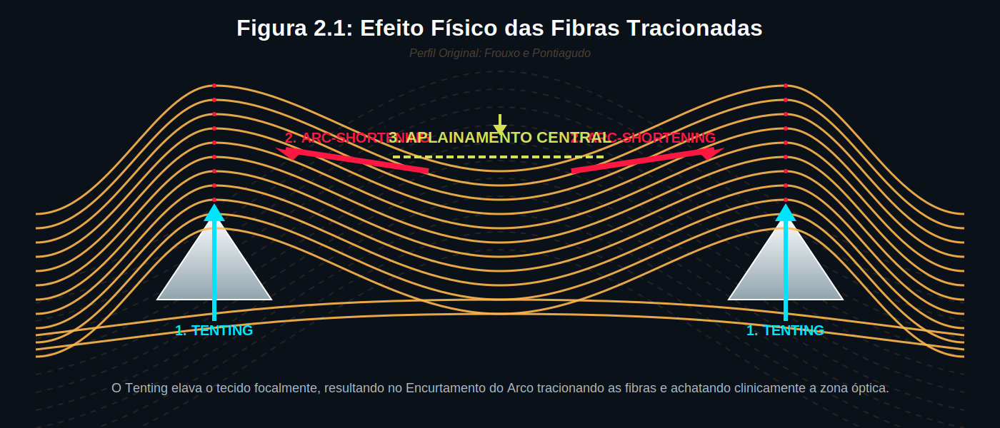
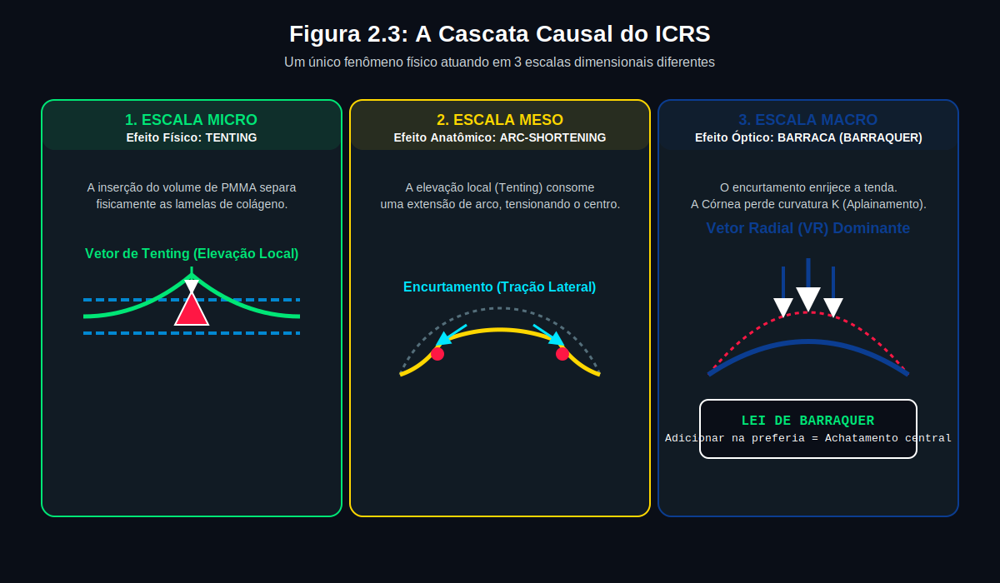
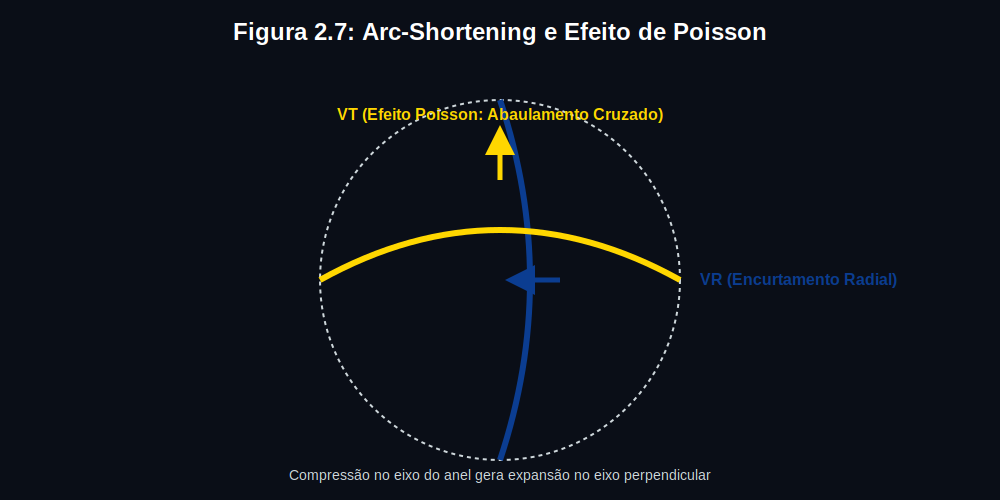

# Capítulo 2 — Biomecânica dos Anéis Intracorneanos: Como o Anel Modifica a Córnea

---

## 📋 METADADOS DO CAPÍTULO

```yaml
chapter_id: CH-002
title: "Biomecânica dos Anéis Intracorneanos: Os Princípios Físicos que Governam Todo o Sistema Vetorial"
language: PT-BR
status: draft
version: 0.1.0
```

---

## 📖 CONTEÚDO INSTRUCIONAL

### Introdução

Este capítulo é a ponte entre a anatomia (Capítulo 1) e o sistema vetorial (Capítulos 4–8). Aqui você entenderá os **princípios físicos fundamentais** que explicam por que e como um pedaço de PMMA inserido no estroma consegue aplainar, redistribuir e reposicionar a curvatura corneana.

> ⚠️ **REVISÃO CONCEITUAL IMPORTANTE:** O framework clássico dos "3 Princípios Independentes" (Barraquer / arc-shortening (encurtamento do arco) / Tenting) é didaticamente convencional, mas biomechanicamente impreciso — pois Barraquer, arc-shortening (encurtamento do arco) e Tenting não são 3 causas paralelas: são **3 escalas de observação do mesmo fenômeno**. Este Atlas os apresenta na forma correta: uma **cascata causal em escala** (micro → meso → macro).

A transição do empirismo clínico para a comprovação matemática é a inovação central deste Atlas. Como é impossível medir in vivo as forças de micronewtons que um anel exerce, recorremos ao Método dos Elementos Finitos (FEM). As regras vetoriais propostas derivam de 84 simulações originais construídas no solver FEBio 4.12. Utilizamos dois modelos complementares: o modelo isótropo de Mooney-Rivlin (para ranqueamento comparativo) e o estado da arte modelo HGO multicamadas (Holzapfel-Gasser-Ogden), que incorpora as exatas orientações das três famílias de fibras.

> **O Nível de Precisão:** O nosso modelo HGO foi testado contra dados clínicos publicados. Ao simular o implante de um anel assimétrico (AJL PRO+ 160°), o modelo previu um aplainamento de 3,74 D. O aplainamento real em pacientes foi de 3,80 D — uma taxa de erro de apenas 1,6%.

### A Cascata Causal do ICRS — Um Único Fenômeno em Três Escalas

```
[ESCALA MICRO — Local/Histológico]
     TENTING (Efeito de Tenda)
     = O anel PMMA ocupa espaço entre lamelas estromais
       → separa fisicamente as lamelas acima e abaixo
       → cria elevação focal ("tenda") sobre o implante
              ↓ causa

[ESCALA MESO — Fibrilar/Tensional]
     arc-shortening (encurtamento do arco) (Encurtamento de Arco)
     = As fibras RADIAIS são forçadas a contornar o implante
       → seu comprimento funcional encurta naquele meridiano
       → tensão periférica nessas fibras AUMENTA
       → as fibras TANGENCIAIS do meridiano perpendicular REDISTRIBUEM
              ↓ causa

[ESCALA MACRO — Geométrico/Óptico]
     LEI DE BARRAQUER (Resultado Final)
     = O encurtamento radial periférico achata a cúpula central
       → K-máximo cai (VR = Vetor Radial)
       → astigmatismo se redistribui (VT = Vetor Tangencial)
       → se assimétrico: torque é gerado (Vτ = Vetor Torsional)
```

> **Por que isso importa clinicamente?** A Lei de Barraquer diz O QUÊ acontece (aplainamento). O arc-shortening (encurtamento do arco) diz COMO acontece (mecânica fibrilar). O Tenting diz ONDE começa (local microscópico). Confundi-los como princípios paralelos leva a erros de raciocínio: por exemplo, tratar Barraquer e Tenting como efeitos independentes sobre o VR — quando na verdade são a mesma cadeia lida em escalas diferentes.

### Os 3 Nomes — Três Janelas para o Mesmo Fenômeno

#### 1. Efeito de Tenda (*Tenting*) — A Janela Microscópica

**O que é:** A separação local das lamelas estromais pelo implante PMMA, gerando um deslocamento anterior (elevação em Z) do tecido acima do anel.

**O que NÃO é:** Uma causa independente do aplainamento central. O tenting é a **origem física** da cascata — sem separação lamelar, não há arc-shortening (encurtamento do arco), e sem arc-shortening (encurtamento do arco), não há aplainamento.

---

#### 🔑 O Aparente Paradoxo: "Como o anel ELEVA e ao mesmo tempo APLAINA?"

> **ELEVAÇÃO FÍSICA ≠ ELEVAÇÃO NO MAPA PENTACAM ≠ CURVATURA (K)**

São três grandezas distintas. Confundi-las é o erro mais comum na interpretação pós-operatória.

| Grandeza | O que mede | Onde ocorre pós-ICRS | Cor no Pentacam |
|----------|-----------|---------------------|-----------------|
| **Elevação física (Z real)** | Posição absoluta do tecido em µm | ↑ no ponto do anel (tenting real) | — (não visível diretamente) |
| **Elevação relativa (mapa Pentacam)** | Desvio do tecido em relação à **esfera de referência best-fit** | **↓ no ponto do anel** | **AZUL** ✅ |
| **Curvatura (K)** | Taxa de variação da superfície (raio de curvatura) | ↓ no centro (K cai) | **AZUL no centro** ✅ |

**Por que o anel aparece AZUL no mapa de elevação? — A explicação:**

1. **O tenting eleva fisicamente** o tecido no ponto do anel (Z absoluto sobe ~5–20 µm sobre o PMMA)
2. **O arc-shortening (encurtamento do arco) aplaina o cone central** → a córnea como um todo fica menos curvada
3. **A esfera best-fit do Pentacam recalcula** → ela se torna uma esfera *maior e mais plana* para se ajustar à nova forma geral da córnea
4. **O ponto do anel**, apesar de fisicamente elevado, agora fica **abaixo desta nova esfera de referência maior** → aparece como **elevação negativa = AZUL**

> ✅ **Referência:** Estudo OCT quantitativo mostra que a implantação de ICRS *diminui* a elevação no mapa em aproximadamente **−20 µm** na área acima do segmento, **devido ao efeito de estiramento** das fibras estromais. (Optica.org; Ortiz et al., OCT quantitativo pós-ICRS)

```
ANTES (ceratocone):                COM ANEL:
  Esfera best-fit: pequena (K alto)   Esfera best-fit: EXPANDIDA (K cai)
  Cone: VERMELHO (acima da esfera)    Centro: AZUL (abaixo ou na esfera)
                                      Anel: também AZUL (referência subiu)
```

**O que significa clinicamente:**
- 🔵 **Azul no anel** = sucesso terapêutico (a esfera de referência expandiu com o aplainamento)
- 🔵 **Azul no centro** = K caiu = cone foi corrigido
- 🔴 **Vermelho residual** = área ainda saliente acima da nova referência = correção incompleta


**Na tomografia (Pentacam) — o que procurar:**
- **Mapa de elevação anterior:** zona do anel azul/verde (sucesso), zona central menos vermelha (aplainamento)
- **Mapa de curvatura (K):** centro azul (K cai = efeito terapêutico)
- **Mapa de espessura:** adelgaçamento relativo no anel (lamelas separadas pelo PMMA → paquimetria local diminui)

**Regras clínicas do Tenting:**
- Maior espessura → maior separação lamelar → maior cascata de aplainamento
- Menor profundidade → tenting mais superficial → risco de erosão epitelial (sem ganho adicional de aplainamento)
- Simétrico → VR puro | Assimétrico (progressivo) → gradiente de pressão → Vτ (torque)


#### 2. Encurtamento de Arco (*arc-shortening (encurtamento do arco)*) — A Janela Fibrilar

**O que é:** As 🔴 fibras radiais contornam o implante → seu comprimento funcional (arco de limbo a limbo) **encurta** naquele meridiano. Como a fibra não pode comprimir-se, ela traciona → tensiona → redistribui.

**O que NÃO é:** Uma causa separada do Tenting. O encurtamento de arco É a consequência mecânica do Tenting nas fibras radiais.

**Dois efeitos em meridianos diferentes (Efeito de Poisson Lamelar):**
- **Meridiano do anel:** fibras tensionam → arco encurta → centro aplaina → **VR**
- **Meridiano perpendicular (90°):** tecido "roubado" redistribui tensão → encurva levemente → **VT (Acoplamento)**

#### 3. Lei de Barraquer — A Janela Macroscópica/Óptica

**O que é:** A expressão ceratométrica do arc-shortening (encurtamento do arco). Barraquer formulou essa lei para LASIK e lamelares — o ICRS a implementa mecanicamente: a cunha PMMA adiciona "volume local" que encurta o arco → aplana o centro.

**O que NÃO é:** Uma causa independente do arc-shortening (encurtamento do arco) ou do Tenting. É a **previsão óptica** (redução de K, em dioptrias) que resulta da cascata.

**Previsão clínica:**
- Anel mais grosso = mais tenting = mais arc-shortening (encurtamento do arco) = mais aplainamento de Barraquer
- Anel mais central (Ø menor) = maior braço de alavanca = mais aplainamento relativo


### Princípio 2: O Efeito de Encurtamento de Arco (*arc-shortening (encurtamento do arco) Effect*)

**Enunciado:** "Quando um segmento rígido é inserido em um arco de tecido flexível, ele encurta funcionalmente esse arco, forçando a redistribuição de tensão para as zonas adjacentes."

Esse é o mecanismo pelo qual o anel não apenas aplaina o centro, mas também modifica a periferia, o astigmatismo e o acoplamento entre meridianos.

> **Analogia:** Imagine um arco de violino (a córnea). Se você colar uma ripa de madeira (o anel) no meio do arco, ele não pode mais flexionar naquela zona. O arco é forçado a se reorganizar — as pontas do arco se movem, e a curvatura geral muda.

**Consequências biomecânicas:**
1. A zona implantada torna-se localmente rígida → a curvatura local é definida pelo anel, não mais pelo tecido
2. A tensão é redistribuída para os meridianos adjacentes → efeito de acoplamento
3. O comprimento do arco ocupado pelo segmento determina a distribuição de forças → arco longo = força distribuída; arco curto = força concentrada

### O Efeito de Tenda nas Fibras: Tenting Simétrico vs. Assimétrico

**Quando o tenting é simétrico** (anel de espessura uniforme) → separação lamelar igual nos dois lados → VR puro (aplainamento central concêntrico)

**Quando o tenting é assimétrico** (anel progressivo: ponta grossa vs. ponta fina) → separação lamelar desigual → gradiente de pressão interlamelar → torque rotacional → Vτ (Vetor Torsional) → reposicionamento do ápice → VComa


### Os 4 Parâmetros que o Cirurgião Controla

Cada parâmetro cirúrgico modifica um ou mais dos princípios acima:

| Parâmetro | O Que o Cirurgião Decide | Qual Etapa da Cascata Afeta | Qual Vetor Domina |
|-----------|--------------------------|----------------------------|--------------------------|
| **Espessura** | 150, 200, 250, 300, 350 μm | Tenting (separação lamelar) + arc-shortening (encurtamento do arco) | **VR (Vetor Radial)** — aplainamento |
| **Comprimento do Arco** | 90°, 120°, 150°, 160°, 210°, 355° | arc-shortening (encurtamento do arco) (distribuição da tensão) | **VT (Vetor Tangencial)** — redistribuição |
| **Assimetria** | Simétrico vs Progressivo | Tenting diferencial (gradiente lamelar) | **Vτ (Vetor Torsional)** — torque |
| **Eixo da Incisão** | Meridiano de implantação | Toda a cascata | Todos os vetores |

---

### O 5º Parâmetro Biomecânico: A Geometria da Seção Transversal

> *O mesmo anel com 250 µm e 120° de arco produz **VR diferente** dependendo do perfil da seção transversal. A geometria do corte determina **como e onde** a força é transmitida ao estroma.*

| Perfil | Fabricantes | Contato com estroma | VR/espessura | Tensão Resultante Estromal¹ | Ofuscamento / Haze² |
|--------|------------|---------------------|-------------|-----------------------------|-----------------------------|
| **Triangular** | Ferrara Ring, Keraring | Aresta apical — força em linha única | Alto | Alta e focal (pico estreito) | Haze menor; ofuscamento por reflexão da aresta |
| **Prisma-trapezoidal** | AJL | Base larga + face plana — distribuição moderada | Alto/moderado | Moderada e distribuída | Moderado |
| **Fusiforme** | Intacs | Bordas arredondadas — contato gradual | Moderado | Baixa e ampla | Menor |
| **Arredondado/elíptico** | CornealRing | Sem arestas — contato suave | Baixo/moderado | Mínima, muito distribuída | Mínimo |
| **Anel completo** | Dioptex MyoRing | Arco 355° — tensão circunferencial fechada | Muito alto | Circunferencial uniforme | Moderado (túnel fechado) |

> ¹ **Tensão Resultante Estromal** (*Von Mises stress* nos modelos FEM): o estresse equivalente máximo no estroma — indica onde o tecido está sob maior carga. Tensão focal alta = maior risco de remodelamento cicatricial local.

> ² **Ofuscamento/Halos** (*Glare*): dispersão luminosa na interface PMMA/estroma. **Haze**: opacidade cicatricial no estroma periférico — quanto maior a tensão resultante focal, maior a tendência à deposição de colágeno desorganizado.

> **Pérola clínica:** Dois cirurgiões implantam "250 µm × 120°" de fabricantes diferentes e obtêm VR distintos. A causa silenciosa pode ser o perfil de seção transversal — **não** a espessura, arco ou profundidade. Na presença de haze sem hipercorreção, considerar o perfil do anel antes de concluir erro técnico.


#### 📊 O Que o FEM Quantifica: Quanto Cada Parâmetro Contribui para o ΔK?

> **Fonte:** García de Oteyza G et al. *"Refractive changes of a new asymmetric intracorneal ring segment with variable thickness and base width: A 2D finite-element model."* **PLOS ONE, 2021.** + Kling S, Marcos S. FEM ICRS Keratoconus. 2013.

O modelo de Elementos Finitos (FEM) 2D corneano simula a córnea como um material hiperelástico e anisotrópico, inserindo geometrias de anel diferentes e calculando numericamente o campo de deslocamento da superfície anterior. Cada parâmetro geométrico é variado isoladamente para quantificar sua contribuição independente ao ΔK (redução de ceratometria central).

**Resultado fundamental (García de Oteyza et al., PLOS ONE 2021):**

| Fator Geométrico | Contribuição para ΔK | Mecanismo |
|-----------------|----------------------|-----------|
| **Altura vertical (espessura do anel)** | **~84%** | Determina a magnitude da separação lamelar (tenting) → diretamente proporcional ao arc-shortening (encurtamento do arco) |
| **Formato da seção transversal** | **~13%** | Determina *como* a tensão é distribuída localmente: focal (triangular) vs. difusa (fusiforme) |
| Largura da base | ~3% | Influência secundária na pressão interlamelar lateral |

> **Por que a espessura domina:** A separação lamelar é diretamente proporcional à altura do anel. Dobrar a espessura (ex: 150→300 µm) dobra aproximadamente o tenting → dobra o arc-shortening (encurtamento do arco) → quase dobra o ΔK. O formato redistribui a mesma força de formas diferentes (mais focal ou mais difusa), mas não muda substancialmente a magnitude total.

> **Por que o formato ainda importa:** O formato determina *onde* a tensão resultante estromal se concentra. Formato triangular = pico de tensão na aresta apical → maior risco de haze focal. Formato fusiforme = tensão distribuída → menor risco de complicação, mas possível perda de precisão do VR.

---

#### Tabela de Especificações por Modelo — Os 3 Parâmetros Geométricos + ΔK

> **Legenda:** Espessura, base e diâmetros confirmados em literatura publicada (NIH/FDA/AJL/Dioptex/Entokey). ΔK† = estimativa proporcional ao FEM (García de Oteyza 2021 + Kling & Marcos 2013). Valores dependem do olho, paquimetria e zona fibrilar interceptada.

##### 🔺 Família 1 — Triangular (Ferrara / Keraring)

| Modelo | Base (mm) | Espessura (µm) | Arcos disponíveis | Ø canal (mm) | ΔK† |
|--------|-----------|---------------|-------------------|-------------|-----|
| **Ferrara AFR** | **0.60** | 150 · 200 · 250 · 300 · 350 | 90°–340° | **5.0** | 2–7 D |
| **Ferrara AFR-6** | **0.80** | 150 · 200 · 250 · 300 · 350 | 90°–340° | **6.0** | 2–7 D |
| **Keraring SI-5** | **0.60** | 150 · 200 · 250 · 300 · 350 | 90°–355° | **5.0** | 2–7 D |
| **Keraring SI-6** | **0.80** | 150 · 200 · 250 · 300 · 350 | 90°–355° | **6.0** | 2–7 D |
| **Keraring SI-5.5** | **0.60–0.80** | 150–350 | 90°–355° | **5.5** | 2–7 D |

> *Ø 5.0 mm tem maior braço de alavanca → mais ΔK por unidade de espessura. Base 0.80 (SI-6/AFR-6) = +~3% na pressão interlamelar lateral vs base 0.60.* (Ref: NIH · Mediphacos · Unimi)

---

##### 🟠 Família 2 — Fusiforme (Ferrara HM)

| Modelo | Base aprox. (mm) | Espessura (µm) | Arco | Ø canal (mm) | ΔK† |
|--------|-----------------|---------------|------|-------------|-----|
| **Ferrara HM** | **~0.80** | **400** (único) | 320° | **5.7** | 6–9 D |

> *Biconvexo (spindle). Sem aresta apical → tensão resultante mais distribuída → menor risco de haze. Espessura fixa 400 µm = o maior de sua família.* (Ref: NIH Ferrara HM)

---

##### △ Família 3 — Prisma-Trapezoidal Progressivo (AJL PRO+)

| Modelo | Base (mm) | Espessura (µm) | Arcos | Ø canal (mm) | ΔK† |
|--------|-----------|---------------|-------|-------------|-----|
| **AJL PRO+** | **0.60→0.80** (variável ao longo do arco) | **150→300** (progressivo) | 160°, 210° | 5.0 / 6.0 | 3–6 D + Vτ nativo |

> *Único anel simulado no estudo FEM de García de Oteyza (PLOS ONE 2021) com variação simultânea de base e espessura. Gera Vτ por geometria. Base 600→800 µm + espessura 150→300 µm ao longo do arco.* (Ref: AJL S.A. · PLOS ONE 2021)

---

##### ⬡ Família 4 — Hexagonal / Oval (Intacs)

| Modelo | Perfil | Ø interno (mm) | Ø externo (mm) | Largura efetiva¹ | Espessura (µm) | Arco | ΔK† |
|--------|--------|---------------|---------------|-----------------|---------------|------|-----|
| **Intacs Standard** | Hexagonal | **6.8** | **8.1** | **0.65 mm** | 250 · 300 · 350 · 400 · 450 | 150° | 4–8 D |
| **Intacs SK** | Oval/elíptico | **6.0** | — | ~0.70 mm | 400 · 450 · 500 | 150° | 6–9 D |

> *¹ Largura efetiva calculada = (Ø ext − Ø int) / 2 = (8.1 − 6.8) / 2 = 0.65 mm por face. Intacs SK: Ø interno menor (6.0) = canal mais central = maior aplainamento para cone central/superior.* (Ref: FDA · NIH · Entokey)

---

##### ⬮ Família 5 — Arredondado/Elíptico (CornealRing)

| Modelo | Base (mm) | Espessura (µm) | Arcos | Ø canal (mm) | ΔK† |
|--------|-----------|---------------|-------|-------------|-----|
| **CornealRing** | **0.70–0.80** | 150 · 200 · 250 · 300 · 350 | 90°–300° | 5.0 / 6.0 / 7.0 | 2–7 D |

> *Perfil sem arestas = tensão resultante estromal mínima = menor haze e ofuscamento. Disponível em Ø 7.0 mm = único no mercado neste diâmetro.*

---

##### ⭕ Família 6 — Anel Completo 360° (MyoRing)

| Modelo | Ø interno (mm) | Espessura (µm) | Arco | Implantação | ΔK† |
|--------|---------------|---------------|------|-------------|-----|
| **MyoRing** | **5.0 · 6.0 · 7.0 · 8.0** | 200–400 (passo 20 µm) | **360°** | Bolso CISIS (femtosseg.) | 8–16 D |

> *Tensão circunferencial fechada e uniforme — sem escape de força nas extremidades. Esp. 320 µm × 360° > dois segmentos 320 µm × 150° funcionalmente. Ø 5 mm + 320 µm = correção máxima.* (Ref: Dioptex · NIH)

---

**Síntese — Escolha de modelo pelo objetivo prioritário:**

| Objetivo clínico | Modelo recomendado | Fundamento FEM |
|-----------------|-------------------|---------------|
| **Máximo ΔK** (cone grave K > 55D) | MyoRing 320 µm · Intacs SK 450 µm | Espessura domina 84% |
| **Controle Vτ** (cone assimétrico) | AJL PRO+ · Keraring progressivo | Assimetria geométrica nativa |
| **Menor haze/halos** (jovem/profissional) | CornealRing · Intacs Standard | Formato sem arestas = 13% difuso |
| **Equilíbrio VR+VT** (cone oval) | Ferrara AFR-6 · Keraring SI-6 250 µm | Base 0.80 + arco > 150° |


---




> **Pérola Fundamental:** A espessura decide "quanto." O arco decide "como distribui." A assimetria decide "para onde empurra." O eixo decide "onde tudo acontece."




### Como a Cascata Causal Gera os 5 Vetores

O ICRS produz 5 vetores biomecânicos como **resultado da cascata Tenting → arc-shortening (encurtamento do arco) → Barraquer**, operando em dois meridianos simultaneamente:

```
══════════════════════════════════════════════════════
  TENTING (origem física — separação lamelar)
══════════════════════════════════════════════════════
           │
           ▼
  arc-shortening (encurtamento do arco) (mecanismo fibrilar)
  ├─ Meridiano do anel → Fibras RADIAIS tensionam
  │      └→ VR (Vetor Radial) — aplainamento central
  │
  └─ Meridiano perpendicular (Efeito de Poisson)
         └→ VT (Vetor Tangencial) — redistribuição de astigmatismo
              └→ Acoplamento (Capítulo 5) — efeito colchão d'água
           │
           ▼
  LEI DE BARRAQUER (resultado óptico — ceratometria)
  └→ ΔK central mensurável = VR expresso em Dioptrias

══════════════════════════════════════════════════════
  TENTING ASSIMÉTRICO (anel progressivo)
  = Gradiente de separação lamelar → torque
       └→ Vτ (Vetor Torsional) — rotação do eixo
            └→ VComa (Vetor de Deslocamento Óptico)
══════════════════════════════════════════════════════

  SOMA DE TODOS:
       └→ VEsférico (Vetor Esférico Resultante) — Capítulo 9
```

> **Pérola conceitual:** Barraquer NÃO gera VR de forma independente do Tenting. Barraquer É o resultado óptico de Tenting → arc-shortening (encurtamento do arco). O VR é a expressão vetorial dessa cascata. Tratar os três como fontes paralelas de VR significa contar o mesmo efeito três vezes.


#### O ICRS na Escala das Fibras — Como o Anel Corrige


> **💡 Síntese do Autor (3-Fibras→3-Vetores):** Na escala das fibras, o anel interage diretamente com cada família: (1) tensiona **radiais** → VR; (2) cria nova linha **tangencial** → VT; (3) estabiliza **lamelas** como trava interlamelar → Vτ. O mecanismo é análogo ao das oblíquas (ambos impedem deslizamento), mas mecanisticamente diferente: oblíquas = tração biológica; ICRS = compressão mecânica PMMA.

### Convenção Fundamental: F (Problema) vs V (Correção)

> **Esta convenção é usada em todo o Atlas.** Memorize-a antes de prosseguir.

O ceratocone gera **forças** que deformam a córnea. O anel gera **vetores** que corrigem a deformação. Usamos prefixos diferentes para distingui-los:

| Prefixo | Significado | Cor Visual | Direção |
|---------|-----------|-----------|----------|
| **F** (Força) | A força que o cone exerce sobre a malha | 🔴 Vermelho | Na direção da deformação |
| **V** (Vetor) | A correção que o anel impõe à malha | 🔵 Azul | Oposta à deformação |

| Força do Cone | Vetor do Anel | Descrição |
|---------------|--------------|----------|
| **Fr** (Força Radial) | **VR** (Vetor Radial) | Compressão central / Aplainamento central |
| **Ft** (Força Tangencial) | **VT** (Vetor Tangencial) | Tensão assimétrica / Redistribuição |
| **Fτ** (Força Torsional) | **Vτ** (Vetor Torsional) | Rotação do eixo / Contra-rotação |

**Regra cardinal:** O objetivo cirúrgico é sempre **V = −F** (neutralização vetorial). 

> ⚠️ **PRECISÃO BIOMECÂNICA (Gemini Deep Review):** Esta equação (`V_anel + V_cone = 0`) é um **modelo heurístico de primeira ordem** estruturado para direcionamento cirúrgico clínico. Do ponto de vista da física de materiais, ela não descreve uma anulação de forças newtonianas num corpo rígido (superposição linear elástica). O estroma corneano é um tecido viscoelástico, hiperelástico e não-linear. O objetivo material real é induzir um campo de estresse diametralmente oposto ao campo patológico, sabendo que a resposta final do sistema será uma resultante conformacional não-linear, e não uma soma algébrica exata a zero.

> **Pérola:** Quando você lê o Plácido, você está lendo **F** (as forças do cone). Quando você prescreve o anel, você está prescrevendo **V** (a correção). O Capítulo 8 (LDM) formaliza essa leitura.
---

### A Cascata na Escala das Fibras de Colágeno

> *O mesmo fenômeno em 3 escalas, visto a nível das lamelas individuais.*

**1. Lei de Barraquer (escala macroscópica — resultado óptico):** O PMMA **afasta fisicamente** as lamelas na zona de implantação. As lamelas que passam por cima e por baixo percorrem um caminho mais longo, **tracionando as fibras radiais centrais** adjacentes e reorganizando a malha central frouxa.


**2. arc-shortening (encurtamento do arco) + Efeito de Poisson (escala fibrilar — mecanismo):** As 🔴 **fibras radiais** são forçadas a contornar o implante → comprimento funcional encurta → tensão periférica aumenta → **VR** (aplainamento). No meridiano perpendicular, o Efeito de Poisson redistribui: tecido tracionado no Meridiano A gera cedência no Meridiano B → **Efeito de Acoplamento** (VT).

> ⚠️ **Nota bibliográfica:** O "Efeito de Poisson" não é a terminologia clínica usual na literatura de ICRS (onde se usa "efeito de acoplamento" ou *coupling*). É a **explicação mecanística** usada nos modelos de Elementos Finitos (FEM) da córnea (Lago et al., Elsheikh et al.), onde a córnea é modelada com coeficiente de Poisson ν ≈ 0.42–0.49 (quase incompressível). O fenômeno é real; o nome é FEM/biofísica, não nomenclatura clínica padronizada.



**3. Tenting (escala microscópica — origem física):** O PMMA separa fisicamente as lamelas, gerando elevação focal. O gradiente de separação determina qual vetor domina: **tenting simétrico** → VR puro; **tenting assimétrico** (anel progressivo) → gradiente interlamelar → torque rotacional → **Vτ** → reposicionamento → **VComa**.


---

### Os 3 Planos do Atlas: X, Y e Z

A maioria dos cirurgiões pensa em 2D — o mapa topográfico. Mas o anel atua em **3 dimensões**. O Atlas usa 3 planos para representar todas as forças:

```
PLANO X-Y (Superfície — Top View):
  X = Meridiano nasal-temporal
  Y = Meridiano superior-inferior
  Aqui se projetam: VR, VT, Vτ, ENM, COF

PLANO Z (Profundidade — Side View):
  Z = 0 na superfície anterior
  Z = 0.70–0.75 na zona de implantação do ICRS
  Z = 1.0 no endotélio
  Aqui se projetam: profundidade do ICRS, desacoplamento A/P

REGRA VISUAL DO ATLAS:
  Nunca misturar 3 eixos em uma única vista.
  Usar VISTAS PAREADAS: top view (X-Y) + side view (X-Z).
```

| Vetor / Fator | Plano | O que mostra | Analogia Corrigida |
|---------------|-------|-------------|--------------------|
| **VR (Vetor Radial)** | X-Y | Aplainamento central | Pressionar as **bordas** de um trampolim para fora — o centro achata |
| **VT (Vetor Tangencial)** | X-Y | Redistribuição entre meridianos | Apertar um colchão d'água — sobe do outro lado |
| **Vτ (Vetor Torsional)** | X-Y + Z | Rotação do eixo | Desenroscar uma tampa de forma— o eixo gira |
| **Fator Z (Desacoplamento A/P)** | Z | Divergência anterior/posterior | Dois andares de um prédio respondendo diferente ao vento |

> 📌 **Nota:** O Desacoplamento A/P **não é um vetor** no sentido clássico — é uma *propriedade biomecânica* da córnea que limita a previsibilidade dos vetores. Um vetor tem magnitude e direção; o desacoplamento é uma divergência de resposta entre camadas.

> **Pérola:** O plano Z é onde os resultados subótimos se escondem. O Plácido lê apenas Z ≈ 0 (superfície anterior). A tomografia (Pentacam/OCT) lê ambas as superfícies (Z≈0 e Z≈1). O ICRS atua em Z ≈ 0.70–75. Se você não pensa em Z, está planejando cego em profundidade.

---

### O Disco de Plácido e os 3 Princípios

O Plácido permite ao cirurgião **ver** os 3 princípios em ação simultânea:

| Princípio | O Que Você Vê no Plácido |
|-----------|-------------------------|
| **Barraquer** | Anéis centrais mais espaçados (aplainamento) |
| **arc-shortening (encurtamento do arco)** | Diminuição da ovalização (redistribuição de astigmatismo) |
| **Tenting** | Leve compressão dos anéis na zona periférica sobre o implante |

### Armadilhas Biomecânicas

1. **"Anel mais grosso é sempre melhor"** — Falso. Um anel excessivamente grosso em uma córnea fina pode causar extrusão, haze, ou hipercorreção com inversão do astigmatismo.

2. **"Dois segmentos são sempre melhores que um"** — Depende. Dois segmentos simétricos em um cone oval (sagging) podem cancelar parcialmente o Vτ. Às vezes, um segmento assimétrico único é superior.

3. **"A profundidade não importa muito"** — Importa enormemente. Estudos de elementos finitos demonstram que a profundidade ideal é **70–75%** da espessura estromal. Acima de 80%, o efeito biomecânico diminui significativamente (UCVA/BSCVA melhora < 1 linha; ΔKmax < 0.5 D). Abaixo de 65%, o risco de extrusão aumenta.

### Pérolas Biomecânicas

1. **Memorize a tríade:** Barraquer (por quê aplaina), arc-shortening (encurtamento do arco) (por quê redistribui), Tenting (como a forma muda localmente).

2. **A córnea é um sistema fechado.** Toda modificação em um meridiano é compensada em outro (conservação de volume). Nunca planeje um vetor sem pensar nas consequências no meridiano ortogonal.

3. **Os 3 princípios são simultâneos.** O anel nunca gera apenas VR "puro" ou VT "puro." Ele sempre gera uma combinação de todos os vetores. O capítulo 8 (VEsférico) ensina a quantificar essa combinação.

---

## 🎨 ESPECIFICAÇÃO VISUAL

1. **Figura 2.1 — Os 3 Princípios Biomecânicos:** Diagrama triplo mostrando Barraquer (volume → aplainamento), arc-shortening (encurtamento do arco) (rigidez → redistribuição) e Tenting (elevação → tenda).
2. **Figura 2.2 — Parâmetros Cirúrgicos → Vetores:** Fluxograma mostrando qual parâmetro gera qual vetor.

---

### A Geometria do Anel Também É um Parâmetro Biomecânico

O mesmo anel com 250 µm e 120° de arco produz VR **diferente** dependendo do perfil da seção transversal. A geometria do corte determina como a força é transmitida ao estroma:

| Perfil | Fabricantes | Arcos | VR/espessura | Von Mises | Glare / Haze |
|--------|------------|-------|-------------|-----------|-------------|
| 🔺 **Triangular** (ápice anterior, base 600-800 µm) | Ferrara (até 340°), Keraring (até 355°) | 90°-355° | +++ Máximo | Focal nas arestas (140-170 kPa) | ⚠️ Alto (concentração focal) |
| △ **Prismático-trapezoidal arredondado** (base ampla, ápice suavizado, bordas curvas) | AJL PRO+ | 160°, 210° | ++ Moderado-alto | Atenuado (concentração suavizada) | ✅ Baixo (bordas arredondadas) |
| 🟠 **Fusiforme (spindle-like)** (biconvexo, afina nas extremidades) | Ferrara HM | 320° | +++ Semi-focal | Intermediário (concentração suave sem ponta) | ★★ Moderado |
| ⬮ **Arredondado / Elíptico** (base curva, sem arestas, modulação difusa) | CornealRing (Visiontech) | 90°-300° | ++ Moderado | Difuso (81-120 kPa) | ✅ **Mínimo** (sem arestas) |
| ⬨ **Hexagonal** (topo plano) | Intacs, Intacs SK | 150° | ++ Moderado | Distribuído | Moderado |
| ⭕ **Anel contínuo 360°** (seção retangular, shape-memory, pocket) | MyoRing | **360°** | ++ Distribuído 360° | Uniforme | ✅ Baixo (pocket) |

> **Pérola:** Os perfis formam um **espectro de concentração → distribuição**:
>
> 🔺 Triangular → △ Prismático-trap. → 🟠 Fusiforme → ⬮ Arredondado → ⭕ MyoRing
>
> **VR MÁXIMO** ──────────────────────────────────────→ **VR MÍNIMO**
>
> A escolha do perfil não é cosmética — é **parte da prescrição biomecânica**, e deve considerar a zona fibrilar onde o anel será implantado.

---

## 📚 REFERÊNCIAS

```yaml
references:
  # Princípios biomecânicos ICRS
  - title: "Barraquer JI — Law of Thickness in Lamellar Surgery"
    relevance: "Lei fundamental que governa o VR."
  - title: "arc-shortening (encurtamento do arco) Biomechanics of Intracorneal Ring Segments"
    relevance: "Demonstração do mecanismo de encurtamento de arco e suas consequências."
  - title: "Tenting Effect After ICRS — OCT Analysis"
    relevance: "Visualização e quantificação do efeito tenda pós-ICRS."
  - title: "Finite Element Modeling of ICRS Biomechanics (Avicenna)"
    relevance: "Validação computacional dos 3 princípios."
  
  # Substrato de fibras (Modelo 3-Fibras)
  - title: "Meek KM, Boote C (2004). The organization of collagen in the corneal stroma. Exp Eye Res."
    relevance: "Os 3 princípios são transmitidos pela malha de colágeno: radiais (VR), tangenciais (VT). WAXS quantifica a orientação preferencial."
  - title: "Winkler M et al. (2013). Three-dimensional distribution of transverse collagen fibers. IOVS."
    relevance: "Fibras oblíquas no anterior explicam por que o túnel ICRS é feito a 70-75% (zona paralela, sem oblíquas)."
```

### Perfil do Anel × Malha Fibrilar — A Lei da Correspondência Geométrica

O formato da seção transversal do anel determina **como** o estresse é distribuído nas fibras de colágeno. Mas a **eficiência** dessa interação depende de **qual tipo de fibra** o anel encontra — e isso muda com o diâmetro.

#### Dado FEM Crucial (✅ Fato Publicado)

| Fator | Contribuição para ΔK | Ref |
|-------|----------------------|-----|
| **Altura vertical (espessura)** | **84%** | ✅ PLOS ONE FEM |
| **Formato da seção** | **13%** | ✅ PLOS ONE FEM |

> A espessura importa muito mais que o formato para aplainamento. Mas o formato determina **distribuição de estresse, complicações e estabilidade** — e interage diferentemente com cada zona fibrilar.

#### As 4 Zonas Fibrilares e Seus Perfis Ótimos

| Diâmetro | Zona WAXS | Fibras | Perfil Ótimo | Alternativas | Razão |
|---|---|---|---|---|---|
| **Ø3mm** | Central (feltro) | 🔴 Entrelaçadas 3D, densas | 🔺 **Triangular** | — | Só a cunha penetra o feltro denso |
| **Ø5mm** | Paracentral (ortogonal) | 🔴 Paralelas N-S/I-T | 🔺 **Triangular** ou 🟠 **Fusiforme** | △ AJL (se Vτ) | Fibras retas = cunha fende eficientemente |
| **Ø6mm** | Transição | 🔴→🔵 Ortogonal → tangencial | ⬮ **Arredondado** ou 🟠 **HM** | ⭕ MyoRing | Fibras curvando = arredondado repousa |
| **Ø7mm** | Pré-limbal (tangencial) | 🔵 Circunferenciais curvas | ⬮ **Arredondado** ou ⭕ **MyoRing** | — | Cunha lateraliza em fibras curvas |

> **💡 Lei da Correspondência Geométrica (Síntese do Autor):** Quanto mais **central** (fibras retas), mais eficiente a **concentração** (🔺>🟠>△>⬮). Quanto mais **periférico** (fibras curvas), mais eficiente a **distribuição** (⬮>⭕>🟠>△>🔺). O perfil ideal é aquele cuja geometria **corresponde** à geometria das fibras no ponto de implantação.

#### 🔺 Triangular (Ferrara/Keraring) — A "Cunha"

- Ponta aguda → **tenting focal** → pressão concentrada em poucas lamelas
- Maximiza arc-shortening (encurtamento do arco) → VR concentrado
- Arcos disponíveis: Ferrara até **340°**, Keraring até **355°**
- ✅ Melhor para: nipple (P1), K-max >60D, Ø5mm (fibras ortogonais → ponta fende entre lamelas paralelas)
- ⚠️ Risco: haze focal, especialmente em arcos longos a Ø6mm+ (lateralização)

#### △ Prismático-trapezoidal Arredondado (AJL PRO+) — O "Diamante Atenuado"

- Base ampla + ápice suavizado → concentração **atenuada** (menos que triangular)
- Base progressiva (150→300 µm) → **Vτ embutido** geometricamente
- ✅ Melhor para: Duck (P3), quando Vτ é prioridade, Ø5mm
- ⚠️ Arco curto (160-210°) limita contenção

#### 🟠 Fusiforme (Ferrara HM 320°) — O "Fuso"

- Biconvexo que afina nas extremidades → concentração **semi-focal** sem ponta aguda
- Arco longo 320° = 89% de cobertura → forte VT + VR
- ✅ Melhor para: alta miopia + KC, Ø5.7mm (zona de transição), VR+VT simultâneos

#### ⬮ Arredondado / Elíptico (CornealRing) — A "Almofada"

- Faces curvas → **modulação difusa** → estresse distribuído maximamente
- Mínimo haze, mínimo glare (sem arestas)
- Arcos até **300°** = 83% de cobertura
- ✅ Melhor para: Ø6mm+ (fibras tangenciais curvas), KC oval (P2), biocompatibilidade máxima

#### ⭕ MyoRing 360° (Dioptex) — A "Cinta Completa"

- Anel contínuo implantado em pocket (não túnel) → annulus perfeito
- 360° = 100% de cobertura → contenção máxima
- ✅ Melhor para: KC progressivo jovem, estabilização pura, Ø5-8mm


---
*Pipeline Status: DRAFT v0.6.0 — Revisado pelo Engenheiro Vetorial*
